# Menu

The  menu control is used to facilitate quick navigation for users. Supports up to secondary menus.

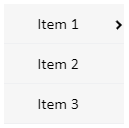

**Properties**

| **Name**   | **Description**  |
|------------|--------|
| Name       | The name of this control.  |
| X          | The distance between the left side of the control and the left side of the canvas. |
| Y          | The distance between the top of the control and the top of the canvas.  |
| W          | The width of the control.  |
| H          | The height of the control.  |
| Layout     | Sets the overall layout of the menu. Including horizontal, vertical and inline. |
| Primary    | Set the display style of the primary menu.   - **W**: The width of the primary menu.  - **H**: The height of the primary menu.  - **Font**: Set the font of the primary menu. Including font type, font size, bold, italic, horizontal alignment, and vertical alignment.  You can set color effects for menus in different operating states. Status includes: default, hover, selected.  The background color and fPont color can be set for each status.   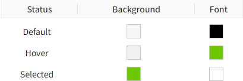|
| Secondary  | Set the display style of the secondary menu.   - **W**: The width of the secondary menu.  - **H**: The height of the secondary menu.  - **Font**: Set the font of the secondary menu. Including font type, font size, bold, italic, horizontal alignment, and vertical alignment.  You can set color effects for menus in different operating states. Status includes: default, hover, selected.   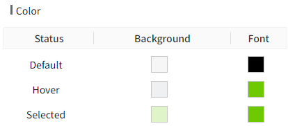   The background color and font color can be set for each status. |
| Navigation | Set the names of menus at each level and the navigation page. 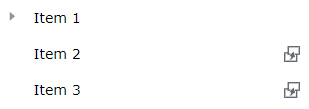    |

## **Navigation**

In the navigation content, you can set the number, name and page navigation function of the menus.

**Set menu name**

Move the mouse over the menu, and the menu will display an editing box. Click the mouse in the editing box to enter the editing state, and you can set the menu name.

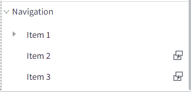

**New menu**

Right-click on the menu to display the operation options. Click the option to perform the corresponding operation. 

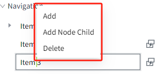

**Note:** Only primary menus support the addition operation.

**Setup navigation**

Click the settings button on the right side of the menu item to pop up the navigation settings window.

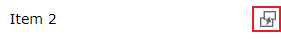

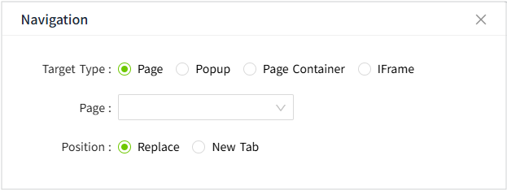

**Target Type**

**Page**

| **Properties**   | **Description**  |
|------------|--------|
| Page          | Navigate to a page in the current project. |
| Position         | **Replace**: Replace the current page   **New Tab**: Open in a new tab|

Example:

Use navigation to switch between pages.

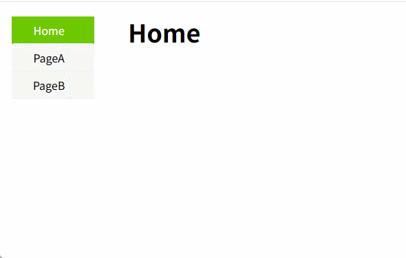

**Popup**

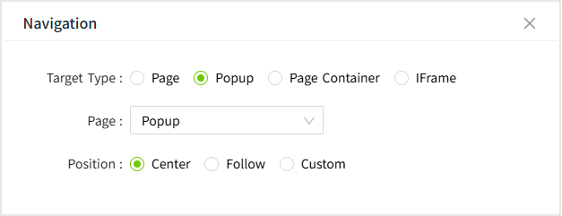

| **Properties**   | **Description**  |
|------------|--------|
| Popup          | Open the selected popup.|
| Position         | **Center**: The popup opens centered on the page.   **Follow**: The popup opens at the cursor location.  **Custom:** The popup opens at a custom position.  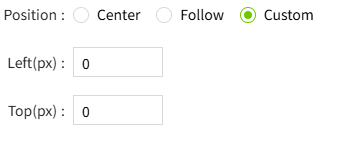|

**Page Container**

Change the page shown in the Page Container control.

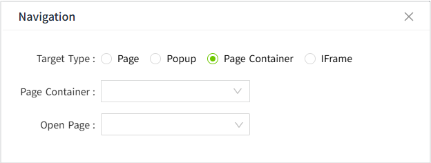

| **Properties**   | **Description**  |
|------------|--------|
| Page Container | Select a page container control on the page. |
| Open Page      | Select a page for the Page Container control to display.|

Note: To avoid circular nesting issues, carefully select the page for the Page Container.

Example:
Use the navigation control to change the page displayed in the Page Container.

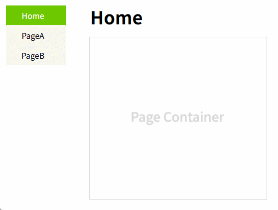

**IFrame**

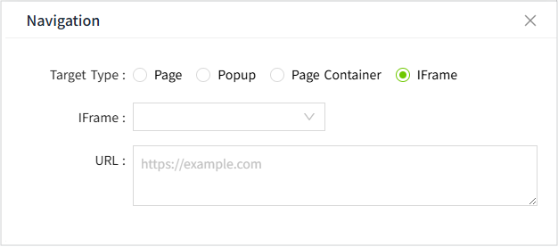

| **Properties**   | **Description**  |
|------------|--------|
| IFrame | Select a IFrame control on the page. |
| URL      | Select a URL for the IFrame control to display.|

Note: Due to iframe isolation, deeply nested iframes cannot be displayed.

