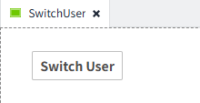
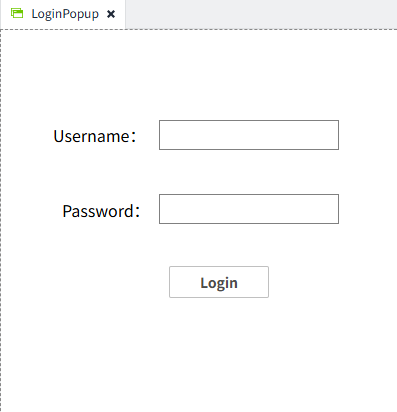

# System.Security.login


## Description

Use this function to log in directly, avoiding the system's built-in login page.

!!! note
    When debugging a page in Preview mode, calling `System.Security.login` or `System.Security.logout` performs a simulated action.
    `System.Security.login` only validates whether the username and password are correct.
    `System.Security.logout` does not perform an actual logout action.
    After a simulated successful login, subsequent behavior still runs under the current Design user.

## Grammar

**System.Security.login(username: string, password: string, pagePath: string): Promise`<void>`**<br>

- Parameters<br>

    username — The user's login name.<br>

    password — The user's password.<br>

    pagePath — The path of the page to navigate to after a successful login.<br>

- Return<br>

    Resolves when the operation completes. If login succeeds, the page will navigate to `pagePath`.<br>

## Code Example

At the top of the page, there is a 'Switch User' button. Clicking the button opens the 'LoginPopup' popup. After the user enters their username and password and successfully login, the system automatically redirects to the project homepage.

Switch User Button Script



```typescript
await System.UI.openPopup('LoginPopup');

```
Login Button Script for the LoginPopup page



```typescript
const usernameInput = await System.UI.findControl('UsernameInput');
const passwordInput = await System.UI.findControl('PasswordInput');
try {
    await System.Security.login(usernameInput.text, passwordInput.text, 'Home');
    // On success the page redirects to 'Home'
} catch (err) {
    // Handle login failure (show error message, etc.)
}


```


