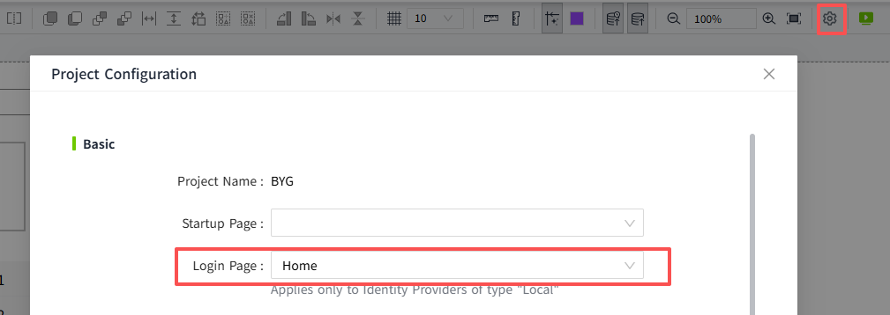

# System.Security.logout


## Description

Log out of the currently logged in user and return to the login page.

!!! note
    When debugging a page in Preview mode, calling `System.Security.login` or `System.Security.logout` performs a simulated action.
    `System.Security.login` only validates whether the username and password are correct.
    `System.Security.logout` does not perform an actual logout action.
    After a simulated successful login, subsequent behavior still runs under the current Design user.

## Grammar

**System.Security.logout(): Promise`<void>`** <br>

- Parameter <br>

    Nothing <br>

- Return <br>

    Nothing<br>

## Code Example

Logout.

```typescript 

System.Security.logout()

```   

## Post-logout redirect behavior

After calling `System.Security.logout()`, the page will redirect according to the following priority (from highest to lowest):

1. If the system has a third-party (**OpenID Connect type**) Identity Provider (IdP) enabled, the user will be redirected to the IdP's login page.
2. If a **Local type** Identity Provider (IdP) is used, 
   - If a custom login page is set in the 2D Designer project configuration popup, the user will be redirected to the login page configured there.
   
   - Otherwise, the user will be redirected to the system's default login page.

   
