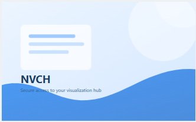
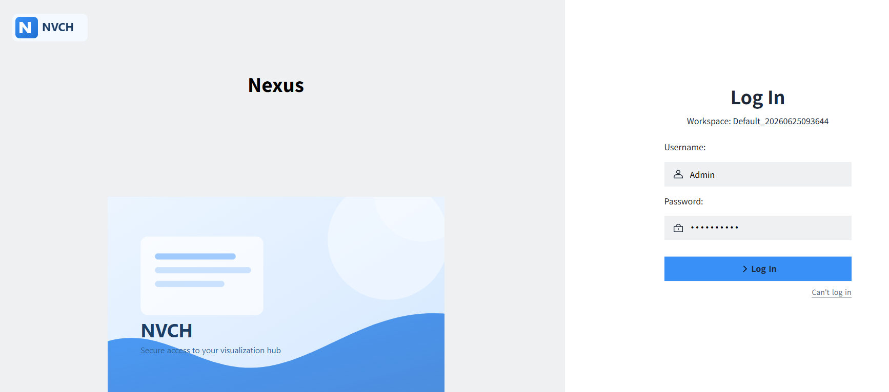
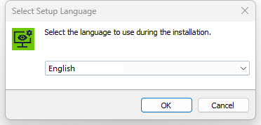
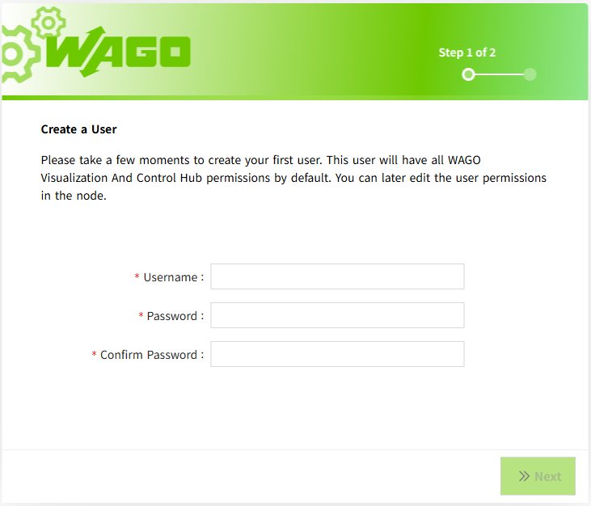

# Branding & Theming (Labeling)

The Labeling feature enables branding and UI theming customization for WAGO VC Hub during product delivery.

With Labeling, system integrators can customize the appearance of the system before delivery, ensuring that the product matches the customer's corporate identity and branding requirements.

## Supported Branding Scope

Currently, Labeling supports customization of the following items:

- Brand Information
     - Product Name
     - Browser Title    
- Images and Logos
     - Logo
     - Login Page Image
     - Logout Page Image
     - Browser Favicon
- Theme Colors
     - Button Colors
     - Icon Colors
     - Decorative Bar Colors
     - Selected Colors
     - Default color of the control
     - Runtime page license status and notification colors
     - AR Report colors

**Example**

| **Customization Item** | **Customized Value**                       |
|-----------|----------------------------------|
| Product Name      | Nexus |
| Theme Color    |   #3991f7  |
| Favicon     |        |
| Login Page Image      |         |

After installation, the customized branding is applied throughout the user interface.

## Customization Process

1. The customer provides branding assets, such as the product name, images, logos, and theme colors.
2. WAGO generates and delivers a customized installation package.
3. After installation, the customer can immediately use the branded interface.

## Constraints

- Labeling affects only the appearance of the user interface and does not change system functionality.
- Only the customization items listed above are supported.
- To modify any branding content, updated assets must be provided and a new installation package must be generated.
- When upgrading the product, a new installation package containing the branding customization must be generated.

## Limitations

- Labeling is not currently supported during installation.
   
- The onboarding pages do not currently support Labeling.
   

