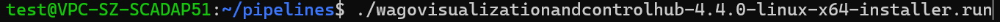
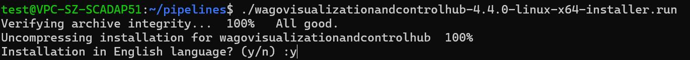
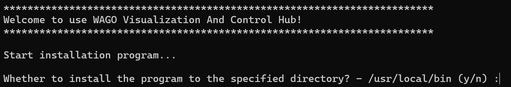
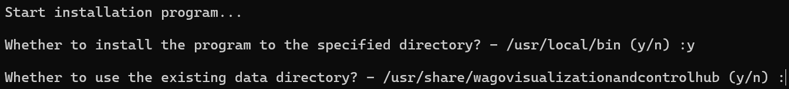
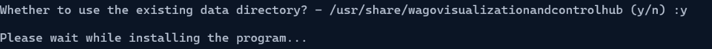
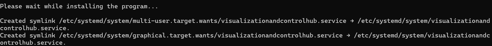
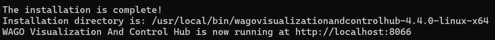
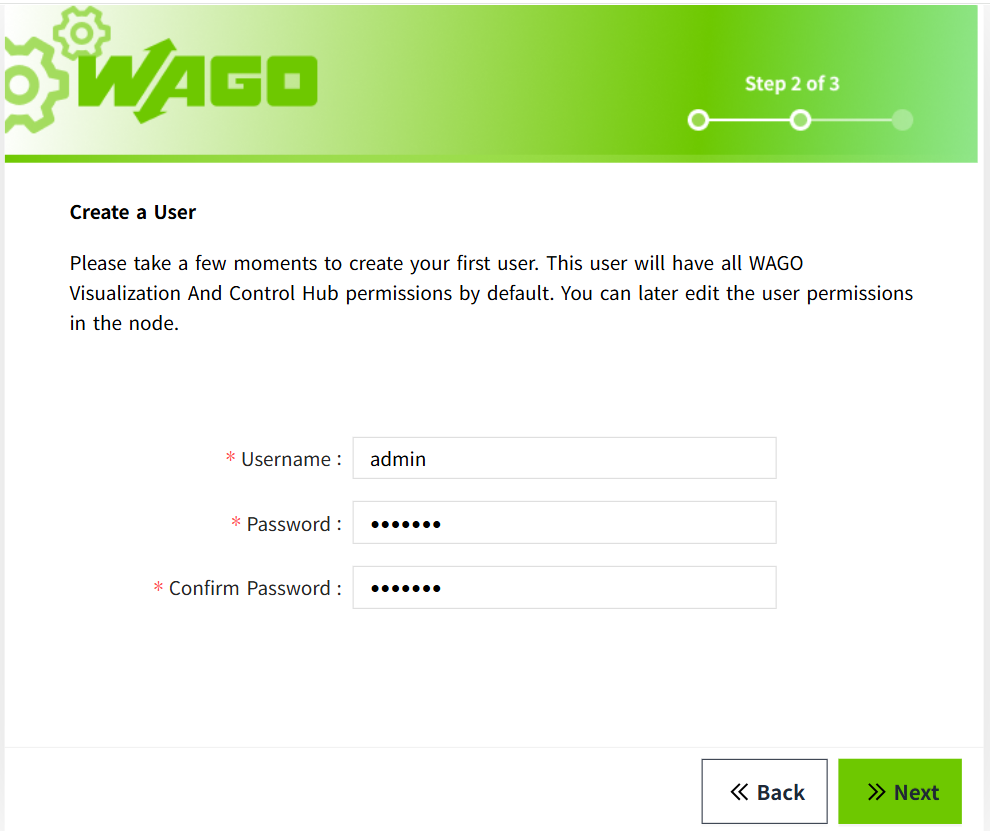
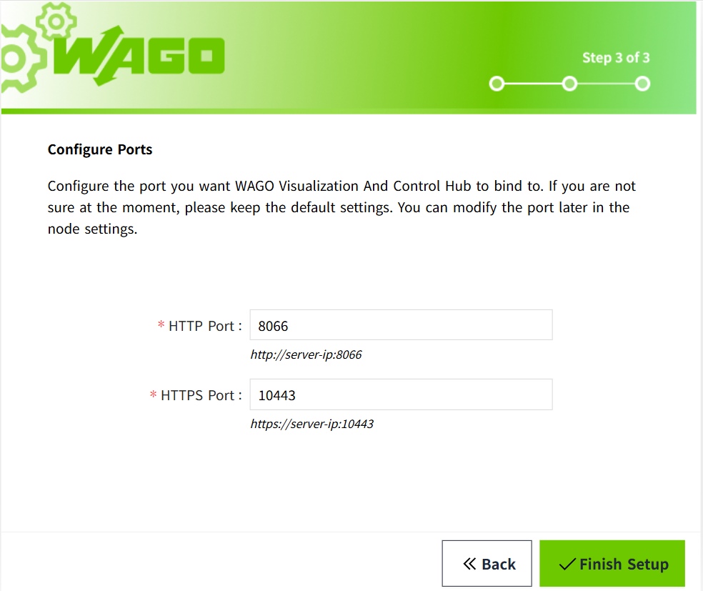
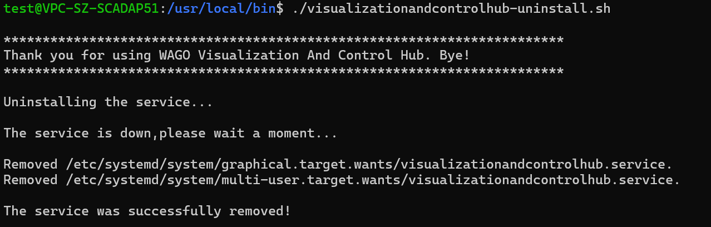

# Linux Environment

VC Hub provides an installation package for the Linux environment, with the file name wagovisualizationandcontrolhub-x.x.x-linux-x64-installer.run.

## **Installation Steps** 

1. Copy the installation package to a directory on the Linux server.
1. Grant the file owner the permission to execute the installation file 
   
1. Run the installation package in the directory using the command ./ followed by the file name. 
   
1. Select the installation language.
   
1. Customize the installation directory or use the default directory. If the installation directory does not exist, the installer will create it automatically.
   
   
1. Customize the data directory or use the default directory.
   
1. Wait for the installation to complete. This process may take some time, so please be patient. 
   
1. The installation is complete.
   
1. After completion, the default access to the VC Hub site is: `http://localhost:8066`. After the installation, you will enter the configuration wizard interface.

**Notes:** 

1. The program is monitored and managed by the systemd service manager provided by the Linux system. Please ensure that systemd is running properly on the server.
2. The installation script includes operations such as creating scripts, so make sure you have sufficient permissions.

## **How to Fix libice6 / libsm6 Installation Failures**

If you see the message **"Failed to install libice6/libsm6. Please try installing it yourself."** during setup, you can install these packages manually by following the steps below:

1. Open a terminal.

2. Update the package list:
   ```
   sudo apt update
   ``` 
3. Install the required libraries:
   ``` 
   sudo apt install libice6 libsm6
   ``` 
   If the installation succeeds, no further action is required.<br>
   If you encounter an error such as **"Unmet dependencies"** or a prompt suggesting to  **try 'apt --fix-broken install'"**, this indicates broken package dependencies on your system.<br>
   Run the following command to resolve them:<br>
   ```
   sudo apt --fix-broken install
   ```
   This command attempts to repair inconsistent package states by installing missing dependencies or completing interrupted installations.
4. After the fix completes successfully, retry installing the libraries:
   ```
   sudo apt install libice6 libsm6
   ```
## **Configuration**

1. Read and agree the license agreement
2. Create an administrator user. Remember this username and password, as you will use them to log in for the first time. 
   
3. Port configuration, configure HTTP, HTTPS ports, and remember the access port. 
   
4. After completing the above steps, wait for the program to load, and then you can log in to the default workspace with the administrator user created in step 2.

**Note**: If you perform an upgrade installation, a new empty workspace will be created by default. To return to the original workspace, you need to log in to the new workspace first and then manually open the original workspace from the workspace list. 


## **Service Security**

The installer automatically creates or reuses the non-login `vchub` system account and configures the VC Hub systemd service to run under that account. It also grants the service only the application and data directory permissions required at runtime.

Do not assign a password to `vchub`, add it to the `sudo` group, configure passwordless sudo, or change the service to run as root.

Linux ports below 1024 require additional operating-system permission. Use a port of 1024 or higher whenever possible. If a low port is required, follow the capability-based procedure in [VC Hub Service Account and File Permissions](setup-service-running-user.md#using-ports-below-1024-on-linux); do not run VC Hub as root.

## **Uninstallation Steps**

1. Go to the parent directory of the installation directory.
2. Grant the file owner the permission to execute the file "`wagovisualizationandcontrolhub-uninstall.sh`"
   
3. Run the script "`wagovisualizationandcontrolhub-uninstall.sh`".
   
4. After these operations, all program-related files will be removed, and the process supervisory service will also be removed.

**Notes:**  

The uninstallation script includes operations such as deleting files, so ensure you have sufficient permissions.
