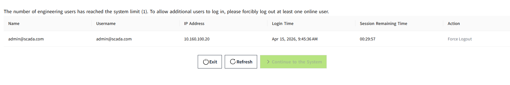
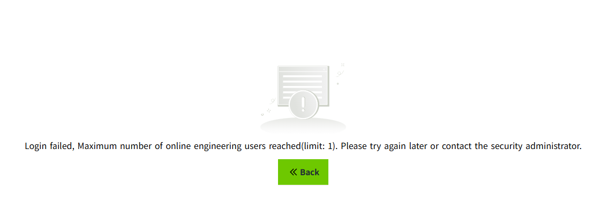
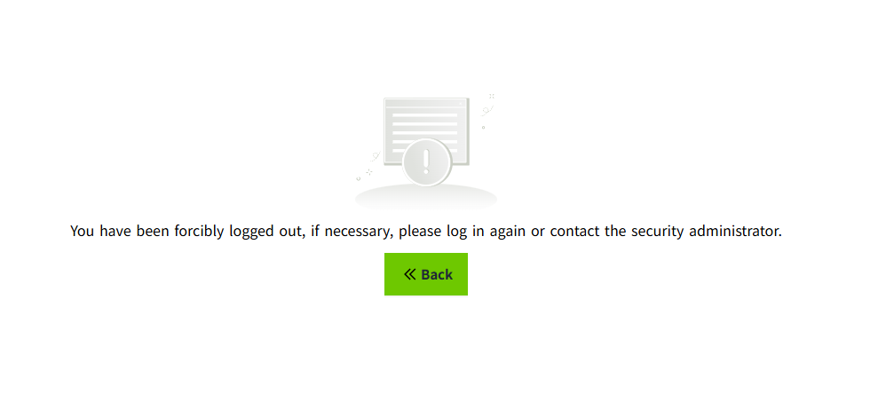
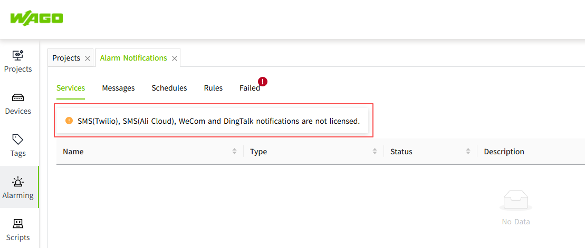
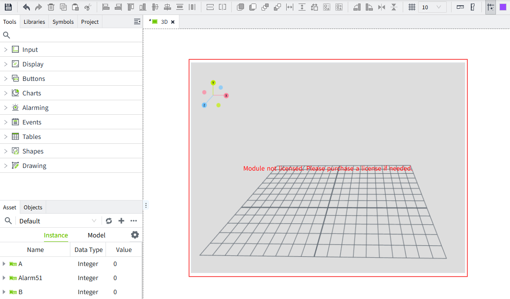

# Product License

## Trial Version Instructions

After installation, VC Hub offers a 30-day free trial. During the trial period, all functions of the product can be used.

You can activate the product by purchasing a formal license. Currently, only online activation is supported.

## Product Authorization Explanation

VC Hub supports both **annual subscription** and **one-time purchase**. Users can only choose one of these methods for purchase.

For detailed instructions on using the License, please refer to [License](../management-platform/license/index.md).

Authorization can be granted based on the following several function modules:

### I/O Tag

There are 7 different license quantities available. You can determine the number of licenses to purchase based on your specific situation.

- 1,000 I/O tags 
- 2,000 I/O tags
- 5,000 I/O tags
- 10,000 I/O tags
- 20,000 I/O tags
- 50,000 I/O tags
- 100,000 I/O tags

**Notes:**

1. The tag numbers cannot be added together. For example: If you need to use 3,000 I/O tags, based on the number of tags, you need to purchase a license with ≥ 3000 tags. So you need to purchase a license that supports 5,000 I/O tags. 
2. If the I/O tag license is not activated, the quality of the I/O tag will be displayed as "Bad_NotLicensed".
3. If the number of created I/O tags exceeds the maximum allowed by the I/O tag license, then according to the tag sorting rules, the tags beyond the maximum limit will have their quality set to "Bad_NotLicensed".
4. Tags with a quality status of "Bad_NotLicensed" will no longer be collected or pushed in the preview and runtime pages.

### Concurrent Online User

The concurrent user count including 5 different types. 

- 2 Engineering Concurrent Online Users, 20 Runtime Concurrent Online Users
- 5 Engineering Concurrent Online Users, 50 Runtime Concurrent Online Users
- 10 Engineering Concurrent Online Users, 100 Runtime Concurrent Online Users
- 20 Engineering Concurrent Online Users, 200 Runtime Concurrent Online Users
- 50 Engineering Concurrent Online Users, 500 Runtime Concurrent Online Users

The number of engineering users and runtime users included in the license is counted separately.

After logging in, engineering users are directed to the Admin Console page, while runtime users are shown the runtime page.

**When the online count reaches the maximum limit, the user logs in**

1. Users with Security Permission attempting to log in will be prompted with a login failure message. As shown in the figure below:

     - Click the "**Exit**" button to navigate to the login page. You can use another account or your current account to log in again. 
     - Click the "**Refresh**" button to refresh the current user list and retrieve the latest list of online engineering users.
     - In the list, click the "**Force Logout**" button for a user to force them offline. After at least one user has been logged out, the "**Continue to the System**" button becomes enabled. Click it to enter the Admin Console page.
2. Users without Security Permission will receive a login failure message if there are already active sessions with different usernames. As shown in the following picture:
 
     - Click the "Back" button to navigate to the login page. You can use another account or your current account to log in again. 
3. If a user does not have Security Permission, but all currently logged-in accounts use the same username as the one attempting to log in, a list of logged-in users will be displayed. 
Users can only view online user information corresponding to their own user type after logging in. It is possible to remove the account that has already been logged in elsewhere.

**When the user is forcibly logged out**

When a user is forced to log out due to violating the rules, they will automatically be redirected to the following page:

     - Click the "Back" button to navigate to the login page. You can use another account or your current account to log in again. 
     

**Notes:**

1. If the user does not purchase any Concurrent Online User type license, only 1 engineering concurrent user and 10 runtime concurrent users are allowed.

2. The number of concurrent users is also not supported for accumulation.

3. An auto login will also count as one runtime online user.

### Add On 

The following functional modules are Add Ons. 

- Database: MySQL, SQL Server, PostgreSQL, InfluxDB
- Report
- Alarm Notifications: SMS(Twilio), SMS(Ali Cloud), WeCom, DingTalk
- Open API
- Device: MQTT Native, MQTT SparkplugB, WAGO Protocol
- Device: IEC 104
- 3D

**Notes:**

1. Each Add-on module can be purchased separately.
2. For modules that have not been licensed, display a message at the top of the page indicating that the corresponding module does not have a license, for example:
    
    
3. For unlicensed functional modules, normal operations (such as create, delete, update, and query) are allowed in the **Admin Console** and **Designer** pages, but functionality is restricted on the Preview and Runtime pages.

