# Windows Environment

VC Hub provides installation packages for the 64-bit Windows operating system.

Recommended Systems for Installation:

- Windows Server 2012 R2
- Windows Server 2016
- Windows Server 2019
- Windows Server 2022
- Windows 10  (Not supported in Home Edition)
- Windows 11  (Not supported in Home Edition)

## **Installation Steps**

1. Run the installation package program as an administrator.
2. Select the installation language.
    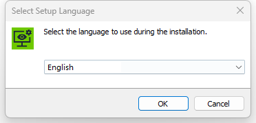
3. Perform a port check, if the port is occupied, the installation cannot proceed. 
      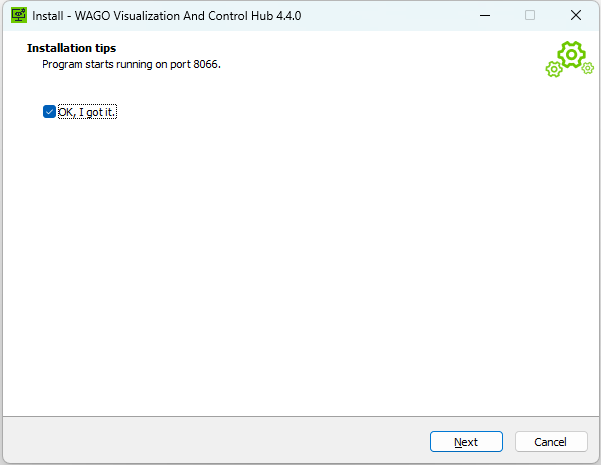
4. Read and accept the license agreement.
      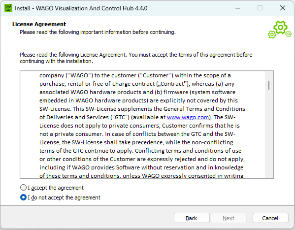
5. Choose the installation location; the default path is: "C:\Program Files\WAGO Visualization And Control Hub".
      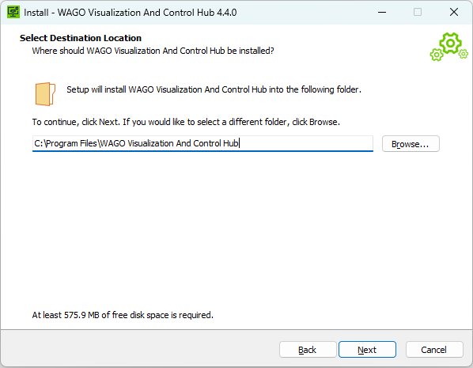
6. Select the VC Hub application data directory.
      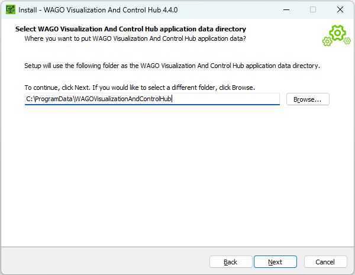
7. Prepare for installation.
      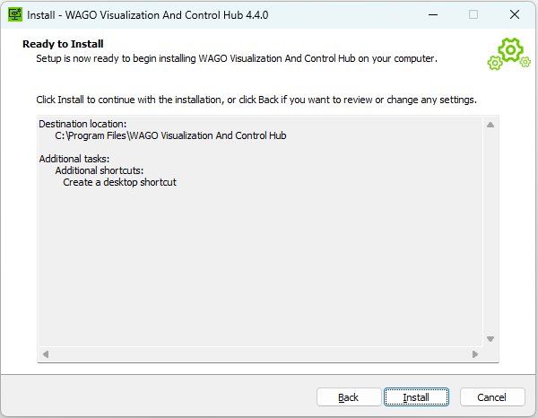
8. The installation is complete.
      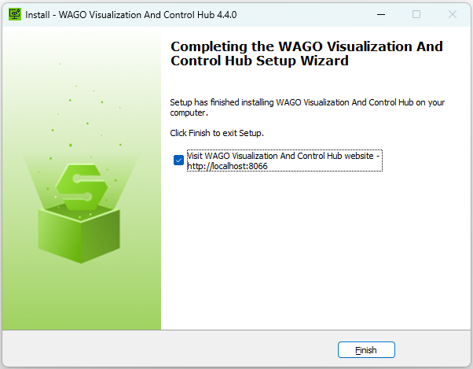
9.  After completion, the default access to the VC Hub site is: `http://localhost:8066`. After the installation, you will enter the configuration wizard interface.

## **Configuration Steps**

1. Create an administrator user. Remember this username and password, as you will use them to log in for the first time. 
      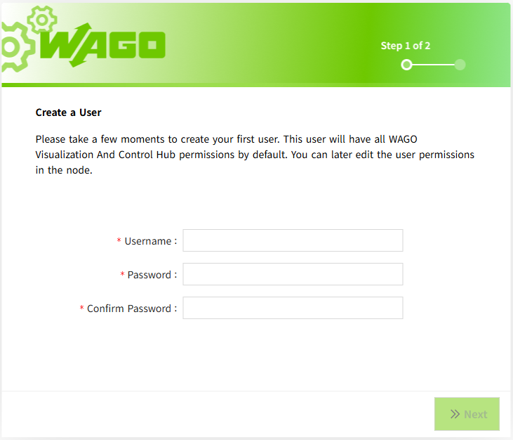
2. Port configuration, configure HTTP, HTTPS ports, and remember the access port. 
      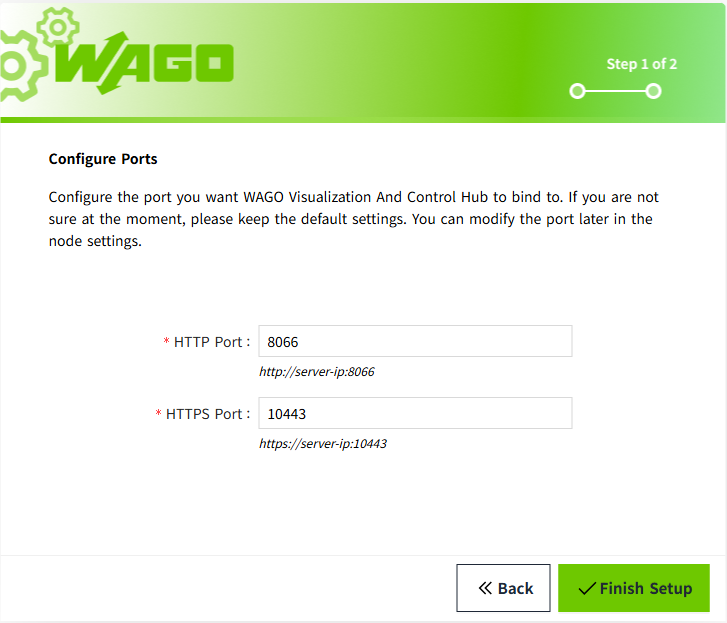
3. After completing the above steps, wait for the program to load, and then you can log in to the default-created workspace with the user created in step 1.

**Note**:

After each installation, a new empty workspace will be created by default. To return to the original workspace, you need to log in to the new workspace first and then manually open the original workspace from the workspace list.

## **Service Security**

The installer automatically configures the VC Hub Windows service to run under the dedicated virtual service account `NT SERVICE\WAGO_Visualization_And_Control_Hub`. It also grants the service only the application and data directory permissions required at runtime.

Do not create a regular local user for the service, change the service to run as `LocalSystem`, or grant it administrator privileges.

For details and verification steps, see [VC Hub Service Account and File Permissions](setup-service-running-user.md).

## **Uninstallation Steps**

1. Enter the software uninstall list from the Control Panel. Find VC Hub and proceed with the uninstallation.
      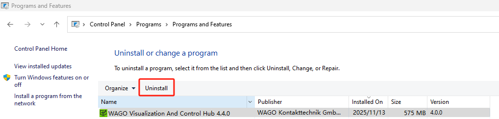
2. Confirm the uninstallation to complete the removal of the application.
      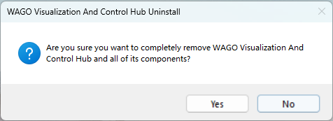

