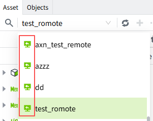
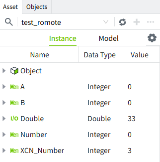

# Remote Tag

Tags under a remote asset tree are referred to as remote tags.

In the asset tree, users can select a remote asset from the drop-down list. The remote asset tree is displayed with a distinct icon to clearly differentiate it from local assets.

After selecting a remote asset, the corresponding remote tags in its asset tree are displayed.

The following operations are supported for remote tags:

- Write values (if the tag has write permission enabled)

- Acknowledge and shelve real-time alarms

- Query historical data