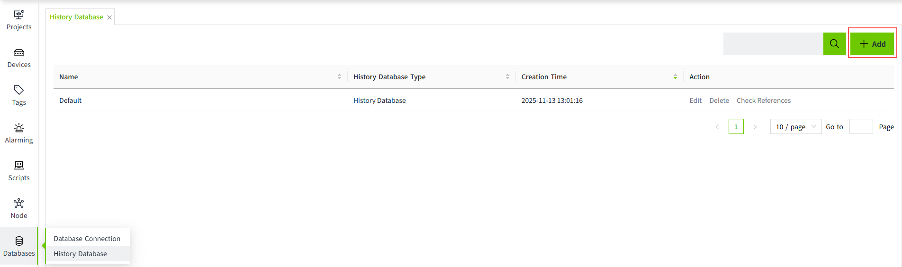
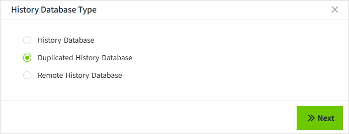
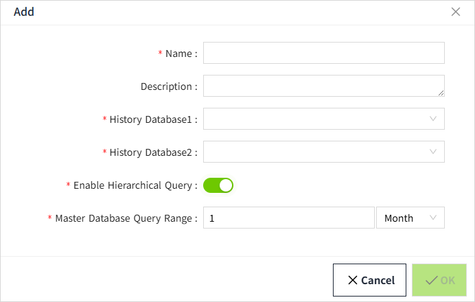

# Create a Duplicated History Database

1. On the "**Databases**" -> "**History Database**" page, click the "Add" button. 
    
2.  In the following pop-up window, select the Duplicated History Database and click "Next" button.
    
3. Fill in the configuration and click "OK" button to save. 
    

**Configuration Description**

| **Configuration Item** | **Description**    |
|----------------------------------|---|
| Name                             | Name of the history database.|
| Description                      | Description Information of the history database.|
| History Database1            | The database connection used for this configuration, derived from the history database configured on the History database list page. |
| History Database2            | The database connection used for this configuration, derived from the history database configured on the History database list page.|
| Enable Hierarchical Query        | Whether or not to hierarchize historical data queries.     **Off**: All historical data query history database1, when history database1 fails query history database2    **On**: All historical data query according to the query configuration, respectively query history database1 and history database2, when history database1 fails query history database2 |
| Master Database Query Range      | Historical data queries with query time within this configuration range will query history database1.|

