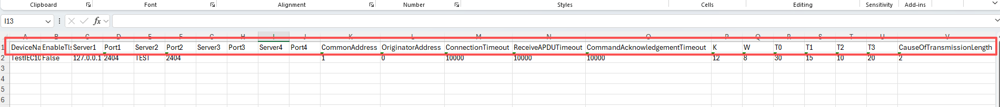
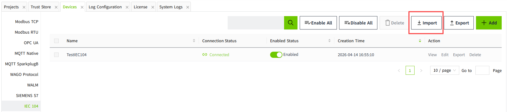
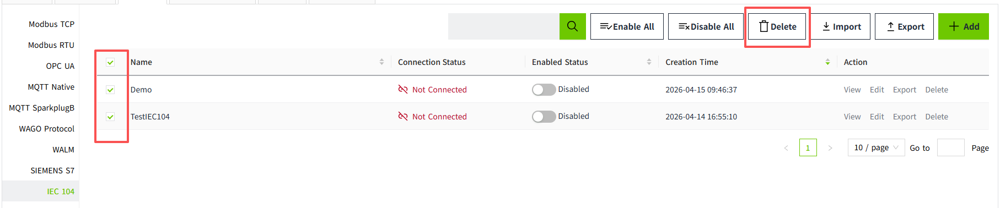
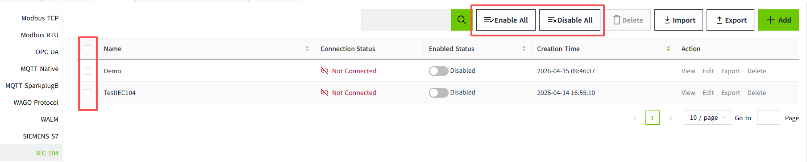

# Batch Operation of IEC 104 Devices

In industrial settings, it is often necessary to create multiple devices in bulk. VC Hub enables this through export and import functions.

**Note:** To quickly create many IEC 104 devices, first manually create one device, then export it and use the exported fields as a template.

## Batch Addition

#### 1.Export Devices

Click the **Export** button in the upper-right corner of the IEC 104 device list to export device information.

**Example of an Exported File:**

- The content inside the red box represents IEC104 device field information.
- IEC104 export focuses on device-level fields (for example: DeviceName, server/port parameters, timeout parameters, and IEC104 protocol parameters).

#### 2.Adding Devices in Excel

Select one or more rows to quickly copy and generate additional devices.

When copying, adjust the following fields carefully to avoid duplicate or invalid configuration:

- DeviceName
- Server1-Server4 and Port1-Port4
- CommonAddress and OriginatorAddress
- Timeout and interval fields

If some values should stay the same for all devices, keep those columns fixed and only update the columns that must be unique.

#### 3.Import Devices

Click the **Import** button in the upper-right corner of the IEC 104 device list, then select the edited Excel file.

After importing, newly added devices are set to **Disabled** by default.

## Batch Modification

You can batch modify existing IEC 104 devices by exporting to Excel, editing, and importing again.

During import, VC Hub updates data by device name:

- If the device name in Excel matches the IEC 104 list, that row updates the existing device.
- If the device name in Excel does not exist in the IEC 104 list, a new device is added.
- If a device exists in the IEC 104 list but is not present in the imported file, that existing device remains unchanged.

## Batch Deletion

Select devices in the current page and click the **Delete** button to delete them in batch.

Notes:

- Devices that are **Enabled** cannot be selected for deletion.
- Only devices on the current page can be deleted; cross-page deletion is not supported.

## Batch Enable / Disable

Use **Enable All** or **Disable All** in the toolbar to change the running state of all IEC 104 devices in the current list view.

Notes:

- **Enable Status** controls whether VC Hub attempts to connect.
- **Connection Status** indicates whether the IEC104 communication connection is currently established.
