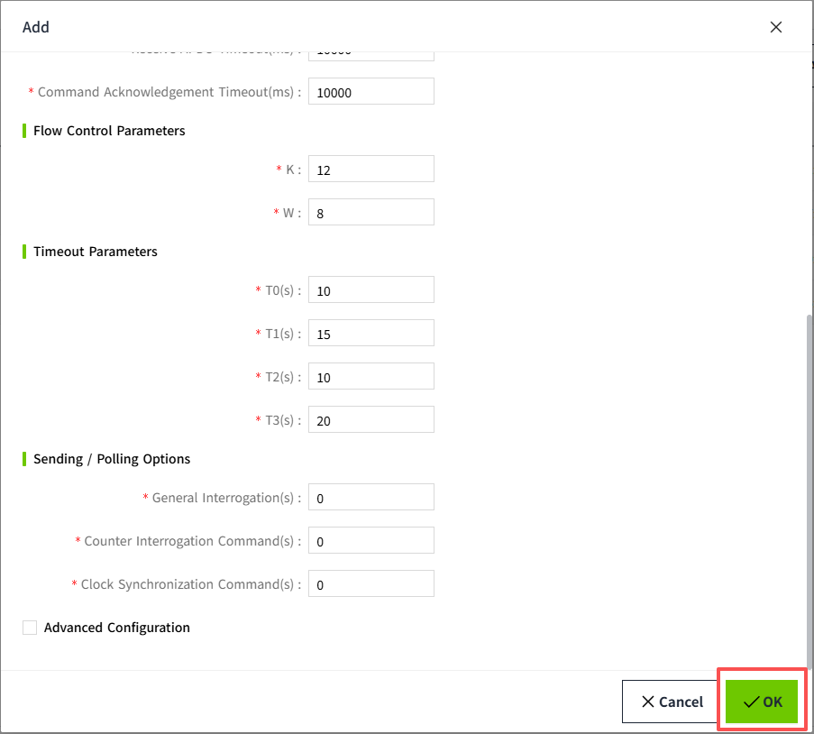
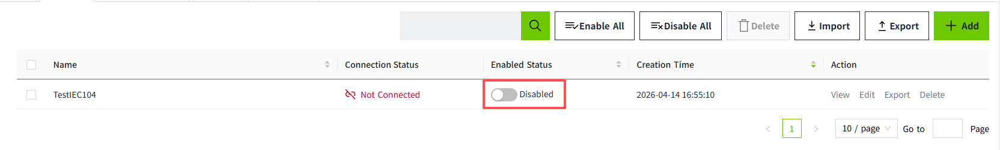
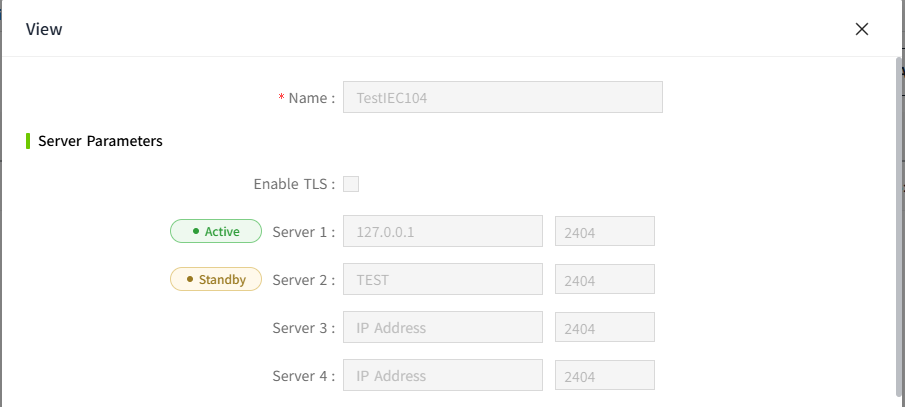
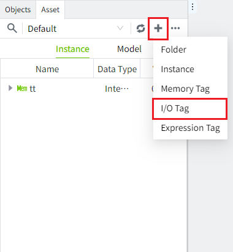
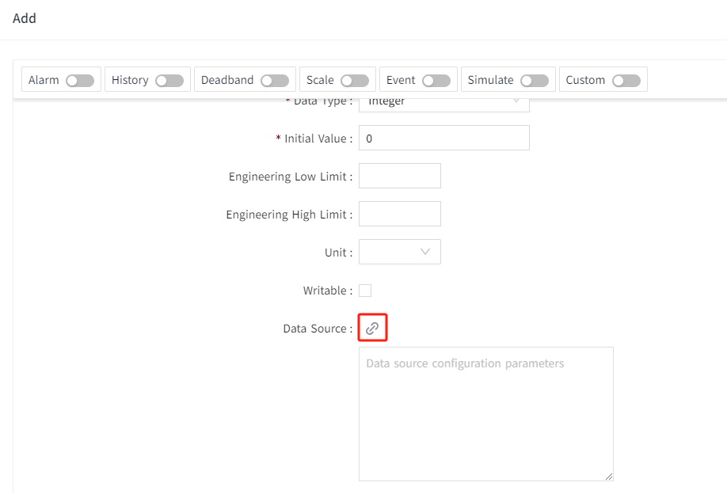
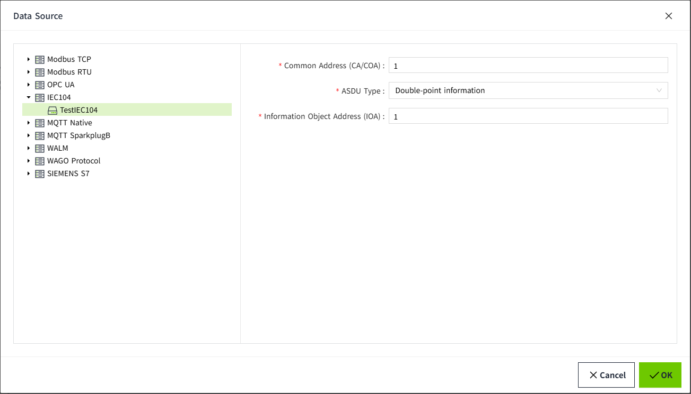
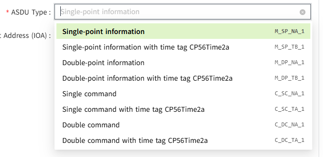
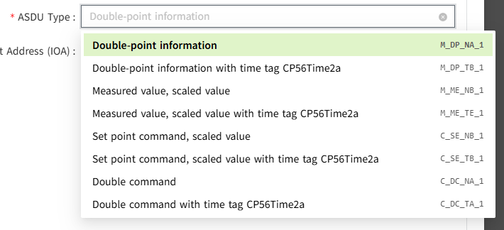
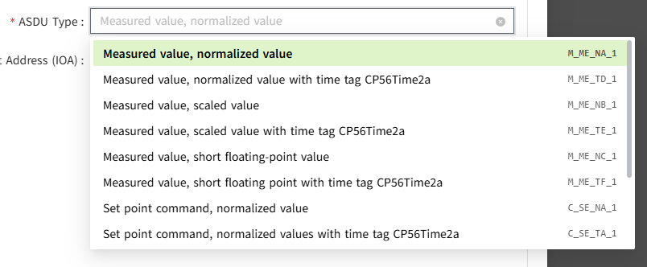

# IEC104

The IEC104 driver in VC Hub communicates with substation devices over IEC 60870-5-104. You can add one IEC104 device, configure communication parameters, enable it, and then bind I/O tags to IEC104 points.

For bulk import/export workflows, see [Batch Operation](batch-operation.md).

## **Connecting to an IEC104 device**

1. On the **Devices** -> **IEC104** page, click the **Add** button.
2. In the Add dialog, enter device information (the values below are examples; use your real project values):
    - Device Name: IEC104_1
    - Enable TLS: Disabled (or Enabled if your server requires TLS)
    - Server1: 127.0.0.1
    - Port1: 2404 or 19998 (TLS port)
    - Common Address: 1
    - Connection Timeout (ms): 10000
    - Receive APDU Timeout (ms): 10000
    - Command ACK Timeout (ms): 10000
3. Keep the default protocol parameters unless your device vendor requires different settings:
    - K: 12
    - W: 8
    - T0: 30
    - T1: 15
    - T2: 10
    - T3: 20
4. Configure **Sending / Polling Options** according to your server behavior:
    - **General Interrogation(s)**: Number of general interrogation commands sent in one polling cycle.
    - **Counter Interrogation Command(s)**: Number of counter interrogation commands sent in one polling cycle.
    - **Clock Synchronization Command(s)**: Number of clock synchronization commands sent in one polling cycle.
5. Configure **Advanced Configuration** (keep defaults unless your server requires custom frame formats):
    - **Originator Address**: Originator address used in IEC104 frames (typically `0`).
    - **Cause of Transmission Length(bytes)**: Byte length of the COT field (typically `2`).
    - **Common Address Length(bytes)**: Byte length of the common address field (typically `2`).
    - **Information Object Address Length(bytes)**: Byte length of the IOA field (typically `3`).
6. (Optional) Click **Test Connection** next to the configured server before saving.
7. Click **OK**. The new device is shown in the IEC104 device list.
   
8. In the device list, turn on **Enable Status** for the device.
   
9. On the device View page, server endpoint status is shown as Active or Standby. Only one endpoint can be Active: VC Hub checks endpoints in configured order and sets the first available endpoint to Active; once one endpoint is Active, all others remain Standby and are not connected.
    - **Active**: the server endpoint currently in use for connection.
    - **Standby**: configured endpoint not currently used for the active connection.
    

**Configuration Fields**

| **Name** | **Description** |
| --- | --- |
| Device Name | Name of the IEC104 device connection. |
| Enable TLS | Enables TLS for IEC104 communication. |
| Server1-Server4 | Up to 4 server IP/domain endpoints. |
| Port1-Port4 | Port for each server endpoint. |
| Test Connection | Verifies connectivity to the selected server endpoint. |
| Common Address | ASDU common address of the remote station. |
| Connection Timeout (ms) | Timeout for establishing TCP/TLS connection. |
| Receive APDU Timeout (ms) | Timeout for receiving IEC104 APDU data. |
| Command ACK Timeout (ms) | Timeout waiting for command acknowledgment. |
| K / W | IEC104 flow-control window parameters. |
| T0 / T1 / T2 / T3 | IEC104 timeout parameters (seconds). |
| General Interrogation Interval | Periodic GI interval. 0 means disabled. |
| Counter Interrogation Interval | Periodic counter interrogation interval. 0 means disabled. |
| Clock Synchronization Interval | Periodic clock sync interval. 0 means disabled. |
| Originator Address | Originator address used in IEC104 frames. |
| Cause Of Transmission Length | Byte length of COT field (1-2). |
| Common Address Length | Byte length of common address field (1-2). |
| Information Object Address Length | Byte length of IOA field (1-3). |

**Notes:**

1. **Enable Status** controls whether VC Hub attempts connection; **Connection Status** shows whether communication is currently established.
2. **Enable All** and **Disable All** are to enable or disable all data in the list.
3. GI/CI/CS intervals should match the capabilities of the target IEC104 server to avoid frequent request.

## **Tag Binding**

Bind I/O tags to data points from your IEC104 device.

1. Create an I/O tag in the editor.

   

2. Open the tag edit page and click the data source binding button.

   

3. In the Data Source dialog, select the target IEC104 device and fill in:
    - Common Address
    - ASDU Type
    - Information Object Address
  
   
   
4. Click **OK** to finish binding.

**Configuration Fields**

| **Name** | **Description** |
| --- | --- |
| Device Name | IEC104 device selected from the device tree. |
| Common Address | Common address used by this tag binding (positive integer). |
| ASDU Type | IEC104 ASDU Type ID; options are filtered by the tag data type. |
| Information Object Address | IEC104 IOA for the target point (positive integer). |

**Type ID selection by tag data type**

| **Tag Data Type** | **Typical Type ID options** |
| --- | --- |
| **Bool** | <1> M_SP_NA_1 <30> M_SP_TB_1 <3> M_DP_NA_1 <31> M_DP_TB_1 <45> C_SC_NA_1 <58> C_SC_TA_1 <46> C_DC_NA_1 <59> C_DC_TA_1  |
| **Integer** | <3> M_DP_NA_1 <31> M_DP_TB_1 <11> M_ME_NB_1 <35> M_ME_TE_1 <49> C_SE_NB_1 <62> C_SE_TB_1 <46> C_DC_NA_1 <59> C_DC_TA_1  |
| **Double** | <9> M_ME_NA_1 <34> M_ME_TD_1 <11> M_ME_NB_1 <31> M_ME_TE_1 <13> M_ME_NC_1 <36> M_ME_TF_1 <48> C_SE_NA_1 <61> C_SE_TA_1 <49> C_SE_NB_1 <62> C_SE_TB_1 <50> C_SE_NC_1 <63> C_SE_TC_1  |
