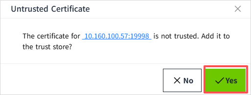
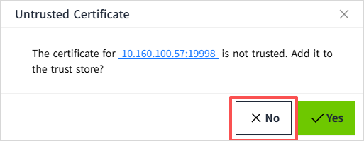

# IEC104 TLS

This page describes how TLS works for IEC104 devices in VC Hub, including TLS configuration, default port behavior, certificate validation rules during enable/start, and trust-store dialog behavior.

## When to Use TLS

Use TLS for IEC104 devices in the following scenarios:

- Communication crosses untrusted networks (for example, public WAN, shared enterprise network, or wireless segments).
- Security or compliance requirements require encrypted transport and certificate-based endpoint validation.
- You need to reduce the risk of eavesdropping and man-in-the-middle attacks on control and telemetry traffic.
- The project uses remote access, multi-site deployment, or third-party network infrastructure where link security cannot be guaranteed.

## Enable TLS for an IEC 104 Device

1. Open **Devices** -> **IEC 104** and click **Add** (or **Edit** an existing device).
2. Check **Enable TLS**.
3. Configure server endpoints and ports.
4. Save and enable the device.

## Port Behavior with TLS

When **Enable TLS** is checked, VC Hub uses TLS-oriented default behavior:

- The TLS default server port is **19998**.
- For empty server rows, port defaults are switched automatically:
    - TLS enabled: default port is **19998**.
    - TLS disabled: default port is **2404**.

## Test Connection with TLS

- The **Test Connection** action uses the current form values.
- If **Enable TLS** is checked, the request includes the TLS flag.
- If TLS is not checked, the request is sent as non-TLS.

## Certificate Validation and Warning Prompt

When working with TLS-enabled IEC 104 devices, VC Hub checks the security certificate of the connected endpoint before allowing the device to start.

If there is a problem with the certificate, VC Hub will display a warning and prevent the device from being enabled.

### When Does a Warning Appear?

A warning icon appears if:

- The certificate is not trusted
- The certificate is expired

In both cases, the device cannot be started until the issue is resolved.

### Warning Icon

A warning icon is displayed next to the affected device.

To view details:

- Click the warning icon
- The "Untrusted Certificate" dialog opens

### Viewing Certificate Details

Inside the dialog:

- Locate the endpoint IP address
- Click the IP address
- A detailed view of the certificate is displayed

### What You Can Do

**Option 1: Click Yes**

If the certificate is not trusted:

- The certificate will be added to the trust store
- VC Hub will check the certificate again
- If valid, the device can be enabled

If the certificate is expired:

- The certificate will not be accepted
- A message will inform you that the certificate is expired
- The device will remain disabled

**Option 2: Click No**

- The dialog will close
- No changes are made

The device will remain disabled in both cases:

- Untrusted certificate
- Expired certificate

## Notes

1. TLS-enabled devices must pass certificate validation before they can start.
2. Endpoint status in **View** can show **Active** (currently connected endpoint) and **Standby** (configured but not currently used endpoint).
3. The warning dialog provides different messages for **not trusted** and **expired** certificate states.
4. For stable TLS operation, ensure endpoint certificates are valid (not expired) and trusted before long-running communication.
