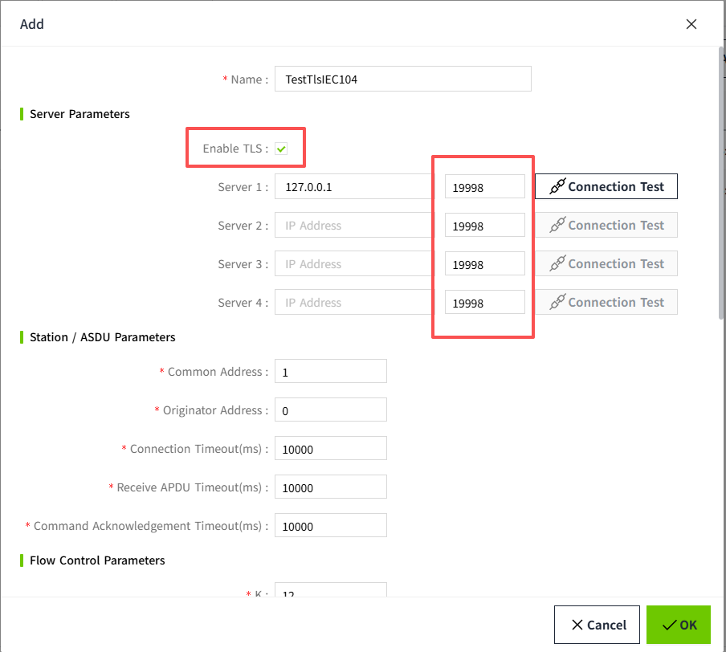
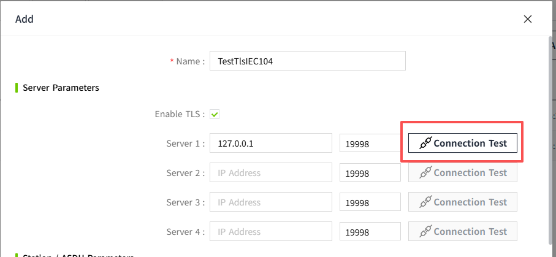
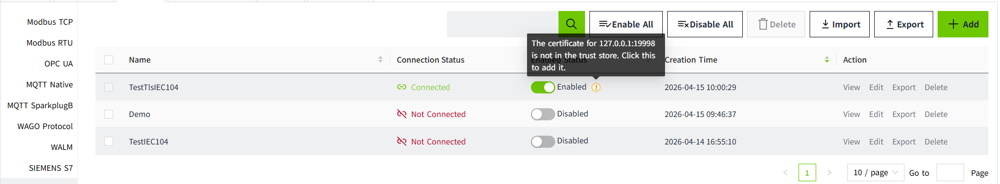
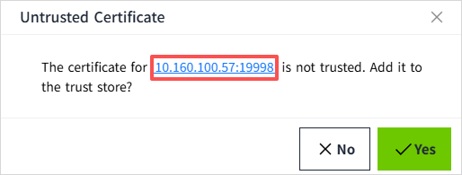
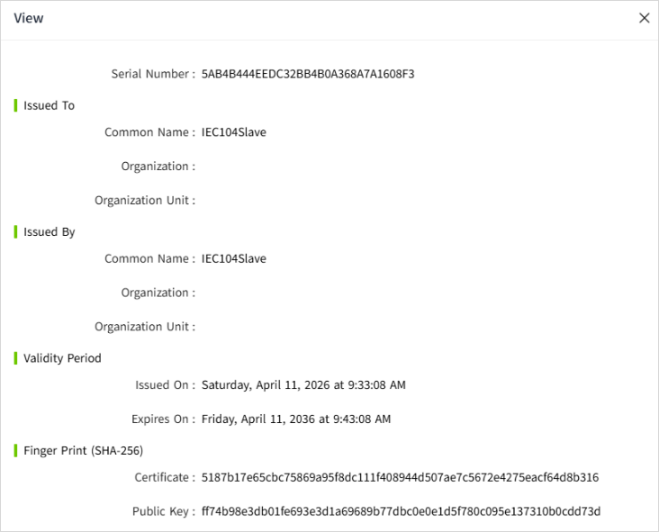
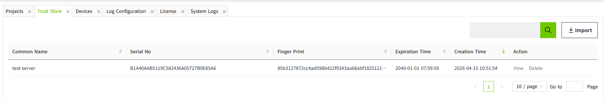

# IEC104 TLS

This page describes how TLS works for IEC104 devices in VC Hub, including TLS configuration, default port behavior, certificate validation rules during enable/start, and trust-store dialog behavior.

## Enable TLS for an IEC104 Device

1. Open **Devices** -> **IEC104** and click **Add** (or **Edit** an existing device).
2. Check **Enable TLS**.
3. Configure server endpoints and ports.
4. Save and enable the device.

## Port Behavior with TLS

When **Enable TLS** is checked, VC Hub uses TLS-oriented default behavior:

- The TLS default server port is **19998**.
- For empty server rows, port defaults are switched automatically:
    - TLS enabled: default port is **19998**.
    - TLS disabled: default port is **2404**.

## Test Connection with TLS

- The **Test Connection** action uses the current form values.
- If **Enable TLS** is checked, the request includes the TLS flag.
- If TLS is not checked, the request is sent as non-TLS.

## Certificate Validation and Warning Prompt

When you enable/start a TLS-enabled IEC104 device, VC Hub validates the certificate of the active endpoint before allowing the device to run:

- If the certificate is **not manually trusted**, the device is **not allowed to start**.
- If the certificate is **expired**, the device is also **not allowed to start**.
- In both cases, a warning indicator is shown.
- Clicking the warning opens the certificate/trust dialog.
- In that dialog, you can click the endpoint **IP address** to view certificate details.

## Dialog Behavior: Yes / No

### Yes

- If certificate state is **not trusted**:
- VC Hub adds the endpoint certificate to trust store.
    - Trust-store cache is cleared.
    - TLS trust status is re-checked for visible devices.
    - The device can then be enabled/started.
- If certificate state is **expired**:
    - VC Hub does **not** add the certificate.
    - An expired-certificate message is shown.
    - The device remains not allowed to start.
  

### No

- The dialog is closed.
- For a **not trusted** certificate, the device remains disabled (not started).
- For an **expired** certificate, the device also remains disabled (not started).

## Notes

1. TLS-enabled devices must pass certificate validation before they can start.
2. Endpoint status in **View** can show **Active** (currently connected endpoint) and **Standby** (configured but not currently used endpoint).
3. The warning dialog provides different messages for **not trusted** and **expired** certificate states.
4. For stable TLS operation, ensure endpoint certificates are valid (not expired) and trusted before long-running communication.
