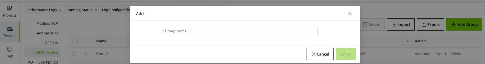
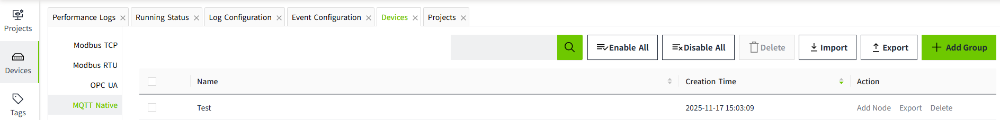
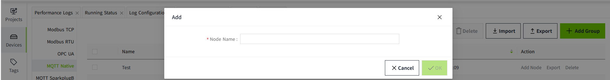
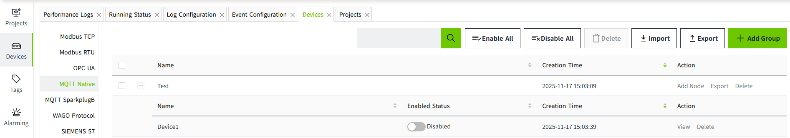
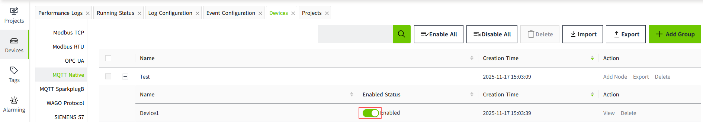
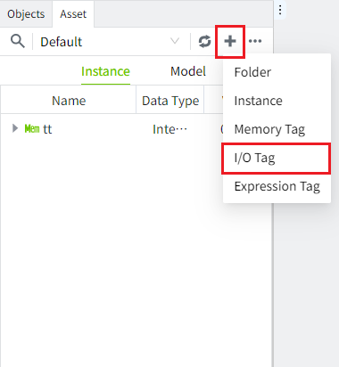
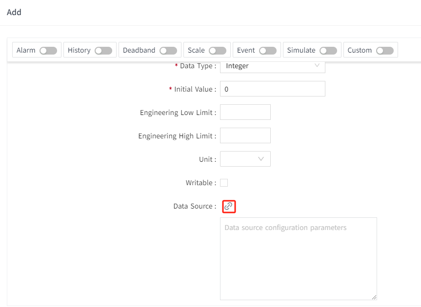
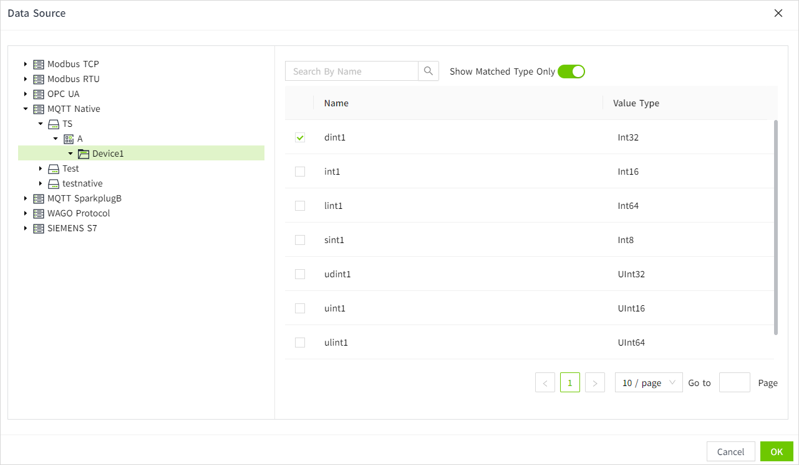

# MQTT Native

The MQTT Native driver receives device definitions and point values from MQTT clients through the built-in VC Hub MQTT Broker. A **group** organizes nodes; a **node** represents a configured MQTT source; a **device** is a logical device reported by that source; and a **point** is a value under a device.

For bulk import and export of groups and nodes, see [Batch Operation](batch-operation.md).

## Create a group and node

1. Go to **Devices** -> **MQTT Native** and click **Add Group**. Enter a group name and click **OK**.

    
    

2. In the group's **Operation** column, click **Add Node**. Enter a node name and click **OK**.

    
    

3. Turn on **Enabled Status** for the node.

    

| Field | Meaning |
| --- | --- |
| Group Name | Identifies the group in MQTT topics. Use the same value in every topic sent by its nodes. |
| Node Name | Identifies a node within the group. Use the same value in that node's MQTT topics. |
| Username | Broker account generated for the node. View it in the node details; it cannot be edited. |
| Password | Broker password generated for the node. View it in the node details; it can be reset. |

**Enabled Status** controls whether the VC Hub driver handles the node; it does not show whether an external MQTT client is connected. **Enable All** and **Disable All** apply to the nodes in the list. Keep node credentials secure, and reset the password if it is exposed.

## Connect an MQTT client

1. Click **View** on the node and copy its username and password.
2. Configure your device or application with the VC Hub Broker address, Broker port (default: `1884`), a unique MQTT Client ID, and the node's username and password.
3. Connect the client, then publish the node's configuration and values using the topics below.

The MQTT Client ID identifies the network connection. **Group Name** and **Node Name** identify where VC Hub processes its messages; use the names configured in VC Hub even if the Client ID is different.

## MQTT topics

Use the exact prefix `wsV1.0` (including capitalization). Replace placeholders in braces with actual names; do not include the braces in a published topic.

| Message | MQTT topic | Client action | Purpose |
| --- | --- | --- | --- |
| NBIRTH | `wsV1.0/{group_name}/NBIRTH/{node_name}` | Publish | Define the devices and points under the node. |
| NDATA | `wsV1.0/{group_name}/NDATA/{node_name}/{device_name}` | Publish | Send values for one device defined by NBIRTH. |
| NCMD | `wsV1.0/{group_name}/NCMD/{node_name}/{device_name}` | Subscribe | Receive point write commands from VC Hub. |

`group_name` and `node_name` must match the configured group and node. `device_name` must match a `DeviceName` in the NBIRTH payload. Each name occupies one topic segment, so it cannot contain `/`; MQTT wildcards `+` and `#` cannot be used as literal names. Topic matching is case-sensitive.

For example, with group `Plant1`, node `Gateway1`, and device `Boiler1`, publish configuration to `wsV1.0/Plant1/NBIRTH/Gateway1`, publish values to `wsV1.0/Plant1/NDATA/Gateway1/Boiler1`, and subscribe to `wsV1.0/Plant1/NCMD/Gateway1/Boiler1`.

Although the topic parser accepts an NDATA topic without the last segment, normal device values need `{device_name}`: the driver uses it to find the device's bound points.

## NBIRTH: define devices and points

Publish a JSON array to `wsV1.0/{group_name}/NBIRTH/{node_name}`. Each array item defines one logical device and its points. Send the complete configuration for the node when points or devices change: processing NBIRTH replaces the stored device and point definitions for that node.

| JSON field | Required? | Meaning |
| --- | --- | --- |
| `DeviceName` | Yes | Logical device name. Use it as `{device_name}` in NDATA and NCMD topics. |
| `Tags` | Yes | Array of point definitions for this device. Include at least one point per device so it appears in VC Hub. |
| `Tags[].Name` | Yes | Point name. It can contain `/` to display a directory path, such as `Process/Temperature`; this slash is in JSON, not in the MQTT topic. Use a distinct name for each point in a device. |
| `Tags[].DataType` | Yes | Numeric type code for the point. It determines the point type shown when binding an I/O tag. |
| `Tags[].Address` | No | Unsigned integer identifier assigned to a point. Use a distinct address for each point in a device if you provide it; later NDATA messages can send this number instead of the Name. |
| `Tags[].Description` | No | Human-readable description of the point. |
| `Tags[].Unit` | No | Engineering unit, such as `°C`. |

`Value` in an NBIRTH point definition is not used to update the point value. Send live values in NDATA instead.

The `DataType` codes supported by MQTT Native are:

| Code | Data type | Description |
| --- | --- | --- |
| 0 | Unknown | Unspecified type; choose a specific type for points you intend to bind. |
| 1 | Int8 | 8-bit signed integer. |
| 2 | Int16 | 16-bit signed integer. |
| 3 | Int32 | 32-bit signed integer. |
| 4 | Int64 | 64-bit signed integer. |
| 5 | UInt8 | 8-bit unsigned integer. |
| 6 | UInt16 | 16-bit unsigned integer. |
| 7 | UInt32 | 32-bit unsigned integer. |
| 8 | UInt64 | 64-bit unsigned integer. |
| 9 | Float | Single-precision floating-point number. |
| 10 | Double | Double-precision floating-point number. |
| 11 | Boolean | Boolean value (`true`/`false` or `1`/`0`). |
| 12 | String | Text value. |
| 13 | DateTime | Date and time; Unix time in seconds or a date-time string. |
| 14 | Text | Text value; handled like String by the driver. |

Example: define three points under `Boiler1`. `Process/Temperature` appears under a `Process` directory in the point browser.

```json
[
  {
    "DeviceName": "Boiler1",
    "Tags": [
      {
        "Name": "Process/Temperature",
        "Description": "Outlet temperature",
        "Unit": "°C",
        "Address": 1001,
        "DataType": 10
      },
      {
        "Name": "Process/Running",
        "Address": 1002,
        "DataType": 11
      },
      {
        "Name": "Control/Setpoint",
        "Address": 1003,
        "DataType": 10
      }
    ]
  }
]
```

## NDATA: send point values

Publish a JSON object to `wsV1.0/{group_name}/NDATA/{node_name}/{device_name}` after defining the device with NBIRTH. The topic selects the device; each item in `Tags` selects a point within that device.

| JSON field | Required? | Meaning |
| --- | --- | --- |
| `Tags` | Yes | Array of point values. |
| `Tags[].Name` | Name or Address | Exact point name or path from NBIRTH. Matching is case-sensitive. |
| `Tags[].Address` | Name or Address | Numeric point address from NBIRTH. Do not quote it as a string. |
| `Tags[].Value` | Yes | Point value, compatible with the type selected when the I/O tag is bound. |
| `Timestamp` | See below | Default timestamp for points without their own timestamp. |
| `Tags[].Timestamp` | See below | Timestamp for this point; takes precedence over the top-level timestamp. |

Provide **at least one of `Name` or `Address`** for each point. You can use Name for readable messages, or Address to reduce the size of frequently published NDATA messages. If you send both, they should identify the same point. A point can match a bound I/O tag by either field, so reusing an address or name for different points in one device can produce unexpected updates.

**Why use Address?** Point names can be long, especially when they include directory paths. If a device publishes thousands of points repeatedly, sending every Name in every NDATA message uses extra bandwidth. Define each point's Name and Address once in NBIRTH, then send only its numeric Address with each value. For the NBIRTH example, `{"Name":"Process/Temperature","Value":35.5}` and `{"Address":1001,"Value":35.5}` refer to the same point; the second form avoids repeating the long name. The saving grows with the number of points and how often they are published. Keep the Name in NBIRTH for point browsing and binding. NCMD writes still use Name, so a client that receives commands must recognize those names.

Provide a positive timestamp either at the top level or on **every** point. Timestamps are Unix time in seconds or milliseconds; the driver distinguishes them by magnitude. To avoid ambiguity when points have different times, give every point its own `Timestamp`.

Example: the first value uses its Name, while the second uses its Address. Both belong to `Boiler1` because that name is in the topic.

```json
{
  "Timestamp": 1735689600000,
  "Tags": [
    {
      "Name": "Process/Temperature",
      "Value": 35.5
    },
    {
      "Address": 1002,
      "Value": true
    }
  ]
}
```

## NCMD: receive point writes

Subscribe to `wsV1.0/{group_name}/NCMD/{node_name}/{device_name}` if the client needs to receive values written from VC Hub. The driver publishes one JSON object per command:

| JSON field | Meaning |
| --- | --- |
| `Name` | Point name or path configured in the I/O tag's MQTT Native binding. |
| `Value` | Value to write to that point. |

For a write to the example `Control/Setpoint` point, the client receives:

```json
{
  "Name": "Control/Setpoint",
  "Value": 37.5
}
```

NCMD uses `Name` in its payload; it does not send `Address`. If the client uses numeric addresses internally, map the received Name to its address in the client.

## Bind MQTT points to I/O tags

1. Create an I/O tag in the editor.

    

2. Open the tag editor and click the data source binding button.

    

3. Select the MQTT Native group, node, device, and point created by NBIRTH. Check that the I/O tag's data type matches the point type. The binding stores the point Name and Address; incoming NDATA values can match either one. For commands, the Name is sent in NCMD.

    

4. Click **OK** to save the binding.
