# License

VC Hub uses licenses to enable product features. Currently, only **online activation** is supported.

## License Types

VC Hub provides two licensing methods:

- Subscription License (Annual Subscription)
- Perpetual License (One-time Purchase)

Only one licensing method can be selected for a product.

After installation, VC Hub automatically enters **Trial Mode**, where all features are available for 30 days.

## Trial Mode

### Trial Period

After installation, VC Hub starts a **30-day free trial** automatically.

During the trial period:

- All product features are available.
- No activation is required.
- A trial countdown is displayed in the Admin Console and Designer.

### Trial Expiration

When the trial expires:

- Admin Console remains accessible.
- Designer remains accessible.
- Driver data acquisition stops.
- Preview and Runtime pages display a **Trial Expired** message.

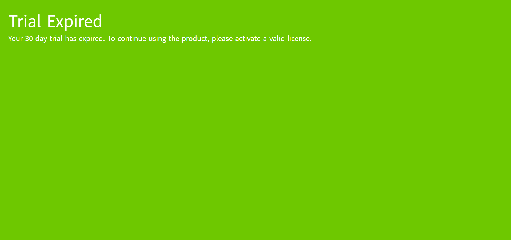

### Extending the Trial

After the trial expires, you may:

- Apply another trial license (contact Sales).
- Purchase formal licenses.

A new trial license always resets the remaining trial period to **30 days**, regardless of the previous remaining days.

## Product Licenses

Product licenses are divided into three categories:

- I/O Tag License
- Concurrent Online User License
- Add-on License

### I/O Tag License

There are 7 different license quantities available. You can determine the number of licenses to purchase based on your specific situation.

- 1,000 I/O tags
- 2,000 I/O tags
- 5,000 I/O tags
- 10,000 I/O tags
- 20,000 I/O tags
- 50,000 I/O tags
- 100,000 I/O tags

**Notes:**

1. License quantities **cannot be accumulated**.
2. Select a license whose capacity is **greater than or equal to** the required number of tags.

   **Example:** If your project requires **3,000 tags**, you must purchase the **5,000-tag** license.

**Behavior Without License**

If no I/O Tag license is activated:

- All I/O tags have quality Bad_NotLicensed.
- Driver data acquisition stops.
- Runtime data publishing stops.

If the configured tag count exceeds the licensed capacity:

- Tags beyond the licensed limit are assigned Bad_NotLicensed according to the system tag sorting rule.
- These tags are neither collected nor published.

### Concurrent Online User

Concurrent user licenses control the maximum number of simultaneously logged-in users.

Engineering users and Runtime users are counted independently.

The concurrent user count including 5 different types. 

- 2 Engineering Concurrent Online Users, 20 Runtime Concurrent Online Users
- 5 Engineering Concurrent Online Users, 50 Runtime Concurrent Online Users
- 10 Engineering Concurrent Online Users, 100 Runtime Concurrent Online Users
- 20 Engineering Concurrent Online Users, 200 Runtime Concurrent Online Users
- 50 Engineering Concurrent Online Users, 500 Runtime Concurrent Online Users

#### Default Capacity

Without a concurrent user license:

- 1 Engineering User
- 10 Runtime Users

are allowed simultaneously.

Automatic login also counts as one Runtime user.

#### User Types

After login:

- Engineering Users enter the Admin Console.
- Runtime Users enter the configured Runtime page.

#### When the User Limit Is Reached

**Users with Security Permission**

Enter the online user management page, and it will display the currently online users.

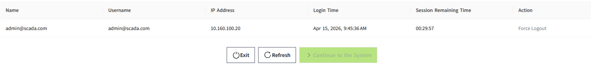

- Click the "**Exit**" button to navigate to the login page. You can use another account or your current account to log in again. 
- Click the "**Refresh**" button to refresh the current user list and retrieve the latest list of online engineering users.
- In the list, click the "**Force Logout**" button for a user to force them offline. After at least one user has been logged out, the "**Continue to the System**" button becomes enabled. Click it to enter the Admin Console page.

**Users without Security Permission**

If different user accounts are already online:

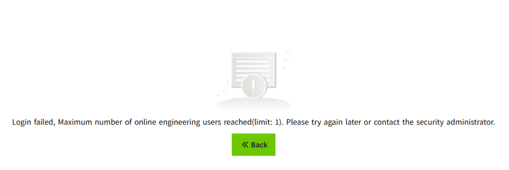

- Login is denied.
- Click the "Back" button to navigate to the login page. You can use another account or your current account to log in again.

If all logged-in sessions belong to the same username:

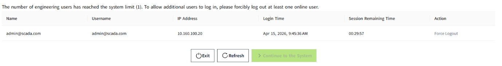

- The user can view only their own sessions.
- It is possible to remove the account that has already been logged in elsewhere.

#### Forced Logout

When a user is forced offline, they are redirected to the login page.

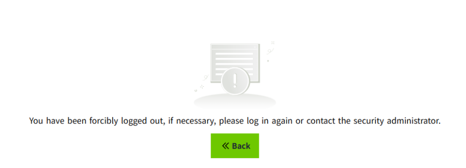

### Add-on Licenses

The following features require separate Add-on licenses:

**Database**

- MySQL
- SQL Server
- PostgreSQL
- InfluxDB

**Reporting**

- Report

**Alarm Notification**

- SMS (Twilio)
- SMS (Ali Cloud)
- WeCom
- DingTalk

**Open API**

**Device**

- MQTT Native
- MQTT Sparkplug B
- WAGO Protocol
- IEC 104

**3D Visualization**

**Notes:**

1. Each Add-on is licensed independently.

2. If an Add-on is not licensed:

     - Admin Console and Designer remain fully functional.
     - Configuration (Create, Update, Delete, Query) is allowed.
     - Preview and Runtime cannot use the feature.
     - A Module Not Licensed message is displayed. For example:

     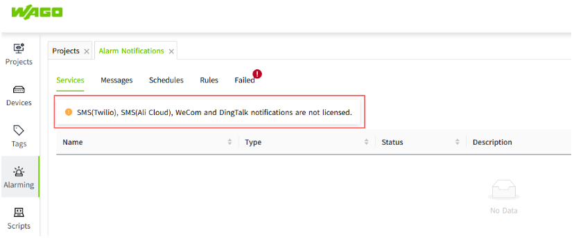

     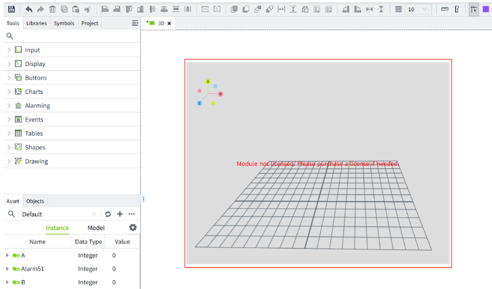

## License Management

Click **Node** -> **License** to manage licenses.

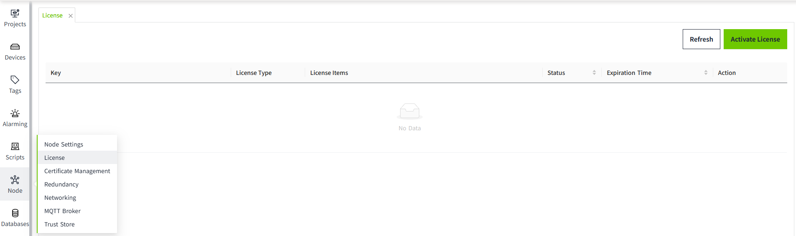

### Activate

**Activation Steps:**

1. Click on the "Activate License" button at the top right corner of the list.
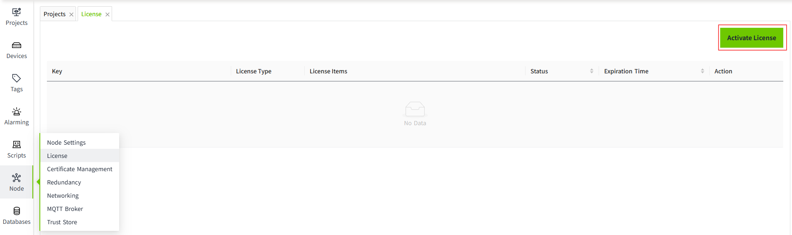
2. Fill in the key and click the "Activate" button.You can input one or more keys at a time.
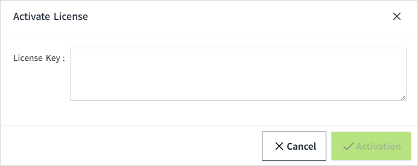
3. After successful activation, the license list will show the license information. For activated keys, you can perform deactivate and update operation.
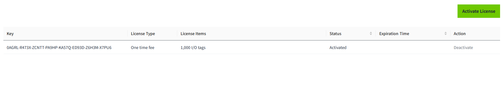

**Notes:**

1. In the license list, the License Type must be the same.
2. For the same License Item, only one activated license is allowed.
3. After activation, the license key will be **bound to the installation server**, and the same key cannot be activated on multiple servers.
4. Once any license in the license list has a remaining validity period of 30 days or less, a license expiration reminder will be displayed in the top-right corner of the Admin Console and Designer pages.

    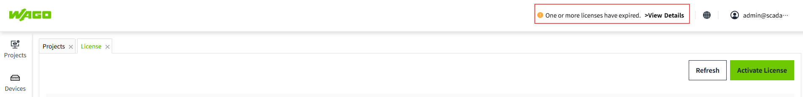

### Deactivate

A license that is in the activated state can be deactivated.

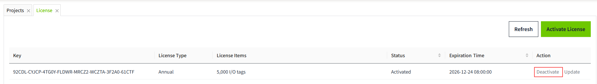

If you wish to remove the license from the current machine and use it on another machine instead, you must first perform a **deactivate** action. After deactivation, the corresponding license will be removed from the current machine. 

You can reactivate it on another machine or on the current one again.

After reactivation, the validity period of this license remains unchanged and is still the same as it was before deactivation.

Unless necessary, please avoid using the deactivation function frequently.

### Delete

A license that is in the expired state can be deleted.

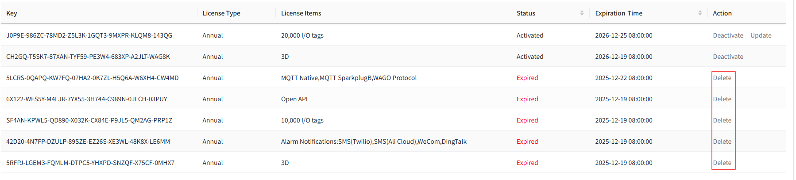

After clicking the Delete button, the license will be removed from the list.

### Refresh

You can refresh the license information at any time. After refreshing, the latest status of the license will be retrieved.

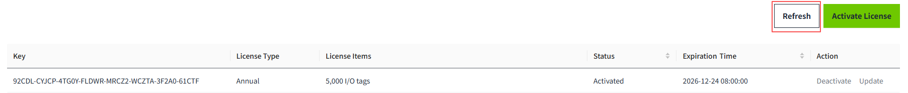

### Renewal

If you would like to continue using the license before it expires, please contact the sales support to renew the license.You only need to refresh the license information to obtain the updated validity period.

Please complete the renewal before the license expires. Once the license expires, the corresponding functionality will become unavailable, which may impact your production environment.

### Update

When you want to change the number of **I/O tags** or **concurrent online users**, you can use the **Update** operation.

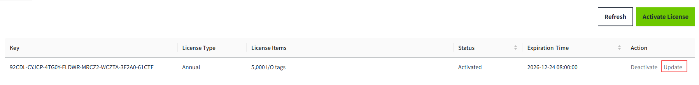

Only one license can be activated for each license item at a time. Normally, to change a license, you need to deactivate the existing license first and then activate a new one. For I/O tag licenses, deactivation will stop data acquisition, which may cause temporary data loss in a production environment.

By using the Update operation, you can avoid this issue and modify the license without interrupting data acquisition.

However, please note that if you attempt to update using an invalid license (for example, an already activated or expired license), the update will fail and may result in the loss of the license for that module.

Therefore, please perform this operation with caution.

## License Expiration

When the license expires:

- The **Admin Console** and **Designer** pages will remain accessible.
- **Driver data acquisition will stop**.
- The **Preview** and **Runtime** pages will display a message indicating that the license has expired if an unauthorized control is used on the page. For example, the licenses for 3D and Report have expired.

    

## License Verification

After a user logs in, the system will display the corresponding interface based on the activated license status.

- If no license is activated, the system will enter trial mode, in which all features are available.
- If a license is activated, the system will display features according to the license type.

Specific limitations include:

- If no license for concurrent online users is activated, the system supports only 1 engineering user and 10 runtime users logged in simultaneously.

- If no license for I/O tag types is activated, all data collection and publishing will stop on the runtime pages.

- For any unlicensed modules, a “Module Not Licensed” message will be displayed. For example, as shown below, the MQTT module is not licensed.

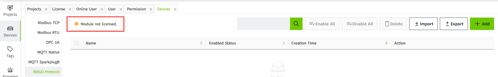

### Distinguishing Between Engineering Users and Runtime Users

When a concurrent online user license is activated, users must be distinguished as either engineering users or runtime users during login.

When the number of users has not reached the limit:

- Engineering users will be directed to the Admin Console page after login.

- Runtime users will be directed to the runtime view after login.

### Configuring Accessible Runtime Views for Runtime Users

Runtime users **must have a role** in order to access runtime views.

The configuration steps are as follows:

**For users with Local Identity Provider**

1. Create a project "ProjectA", and create a page named "Home" under this project.

2. Create a role (e.g., test) and set its Startup Page to "ProjectA.Home".

3. Create a user (e.g., Alex) and assign the role "test".

4. In the project list, click the Design button for "ProjectA". In the opened editor, right-click the page "Home" in the Project panel, set its Permission, and select role "test" in the Access Level tree.

5. Log in as Alex. The Home page will be displayed automatically after login.

**For users with OpenID Connect Identity Provider**

1. Based on the current Identity Provider, create the same role in VC Hub.

2. Add the Identity Provider in VC Hub.

3. Configure **User Attribute Mapping** for the Identity Provider in VC Hub.

4. Configure **User Grants** for the Identity Provider in VC Hub, and add a user (e.g., Jane). (Note: The username must match the one in the Identity Provider. Set the user type to Runtime User.)

5. Create a project ProjectA, and create a page named "Home" under this project.

6. In VC Hub, set the Startup Page of role test to ProjectA.Home. (Note: The user Jane has the role test in the Identity Provider.)

7. In the project list, click the Design button for ProjectA. In the editor, right-click the page "Home", set its Permission, and select "test" in the Access Level tree.

8. Log in as Jane. After accessing VC Hub, the Home page will be displayed automatically.

