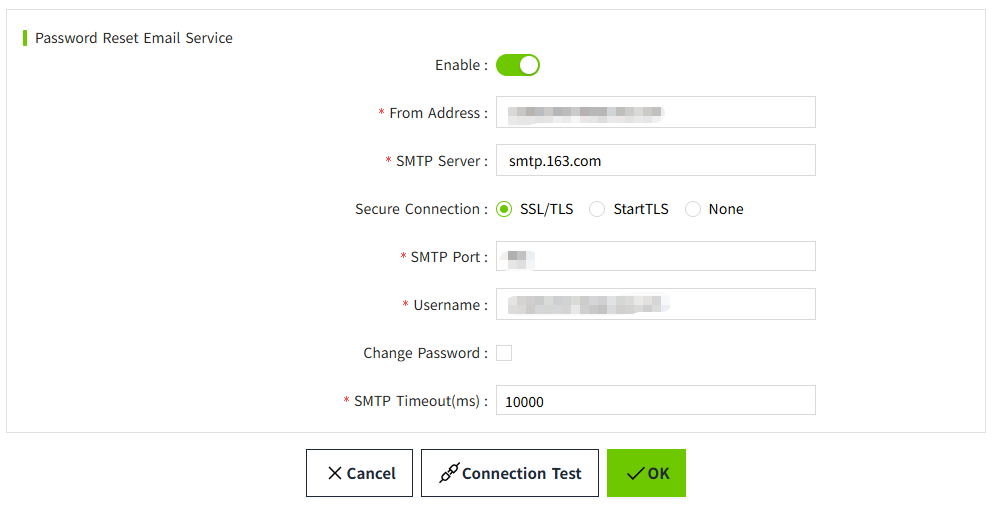
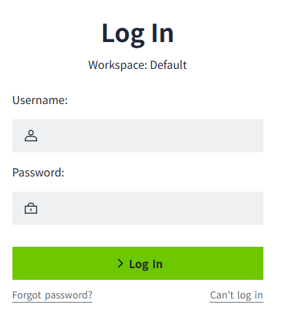
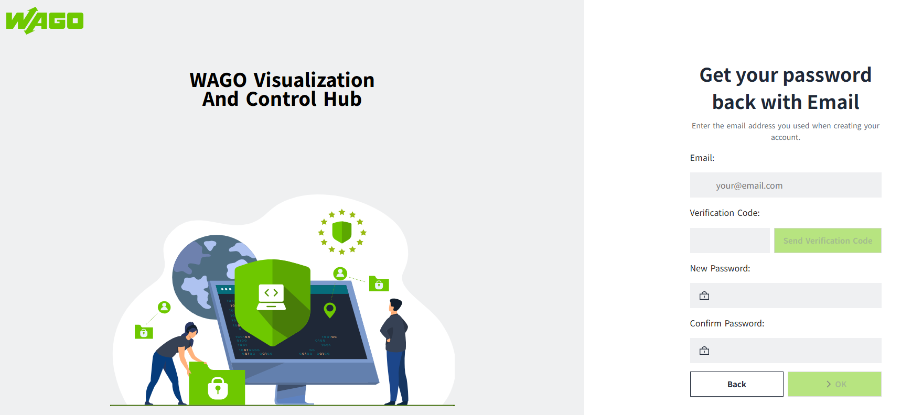
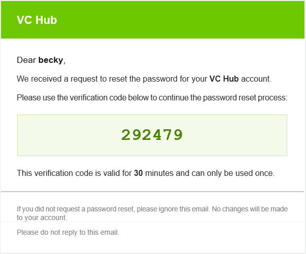
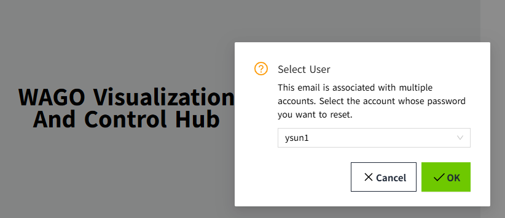
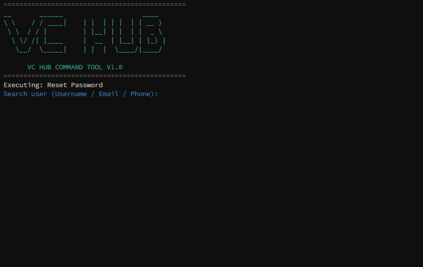
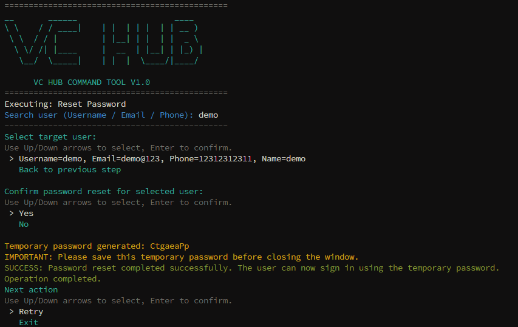

# Password User Reset

VC Hub provides **two methods** for resetting user passwords:

- Email Verification – Allows users to reset their password using a verification code sent to their registered email address.
- Password Reset Tool – Allows administrators to reset a user's password locally on the VC Hub server when email-based recovery is unavailable.

## Password Reset via Email Verification

**Prerequisites**

Before users can reset their passwords by email, ensure that:

- The user account has a valid email address.
- The Password Reset Email Service is configured and enabled.
- The VC Hub server can access the SMTP server.

### Configure the Password Reset Email Service

To configure the email service:

1. Open Admin Console page.
2. Navigate to **Node -> Password Reset Email Service**.
     
3. Configure the following settings:

|Parameter|	Description|
|---------|	---------|
|Enable	|Enables or disables the password reset email service.|
|From Address	|Sender email address displayed in password reset emails.|
|SMTP Server	|SMTP server hostname or IP address.|
|Secure Connection	|SSL/TLS, STARTTLS, or None.|
|SMTP Port	|SMTP server port.|
|User Name	|SMTP account username.|
|Password	|SMTP account password.|
|SMTP Timeout	|Connection timeout in milliseconds.|

4. Click Connection Test to verify the SMTP configuration.
5. Click OK to save the configuration.

**Note:**

- This SMTP configuration is independent of the Alarm Notification Email Service.

### Reset a Password by Email

1. Open the VC Hub login page. 
2. Click Forgot Password. 
 
3. Enter the email address associated with your account. 
 
4. Click Send Verification Code.
5. Check your email and enter the verification code. 
 
6. Enter the new password.
7. Confirm the new password.
8. Click OK.
9. Validate how many users are associated with the email address.
      - If the email address is associated with only one user, clicking OK will redirect the user to the login page.
      - If the email address is associated with multiple users (in version 5.1.0 and earlier, email uniqueness was not enforced, so multiple users may share the same email address), clicking OK will display a user selection list. After selecting a user from the list, after clicking the OK button, the dialog closes, the password reset for the selected user is completed, and the user is redirected to the login page.
      

After the password is successfully reset, you are redirected to the login page.

Log in using your new password.

### Verification Code

- The verification code is valid for 30 minutes.
- Each verification code can be used only once.
- If multiple verification codes are requested, only the most recently generated code is valid.

### Troubleshooting

**I don't receive the verification email.**

Check the following:

- The Password Reset Email Service is enabled.
- The SMTP configuration is correct.
- Your email address is registered in your user account.
- The email has not been filtered into the spam folder.
- The verification code is invalid.

**Possible reasons include:**

- The verification code is incorrect.
- The verification code has expired.
- The verification code has already been used.
- A newer verification code has been generated.
- The verification code does not match the email address.

Request a new verification code and try again.

## Reset a Password Using the Password Reset Tool

If email recovery is unavailable, administrators can reset user passwords using the Password Reset Tool included with the VC Hub installation.

This method can be used when:

- SMTP is not configured.
- The user does not have a valid email address.
- Network access is unavailable.
- No administrator can log in to VC Hub.

**Prerequisites**

The Password Reset Tool:

- Must be executed on the VC Hub server.
- Requires operating system administrator privileges.
      - Windows: Run as Administrator.
      - Linux: Run as root.

### Reset a User Password

1. Locate `vcHubcommandtool.exe` in your installation directory. Example directory path: `C:\Program Files\WAGO Visualization And Control Hub\5.1.1`.

2. Open this file with **administrator** privileges.
3. Docuble click to start the Password Reset Tool.

4. Enter one of the following:
      - Username
      - Email address
      - Phone number
5. Select the user if multiple matching accounts are found.
6. The tool generates a temporary password automatically.

7. Provide the temporary password to the user.

The user can then log in using the temporary password and will be prompted to create a new password immediately after logging in.