# Azure AD integration with MFA

VC Hub identity provider supports integration with Azure AD (Microsoft Entra ID). After integration, users can sign in through Entra ID and use multi-factor authentication (MFA), which improves account security.

## Prerequisites

- Access to Azure portal: [https://portal.azure.com/](https://portal.azure.com/)
- Permission to create app registrations in Microsoft Entra ID
- VC Hub login URL and logout URL
- A test user account in Entra ID

## Configure Microsoft Entra ID

1. Sign in to the Azure portal, then open **Microsoft Entra ID**.

   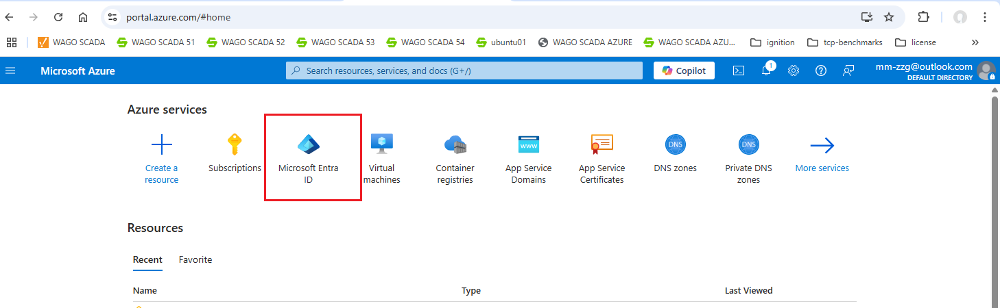

2. In the left panel, select **App registrations**, then select **+ New registration**.

   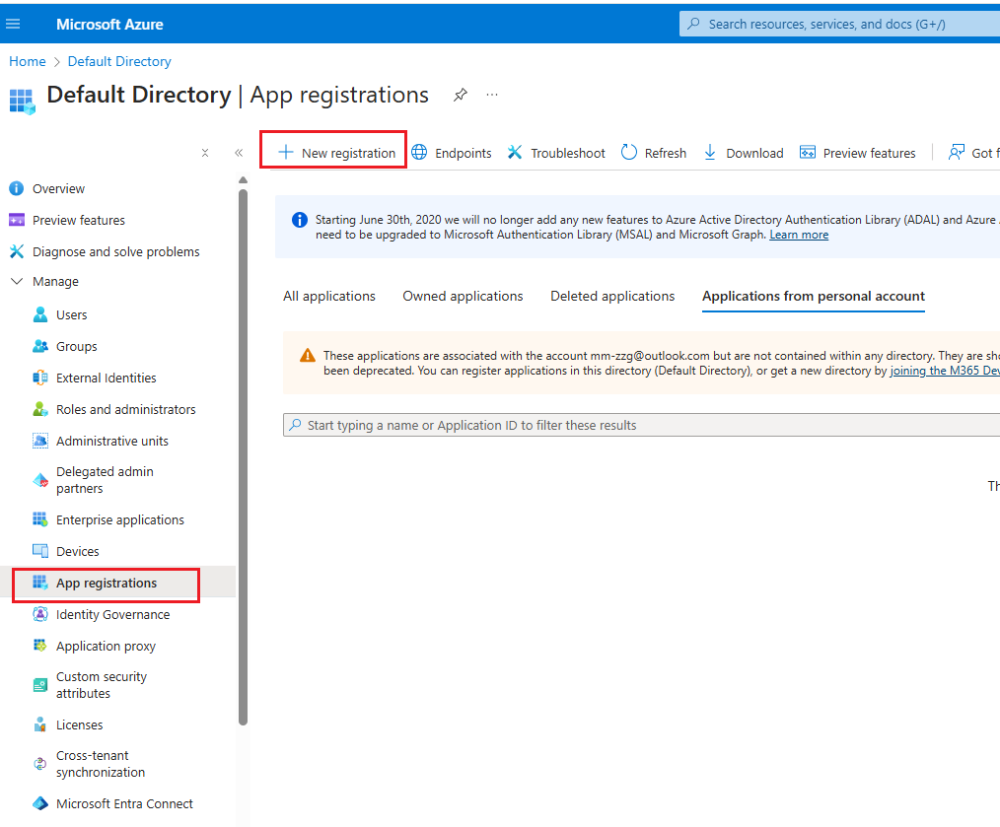

3. Open **Authentication** for the app registration. In **Web redirect URIs**, add the VC Hub login URL and logout URL.

   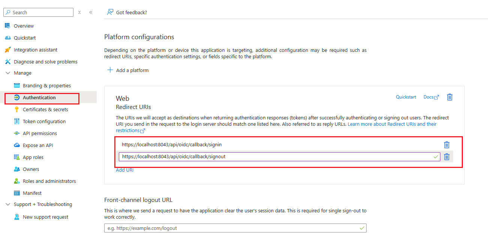

4. Open **Token configuration**, then add the required optional claims.

   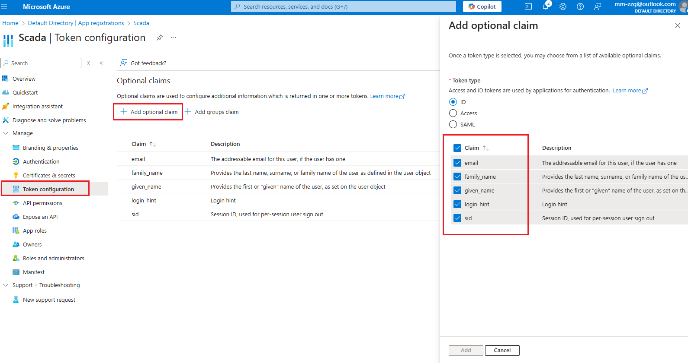

5. Open **Certificates & secrets**, then create a client secret.

   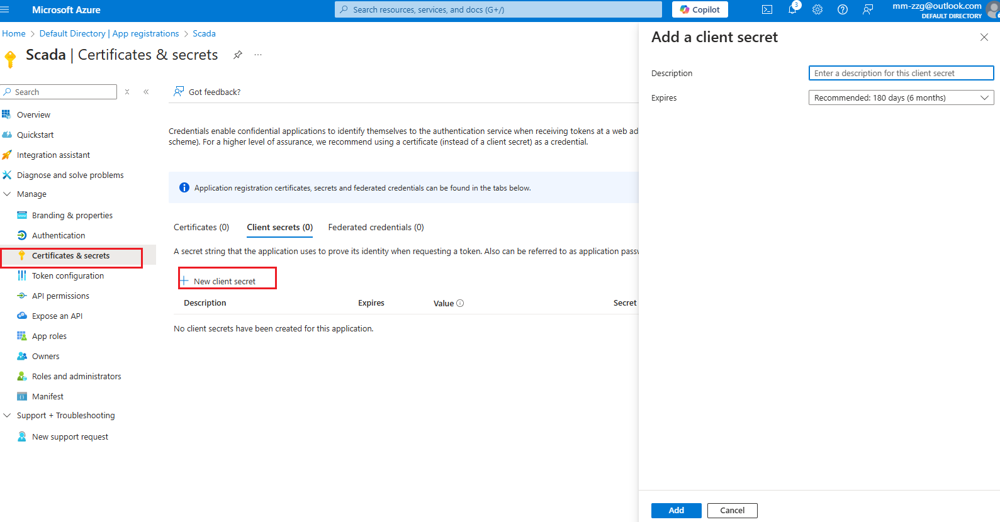

6. Copy the **Application (client) ID**.

   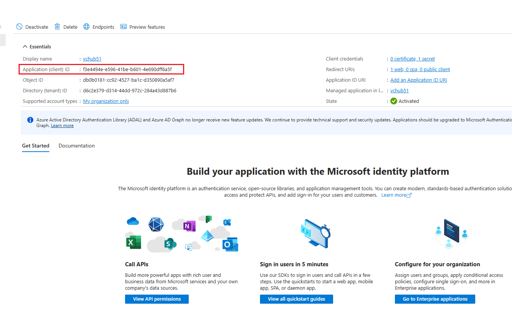

7. Copy the **client secret value**.

   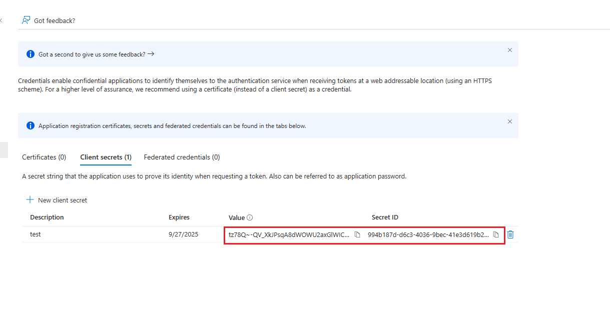

8. Open **Overview**, select **Endpoints**, then copy the **OpenID Connect metadata document** URL.

   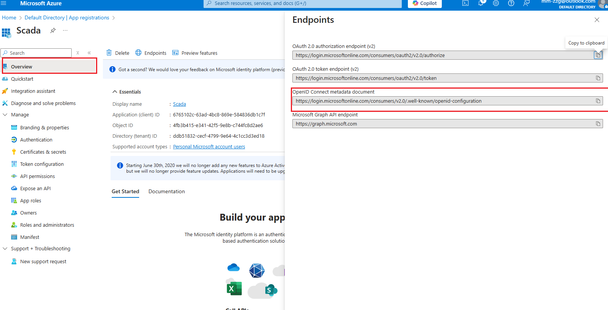

## Enable MFA for users

9. Return to the root of **Microsoft Entra ID**, then open **Users**.

   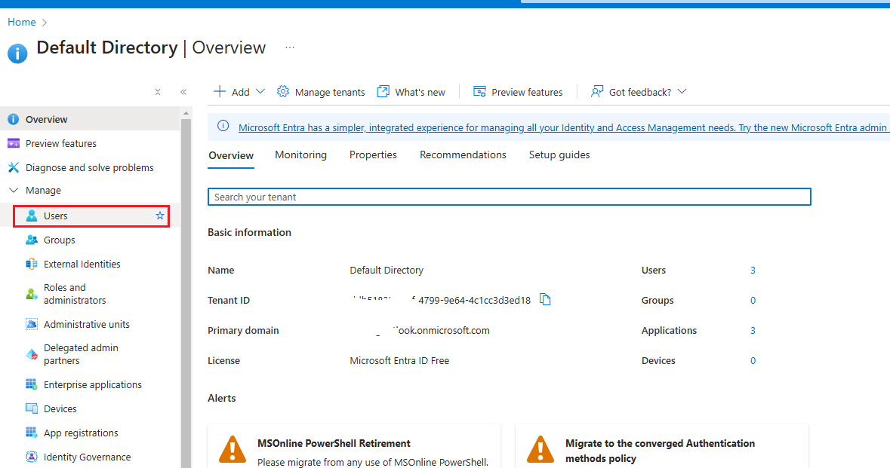

10. Select **Per-user MFA**.

    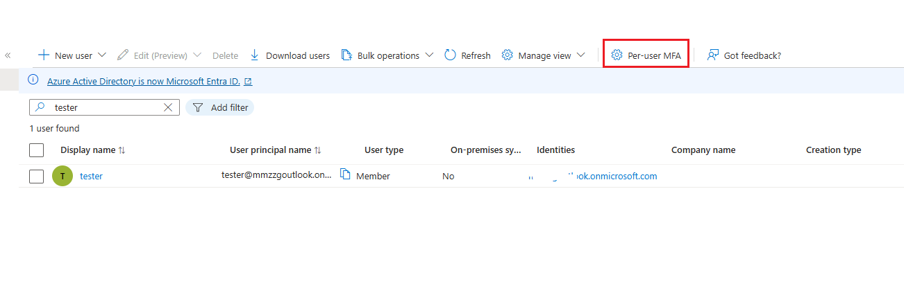

11. Select the target users and choose **Enable MFA**.

    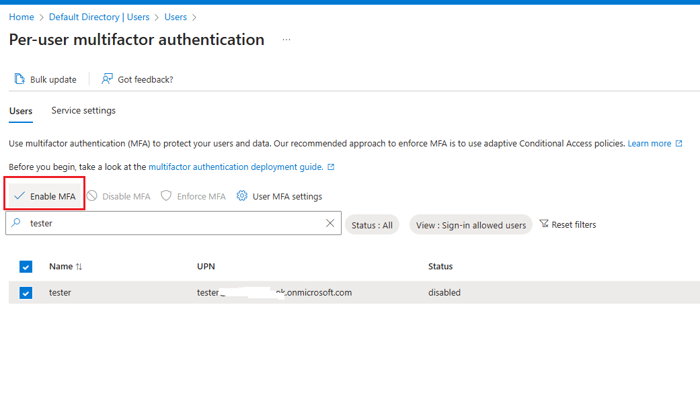

## Configure VC Hub identity provider

12. In VC Hub, open the identity provider page and create a new provider using:

- Client ID
- Client secret
- OpenID Connect metadata document URL

    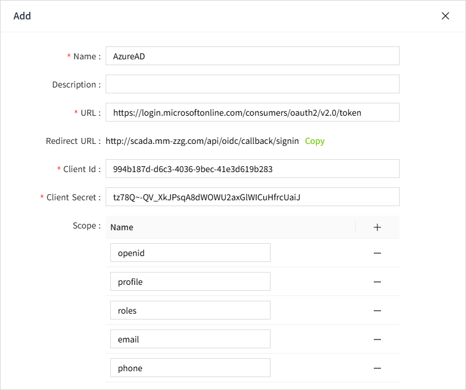

## Verify the login flow

13. In the Azure AD provider settings, select **Login Test**. The browser should redirect to the Microsoft sign-in page.

    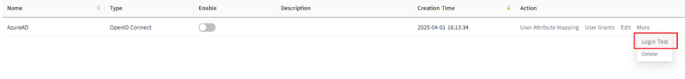

    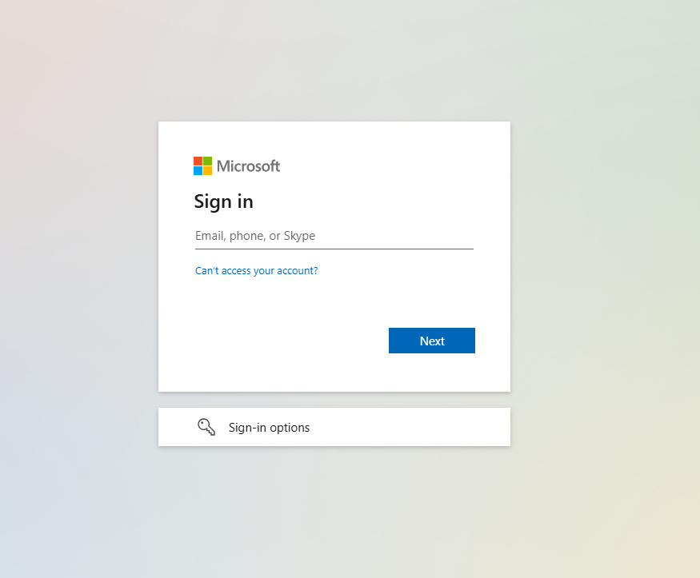

14. Sign in with a personal or domain account. A number-matching challenge is displayed.

    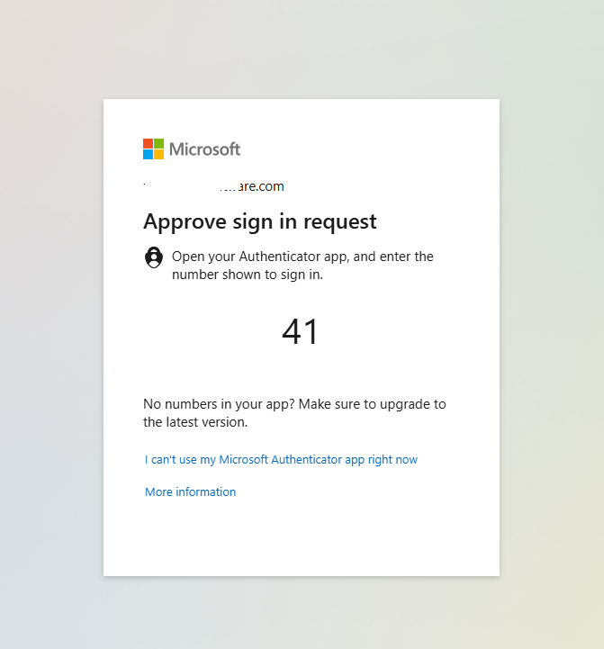

15. Enter the number in Microsoft Authenticator on the mobile device to complete authentication.

    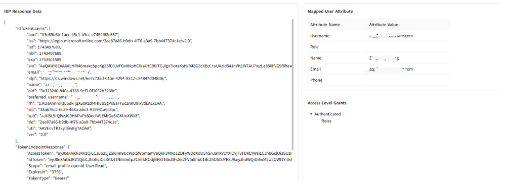

  

