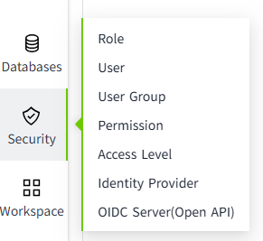
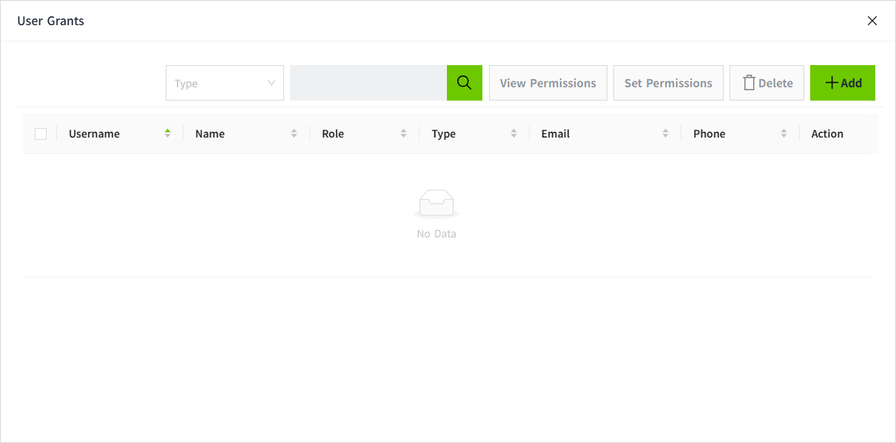
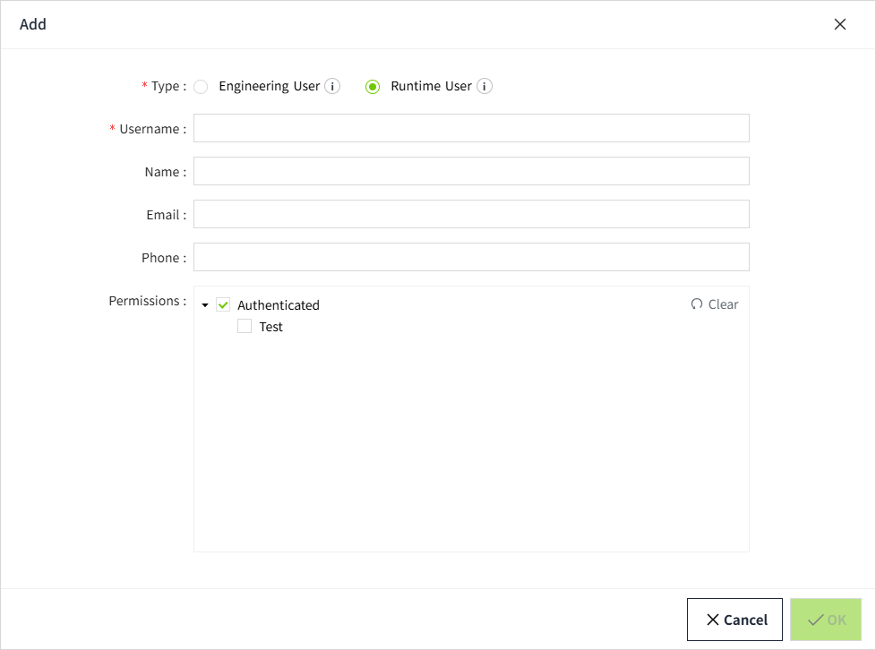
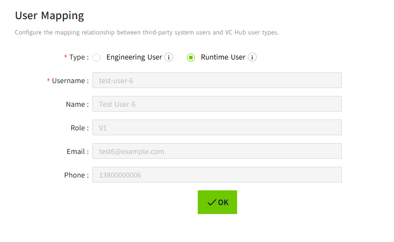

# User Grants

User Grants is used to configure permissions for users who log in through a third-party system.

You can authorize users through the **Security-> Identity Provider** list by clicking the **User Grants** button. Users can be added, allowing you to later assign them specific access levels.

**Note:** Adding or removing users in User Grants does not affect the users within the Identity Provider.

You can assign any number of access levels to these users by their **username**. Selecting a level will automatically select all levels above it.

User Grants can only be applied to users after they authenticate through the Identity Provider.

**Note:** The system cannot verify any users created here based on the actual users in the Identity Provider. Instead, the **username** needs to be entered **accurately**, including case sensitivity. When users log in, the system will check if their username matches any of the configured usernames to grant user authorization.

## Configuring User Grants

1. Click the **"Security" → "Identity Provider"** menu.

    

2. In the **Identity Provider** list, click the **"User Grants"** in the action column for a specific entry.

    

3. In the pop-up window, click the **"Add"** button to add a user.

     

    

4. Select the Type, fill in the user information, and assign Permissions (you can only select access levels outside of roles, since roles are mapped through User Attribute Mapping). Make sure the username matches the username used in the third-party system.

5. Once the configuration is complete, click the Save button to save the settings.

6. The added users will be displayed in the User Grants list.

If a user logs in directly through a third-party system without being pre-created in User Grants, the following dialog will appear after login:

After selecting the Type and clicking the OK button, the system will determine what the user is allowed to access based on the permissions mapped in VC Hub (via Identity Provider’s User Attribute Mapping), and decide which pages the user can view.

After a successful login, the third-party user information will be automatically synchronized to the Identity Provider’s User Grants list, where it can be further modified and have permissions configured.

**Notes:**

Every time a user successfully logs in through a third party, the latest information such as Name, Email, and Phone number from the third party will be synchronized to the VC Hub.

