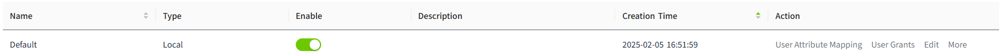
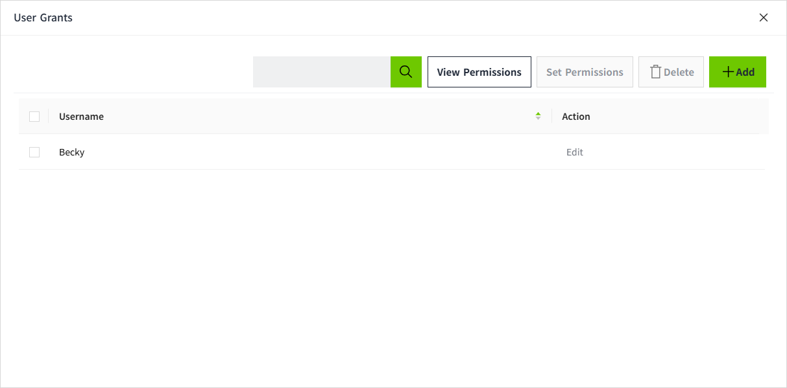
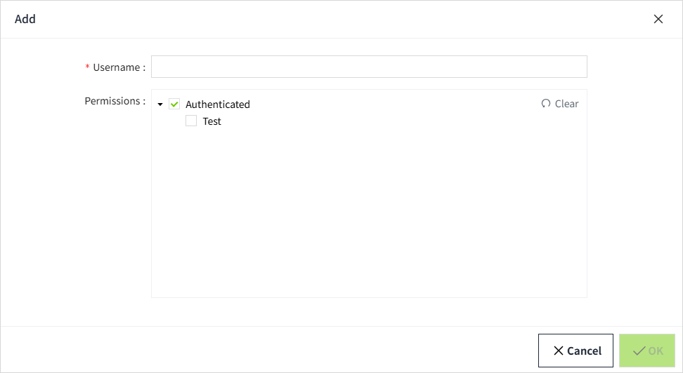

# User Grants

User Grants is used to configure permissions for users who log in through a third-party system.

You can authorize users through the **Security-> Identity Provider** list by clicking the **User Grants** button. Users can be added, allowing you to later assign them specific access levels.

**Note:** Adding or removing users in User Grants does not affect the users within the Identity Provider.

You can assign any number of access levels to these users by their **username**. Selecting a level will automatically select all levels above it.

User Grants can only be applied to users after they authenticate through the Identity Provider.

**Note:** The system cannot verify any users created here based on the actual users in the Identity Provider. Instead, the **username** needs to be entered **accurately**, including case sensitivity. When users log in, the system will check if their username matches any of the configured usernames to grant user authorization.

## Configuring User Grants (Type:OpenID Connect)

1. Click the **"Security" → "Identity Provider"** menu.

    

2. In the **Identity Provider** list, click the "User Grants" button for the data of the type "OpenID Connect".

     
3. In the pop-up window, click the **"Add"** button to add a user.

     

    

4. Select the Type, fill in the user information, and assign Permissions (you can only select access levels outside of roles, since roles are mapped through User Attribute Mapping). Make sure the username matches the username used in the third-party system.

5. Once the configuration is complete, click the OK button to save the settings.

6. The added users will be displayed in the User Grants list.

**Notes:**

1. The Role field is primarily used in scenarios where a third-party Identity Provider (IDP) does not support role creation. In VC Hub, the startup page for a runtime user is configured based on roles. Therefore, if a runtime user does not have an assigned role, they will not be able to open the project’s startup page.

2. Regardless of which role is assigned to the user during creation, if the user is successfully mapped to a role in VC Hub after login, the mapped role will automatically take effect. It will display the mapped role in this field.

3. If the third-party user cannot be successfully mapped to any role in VC Hub, the system will automatically use the role configured here as the user’s role. This ensures the user can proceed with subsequent permission verification and access control.

If a user logs in directly through a third-party system without being pre-created in User Grants, the following dialog will appear after login:

After selecting the Type and clicking the OK button, the system will determine what the user is allowed to access based on the permissions mapped in VC Hub (via Identity Provider’s User Attribute Mapping), and decide which pages the user can view.

After a successful login, the third-party user information will be automatically synchronized to the Identity Provider’s User Grants list, where it can be further modified and have permissions configured.

**Notes:**

- Every time a user successfully logs in through a third party, the latest information such as role, Name, Email, and Phone number from the third party will be synchronized to the VC Hub.

## Configuring User Grants (Type:Local)

1. Click the **"Security" → "Identity Provider"** menu.

    

2. In the **Identity Provider** list, click the "User Grants" button for the data of the type "Local".

    
3. In the pop-up window, click the **"Add"** button to add a user.

    

    

4. Select the permissions (you can only select access levels outside of roles, because the role has already been set when creating the user). Make sure the username matches the username in the user list.

5. Once the configuration is complete, click the OK button to save the settings.

6. The added users will be displayed in the User Grants list.

