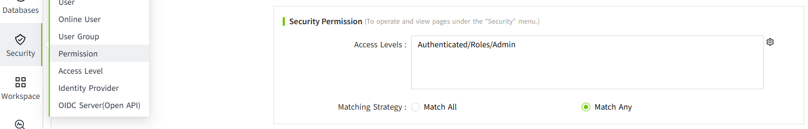

# Online Users

It is used to display all online users and manage them.

Only users with the "**security**" permission have the right to view this page.

For detailed configuration, please refer to [Permission](../security/permission.md).

Click "Security" -> "Online User" in the menu bar, and you can enter the Online User page.

The user type includes **Engineering User** and **Runtime User**.

An **Engineering User** can perform system configuration and design pages, while a **Runtime User** can only access and operate the project's runtime pages.

## Force Logout

When it is necessary to immediately terminate a user’s active session (for example, when permission changes need to take effect immediately, or when a user has occupied a session for an extended period), the administrator can click the **Force Logout** button for that user in the list to log the user out.

Once clicked, the system will immediately terminate the user’s current session and log them out. The user will need to log in again to continue accessing the system.

