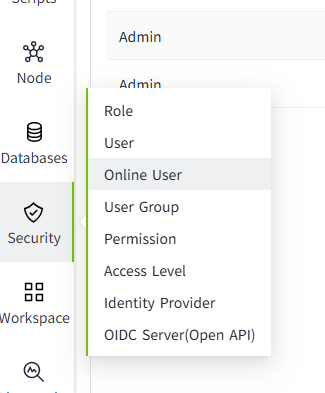
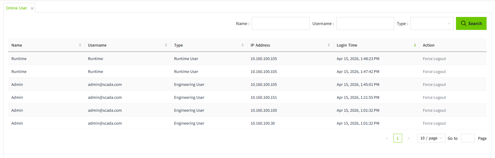

# Online Users

It is used to display all online user information and to count the number of online users.

Click "Security" -> "Online User" in the menu bar, and you can enter the Online User page.

The user type includes **Engineering User** and **Runtime User**.

 An **Engineering User** can perform system configuration and design pages, while a **Runtime User** can only access and operate the project's runtime pages.

## Force Logout

Users who have been granted **Security** permission are authorized to perform the **Force Logout** operation.

