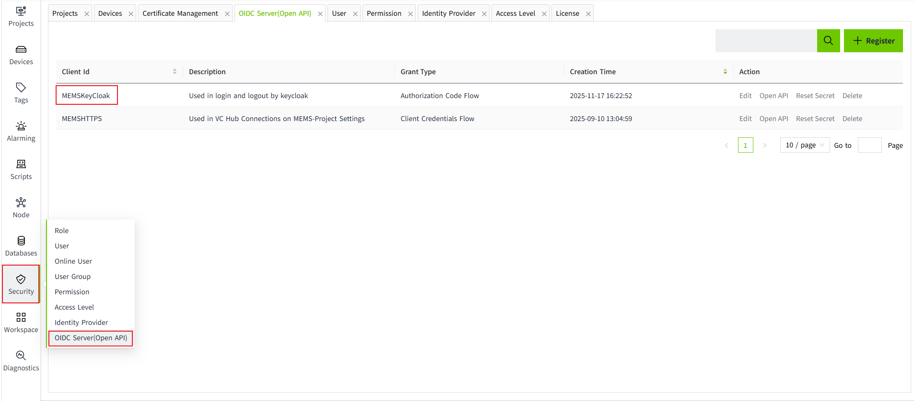
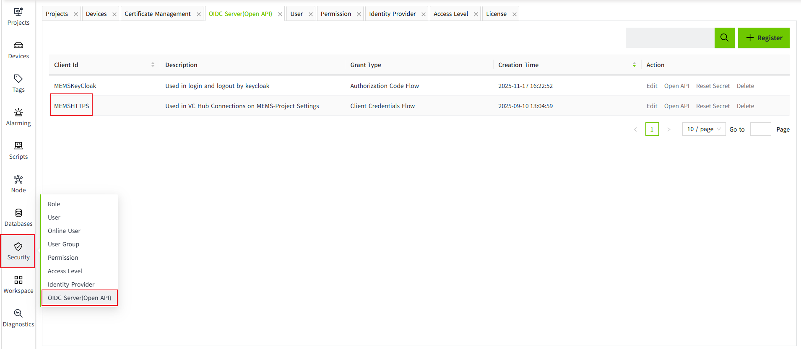
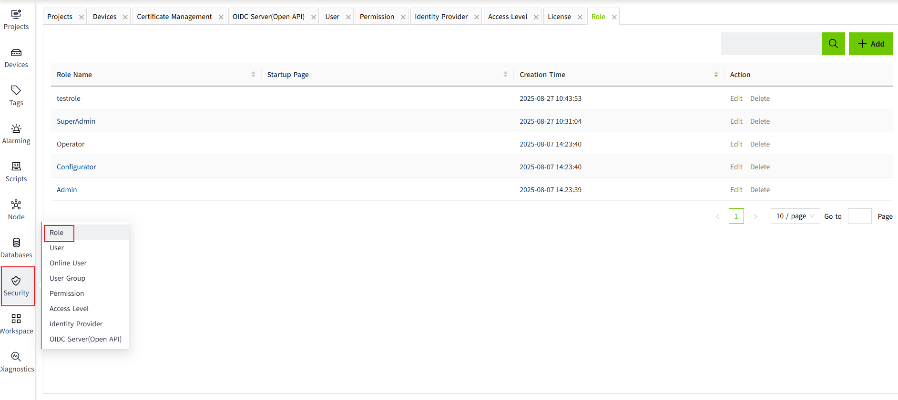
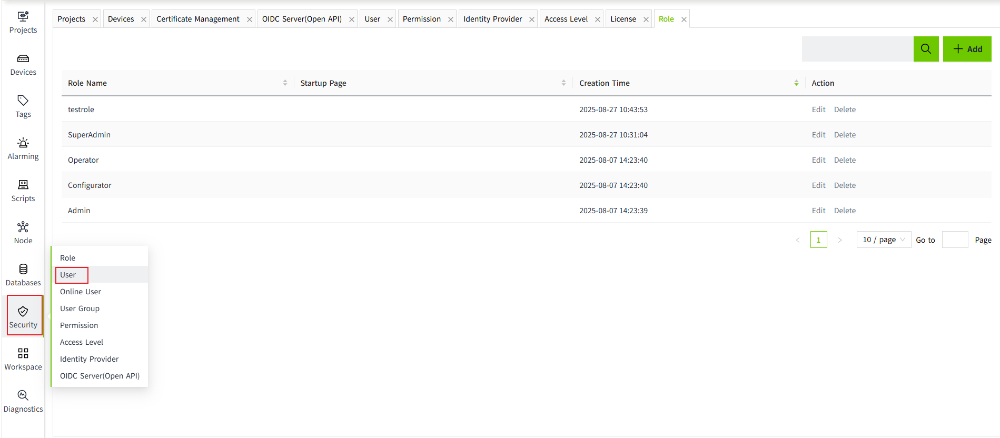
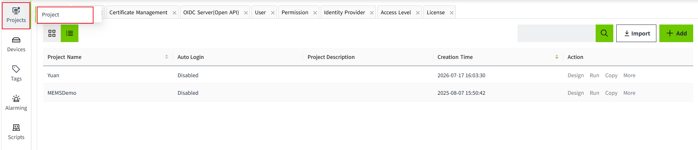
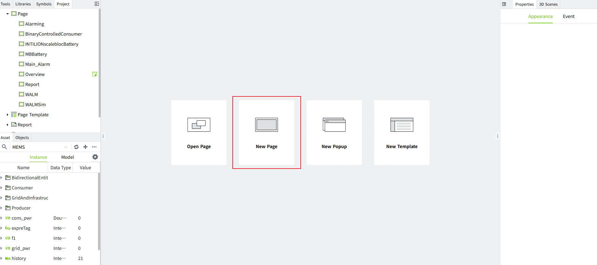
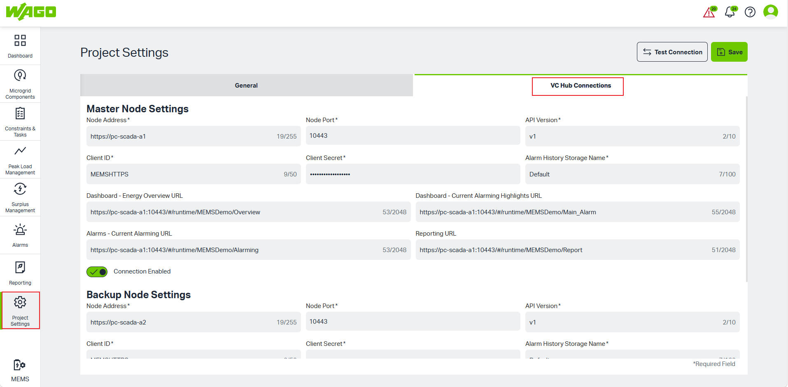
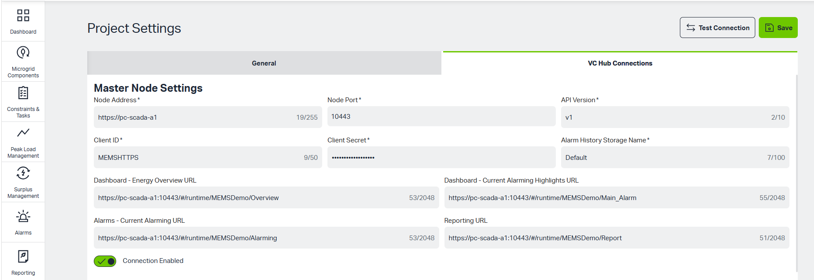
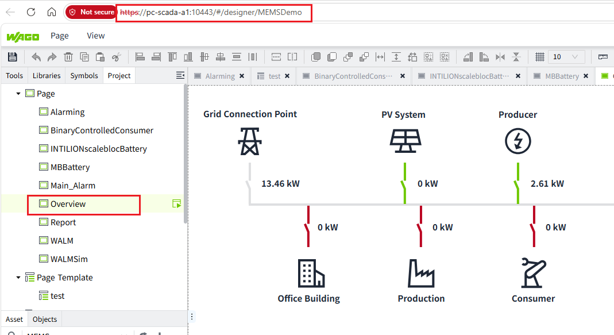

# Configuration
## VC Hub side:
## 1. Create a Client Id to use VC Hub as its identity provider to authenticate its end user.
Click Security >> OIDC Server(Open API)

For more details, users can refer to https://mm-zzg.github.io/vchub-en-v51/management-platform/security/open-api/?h=oi#register

## 2. Create a Client Id to use VC Hub Connections by making Open API requests from its backend.
Click Security >> OIDC Server(Open API)

For more details, users can refer to https://mm-zzg.github.io/vchub-en-v51/management-platform/security/open-api/?h=oi#register

## 3. Create a Role
Click Security >> Role

For more details, users can refer to https://mm-zzg.github.io/vchub-en-v51/management-platform/security/roles-and-users/?h=role

## 4. Create a user
Click Security >> User

For more details, users can refer to https://mm-zzg.github.io/vchub-en-v51/management-platform/security/roles-and-users/?h=role#creating-users

## 5. Create a Project
Click Projects >> Project

For more details, users can refer to https://mm-zzg.github.io/vchub-en-v51/management-platform/projects/#what-is-a-project

## 6. Design different pages
Click Projects >> Project >> Design >> New Page

For more details, users can refer to https://mm-zzg.github.io/vchub-en-v51/quick-start-guide/?h=new+page#55-create-a-new-page

## MEMS Side:
## 1. Configure page on MEMS
After logging into MEMS system, Click left navigation siderbar Project Settings >> VC Hub Connections tab

### 1.1 Master Node Settings

This area is used to configure the primary communication node for the system.

Node Address*: Enter VC Hub server address.

Node Port*: Enter VC Hub communication port number, default value 10443.

API Version*: Enter the API version number, default value v1. 

Client ID*: The client identifier used for authentication, enter Client Id which created on VC Hub. 

Client Secret*: The password used for authentication, enter Secret which created on VC Hub.

Alarm History Storage Name*: Specify the name of the storage repository for alarm data, default value Default. 

Dashboard - Energy Overview URL: Direct access link for the Dashboard >> Energy Overview page. 

Dashboard - Current Alarming Highlights URL: Link for the Dashboard >> Current Alarms page. 

Alarms - Current Alarming URL: Link for the Alams page. 

Reporting URL: Link for the Reporting page. 

Connection Enabled: Toggle switch. Green indicates Enabled (On), while gray indicates Disabled (Off).

Users can copy the url from VC Hub, replace "designer" to "runtime", append "/" Page name

### 2.2 Backup Node Settings

