# Peak Load Management
## 1. Introduction
Peak Load Management is designed to help users monitor and control power consumption within a microgrid. Its primary goal is to prevent power peaks from exceeding a defined threshold (Setpoint), thereby avoiding high demand charges or grid overloads. By integrating Battery Energy Storage, the system can automatically discharge power when a peak is imminent, achieving "peak shaving."

Peak Load Management is activated if "Activate Load Managent" toggle is activated in the "Project Settings" based on entered "Setpoints", "Upper Threshold" and "Lower Threshold".
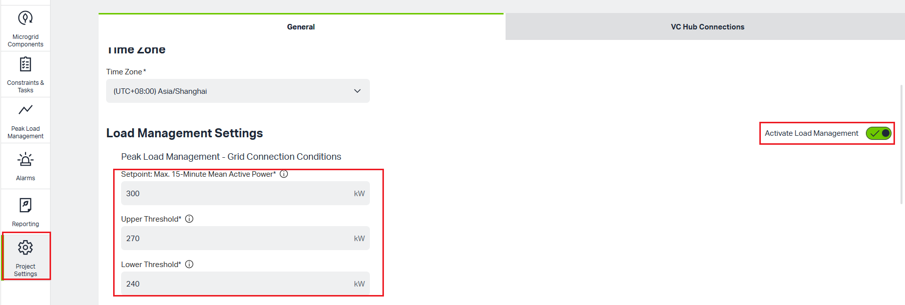

Users inactivate "Activete Load Managent" toggle, "Turn off" symbol displays to present the "Peak Load Management" feature of the system is currently inactivated.
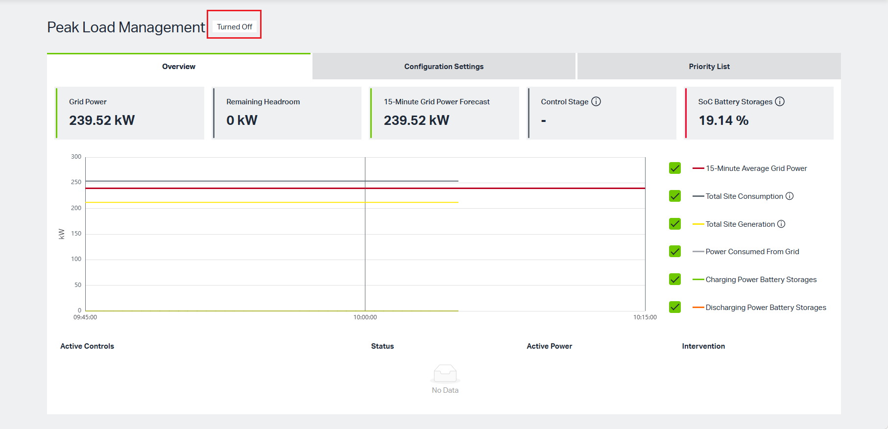

## 2. Interface Navigation & Layout
This module contains three main tabs:

**Overview**: Displays real-time power status, forecasts, and system active control states.

**Configuration Settings**: Used to display predefined limits, limits based on constraints, and different actions to avoid peak load.

**Priority List**: Used to display the priority of various Charging Infrastructure(WALM) when peak load shedding is required.

## 3. Overview page
The Overview page is divided into four main areas: **Key Metrics Cards**, **Real-time Trend Chart**, Legend, and **Active Controls List**.

### 3.1 Key Metrics Cards
The five cards at the top of the page provide core operational data for the current system status:

| **Name**                  | **Description** |
|---------------------------|---------------------|
| Grid Power                | The actual power currently drawn from the grid.                   |
| Remaining Headroom        | The available power remaining before reaching the peak Setpoint. |
| 15-Minute Grid Power Forecast | The system's predicted average grid power for the next 15 minutes, used for proactive decision-making. |
| Control Stage             | The current control stage the system is in.|
| SoC Battery Storages      | The average State of Charge (SoC) percentage of all connected controllable battery storages.|

Vertical status indicator bars Indicators：

Grid Power

    Red - Over Setpoint

    Yellow - Over Upper Threshold

    Green - Under Upper Threshold

Remaining Headroom

15-Minutes Grid Power Forecast

    Red - Over Setpoint

    Yellow - Over Upper Threshold

    Green - Under Upper Threshold
    
Control Stage - Stage [number according to actual stage]

    Grey - Not active

    Green - Active

    Red - Last stage reached and Peak Load not avoided ( Notification of the User )

Battery Storage SoC 

    Grey - there is no battery

    Green  - SoC > 80% 

    Yellow -SoC > 20% and SoC < 80%

    Red - SoC < 20% or SoC = 0%
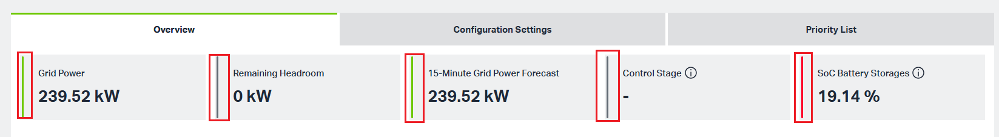

### 3.2 Real-time Trend Chart
The chart displays the trends of power parameters over time:
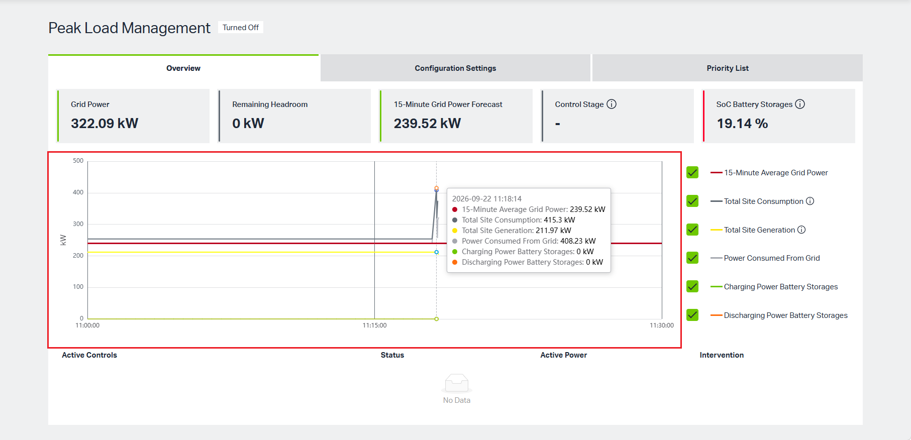

Tooltip: Users can hover over the chart displays data for a specific point in time.

### 3.3 Legend

The checkboxes on the right side of the chart control the visibility of different data curves. A checkmark indicates the item is currently displayed. Users can select/unselect checkboxes.
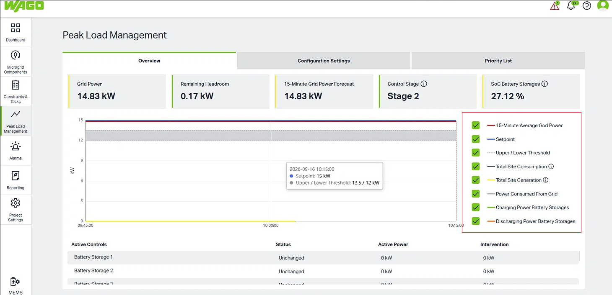

### 3.4 Active Controls List

This section shows the current control status of individual component which on stages.(Configuration Settings - Actions to Avoid Peak Load)

Active Controls: Lists managed components which from stages.

Status: Displays the current action state of the component.(Unchanged/Increased/Decreased)

Active Power: The actual current power of the Component.

Intervention: The power adjustment requested by the system for peak shaving.
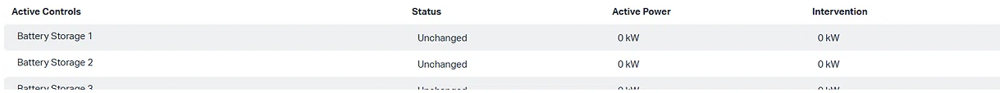

## 4. Configuration Settings page
This page is divided into two main areas: **Limits for Peak Load Detection** and **Actions to Avoid Peak Load**.

### 4.1 Limits for Peak Load Detection

Predefined Limits: 

The values are from Project Settings - General - Load Management settings.
Click the gear icon ⚙️ Limits, it navigates to Project settings page, and you can set values for Setpoint, Upper Threshold, Lower Threshold here.

Limits Based On Constraints:

If not configured, it displays as -kw.

If configured, the values are from Enabled Grid Setpoint Change constraint. 
Click the gear icon ⚙️ Constraints, it navigates to Constraints & Tasks page, and users can add new Constraints and Tasks here.
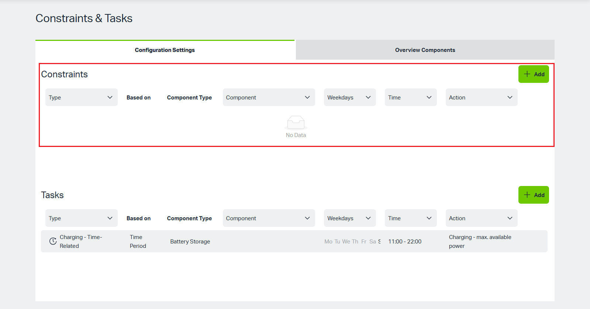

Users can add a new Grid Setpoint Change constraint.

Steps:

1. Click "Add" button.
2. Select "Grid Setpoint Change" Constraint Type and enter suitable values.
3. Click "Add" button and a new constraint is created successfully.

During Grid Setpoint Change type constraint enabled period, System's Setpoint, Upper Threshold, Lower Threshold of Predefined Limits are overwrited temporary by Limits Based on Constraints.

Note: Grid Setpoint Change type Constraint needs to wait to next 15-Minute Time Frame.

### 4.2 Action to Avoid Peak Load
When the system meets the trigger condition, the system will execute actions defined here in the order of "Stages."

#### Stage configuration

•Add a new Stage 1 - Discharge all at once for Battery Storages

1. Click the green + Add Stage button

2. Select "Discharge Battery Storages" for "Action" field

3. Select "Dischage all at once" for "Discharge selection" field

4. Enter suitable value for "Reduce to Target SoC"

5. Select target battery storage for "Component" field

6. Click "Save" button, and Stage 1 is created successfully.

Notes：

1. If the battery storage's SoC is "Not Set", "Some components have no Minimum SoC. Please change in component settings." message is displayed, users can click "Edit" button to set it.

Step 1: Click "Edit" button, there will open a new window, and navigate to "Microgrid Components - Components- Control Parameters" page.

Step 2: Click "Edit" button, enter suitable value for "Minimum State of Charge" field, click "Save" button.

Step 3: Switch to the first window, the setted value is populated.

2. If value of "Target SoC/Minimum SoC" is higher than value of "Reduce to Target SoC", "Minimum SoC of some components is higher than Target SoC. " message will display, users can still add the battery storage to the stage.
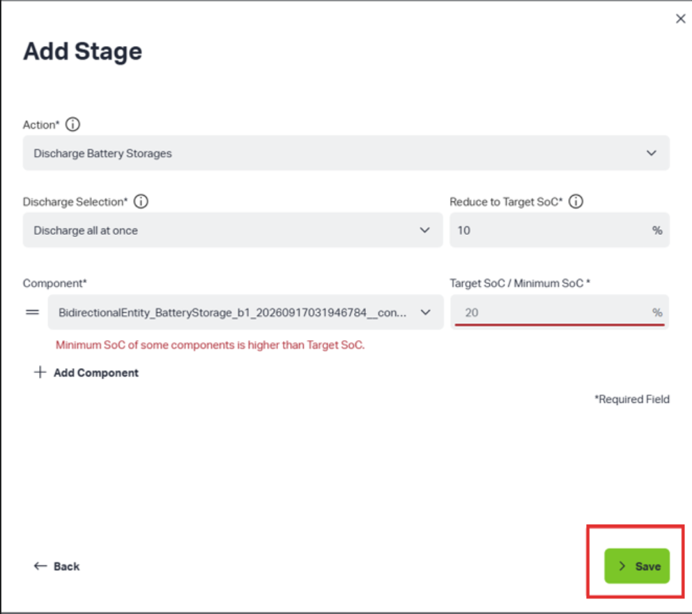

3. If want to add more Components on this stage, users can click "Add Component" button.

4. If want to delete added Component, users can click "Trash" button.

•Add a new Stage 2 - Discharge one after each other for Battery Storages.

1. Click the green + Add Stage button.

2. Select "Discharge Battery Storages" for "Action" field.

3. Select "Dischage one after each other" for "Discharge selection" field.

4. Select target battery storage for "Component" field.

5. Click "Save" button and Stage 2 is created successfully.

•Add a new Stage 3 - Decrease Consumption of Controllable Consumers

1. Turn on the toggles that users want.

2. Click "Save" button and Stage 3 is created successfully.

•Add a new Stage 4 - Turn Off Binary Controlled Consumer

1. Click the green + Add Stage button

2. Select "Turn off Binary Controlled Consumer" for "Action" field

3. Select target component for dropdown list for "Component" field

4. Click "Save" button, and Stage 4 is created Successfully.

Note: 

Before performing the turn-off Binary Controlled Consumer stage operation, please confirm that the status indicator next to the target component is green. Green indicates the component is online, and the system can successfully issue the 'Turn Off' command. If the indicator is red, it means the component is offline, and the system will not be able to effectively control it to reduce power consumption.
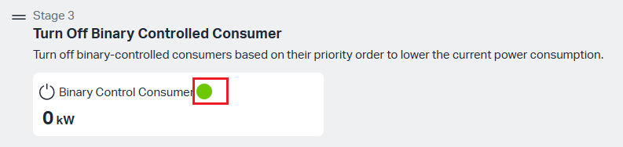

•Edit a Stage

1. Click "Edit" button.

2. Selected target values.

3. Click "Sava" button.

•Delete a Stage

1. Click "Delete" button.

2. Click "Delete Anyway" button.

•Notification of the User stage

This stage is default notification stage, this stage is entered when automatic control methods have been exhausted but the overload problem persists.

Tips:

1. If users want to adjust the sequence of stages，users can do it by dragging.
Move the mouse to the Drag Icon (≡), and the cursor will change to cross. hold on the left mouse button and drag the stage to the desired location.

2. Click "Show All ↓" button will expand the list downward to expand all the component assigned to that stage.

3. Click "Hide ↑" to hide the extra items to save screen space.

#### Explanation of Stage

**Discharge Battery Storages**

| **Name**                  | **Description**                      |
|---------------------------|--------------------------------------|
| Target                    | The desired state of charge (SoC) the battery storage is intended to discharge down to.                                                 |
| Actual                    | Real-time state of charge(SOC)                                                        |
| Blocked                   | The battery storage can not be used because license capacity exceeded                                                           |

**Descrease Consumption of controllable Consumers**

| **Name**                  | **Description**                      |
|---------------------------|--------------------------------------|
| Low Priority              | Classification for Components that are minimal.     |           
| Mid Priority              | Classification for Components that are important, but not critical.                                                          |
| High Priority             | Classification for Components that are critical.                                                          |
| Limit                     | Refers to the maximum power consumption limit allowed for the component during this stage.                                                 |
| Previous                  | Refers to the power limit value of the component before entering this stage.                                                             |

## 5. Priority List page

In the "Priority List" tab, users can view and manage the priority order of all **controlled** Charging Infrastructure(WALM). When executing peak-shaving actions, the system will limit WALM power consumption sequentially based on the order in this list.
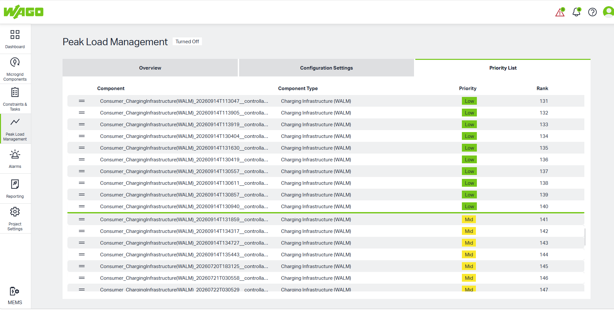
Tips:

1. Users can click and hold the icon to drag rows up and down to the desired position.
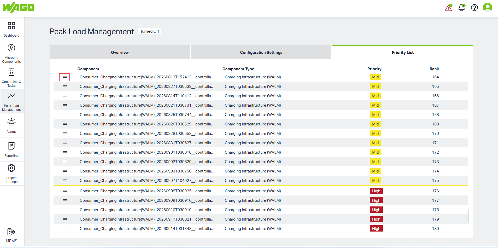
2. Users can click and hold the Priority line to change the priority quickly.
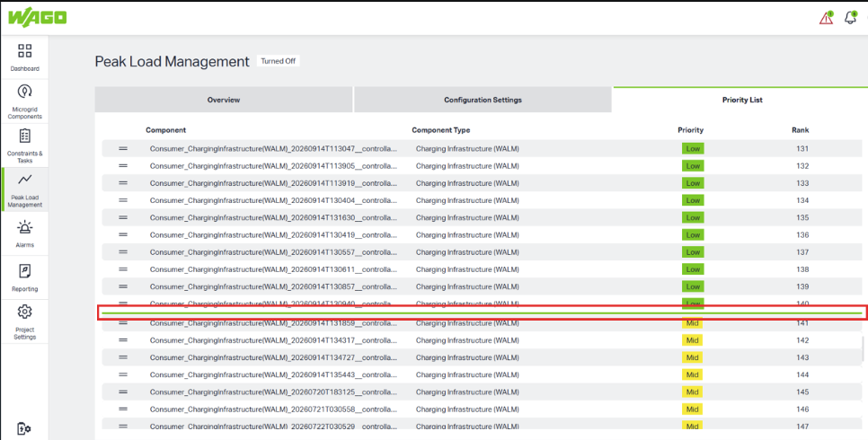