# Dashboard Overview

There are three main functional modules on the dashboard: Energy Overview, System State, and Current Alarms.

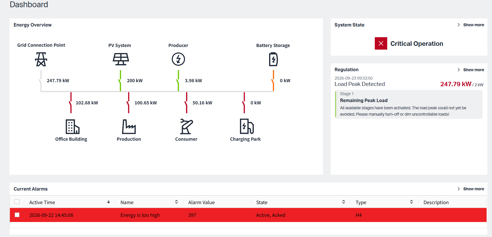

## 1.Energy Overview

MEMS (Microgrid Energy Management System) manages electricity generation, consumption, and storage within a microgrid. It continuously balances supply and demand to ensure stable, efficient, and reliable operation. The system includes generation/supply roles, consumption roles, and a battery storage role.

#### 1.1 Energy Roles

MEMS allows users to customize Energy Roles by assigning different types of components to predefined role categories. These Energy Roles determine how a component participates in monitoring, reporting, energy balancing, and control.

The system provides four Energy Role categories:

1. Grid & Infrastructure

2. Producer

3. Consumer

4. Bidirectional Entity

Each category contains specific component types that can be bound to real devices or data sources. After binding and synchronization, the system can display real-time data and include the component in energy calculations, reports, alarms, and regulation logic.

| Energy Role Category | Available Component Types | Main Purpose | |
| :--- | :--- | :--- | :--- |
| Grid & Infrastructure | Grid Connection Meter, Total Meter | Bind to the external grid and participate in energy exchange with the outside. |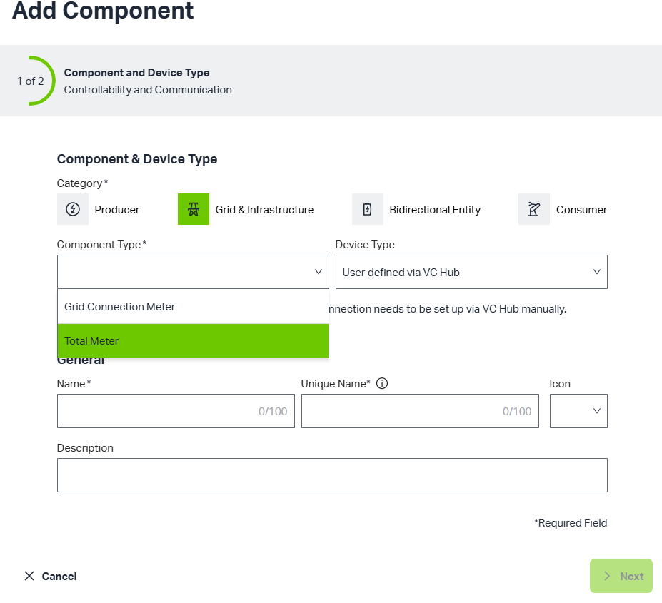|
| Producer | PV Inverter, Generation Meter, Datalogger | Bind to internal generation devices and monitor generated electricity in real time. |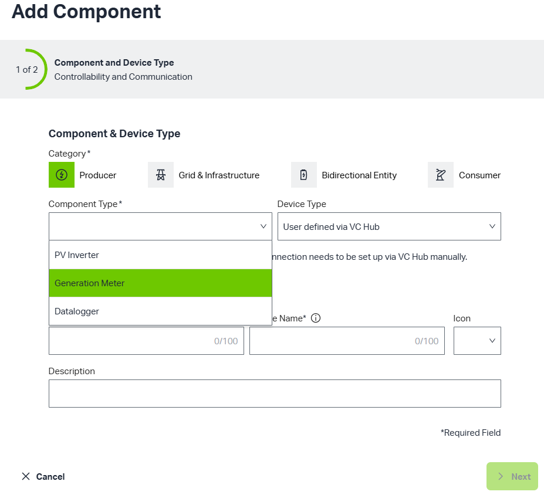|
| Consumer | Charging Infrastructure (WALM), Consumption Meter, Binary Controlled Consumer | Bind to internal consumption devices and monitor consumed electricity in real time. |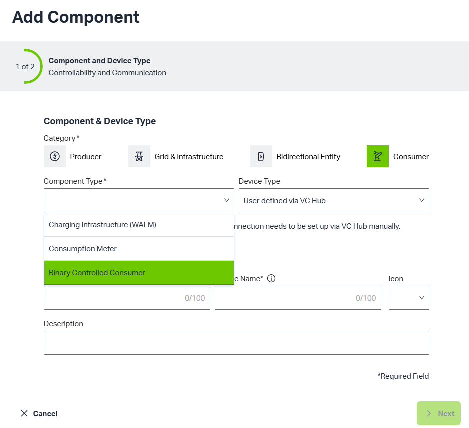|
| Bidirectional Entity | Battery Storage | Store surplus energy and discharge when energy is insufficient. |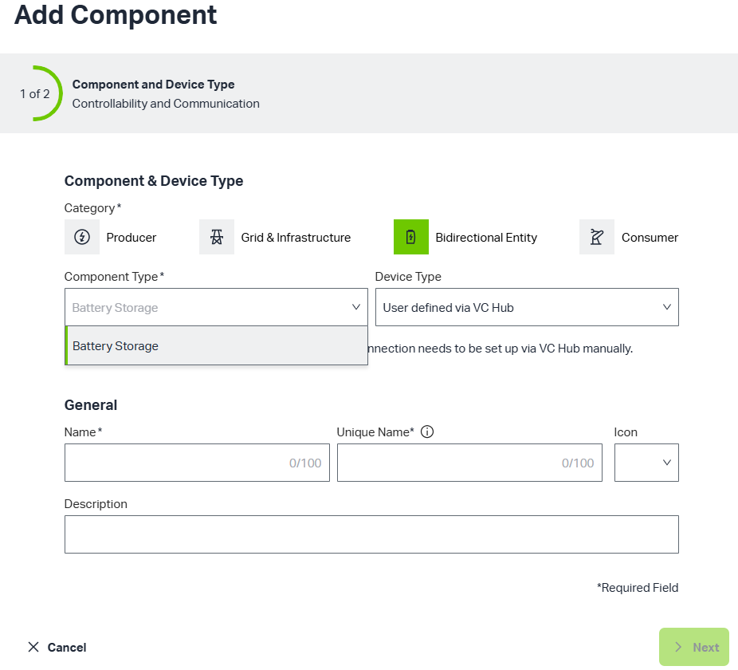|

Users can create the following components and configure the relevant information in VcHub, and then can see the real-time effect on the overview.

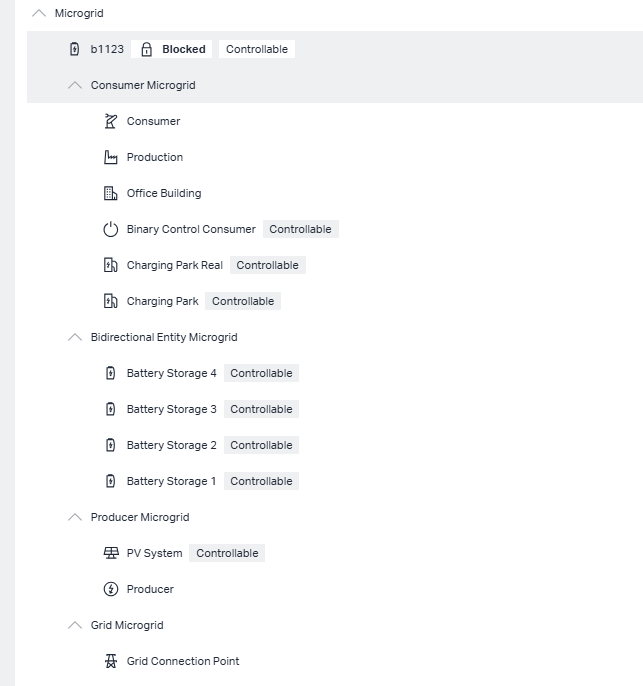

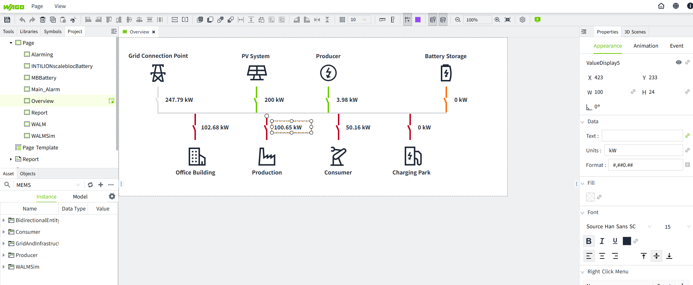

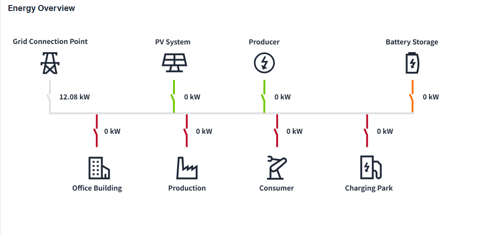

Refer to [Project Configuration](../../2d-visualization/index.md) for the VcHub interface configuration

#### 1.2 Definition of Metric

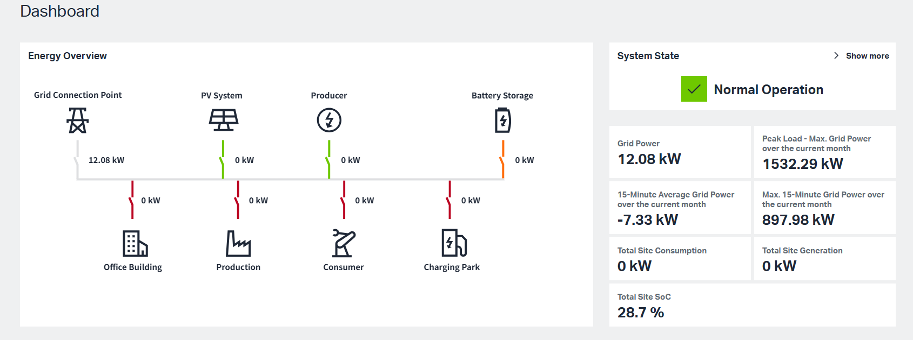

| Metric | Definition |
| :--- | :--- |
| Grid Power | Represents the aggregated value of the Grid Connection Meter(s). |
| Peak Load – Max. Grid Power over the Current Month | The maximum Grid Power value recorded during the current month. |
| 15-Minute Average Grid Power over the Current Month | The average of all 15-minute average Grid Power values in the current month. |
| Max. 15-Minute Grid Power over the Current Month | The maximum value among all 15-minute average Grid Power values in the current month. |
| Total Site Consumption | The sum of electricity consumed by all consumption endpoints in the system. |
| Total Site Generation | The sum of electricity generated by all generation sources in the system. |

## 2.System State

The System State reflects the overall operating condition of the MEMS system. It changes dynamically based on two main factors:

1. Peak Load Management activities.

     When Peak Load Management is enabled in Project Settings, the system continuously monitors the 15-Minute Grid Power Forecast against the configured setpoint.

     | Condition | System State |
     | :--- | :--- |
     | 15-Minute Grid Power Forecast > Setpoint | Critical |
     | 15-Minute Grid Power Forecast < Setpoint | Normal Operation |
     | System is under Reactivation| Limited |

     If System State is 'Normal Operation', Data Metric is displayed under 'System State'

     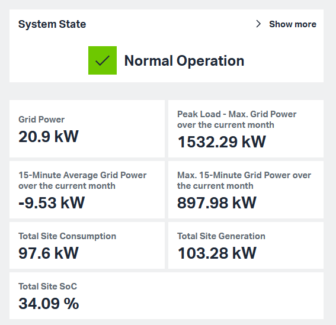

     If System State is 'Critical Operation', system will trigger the regualtion stage set in PeakLoad Management, and the regulation stage list is displayed under 'System State'

      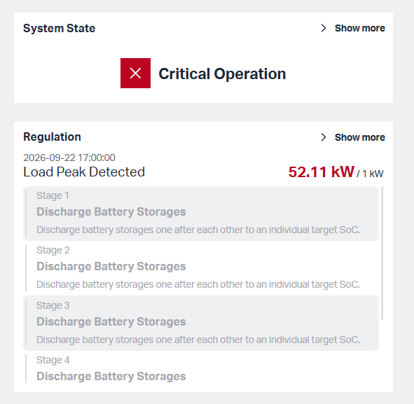

      If System State is 'Limited', system will display regulation list for 60 seconds 

2. User-defined alarms.

    1. When user-defined alarm condition is met, and alarm lever is 'critical'/'high', the System State changes to 'Critical Operation' to alert the user. The alarm appears in the Current Alarms list and the Alarm interface.

         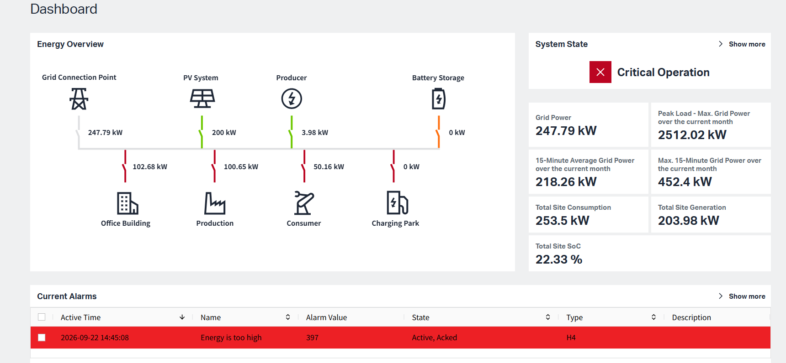

         Click 'Show more' button, it will turn to Alarms page to display more detailed alarm infomation 

         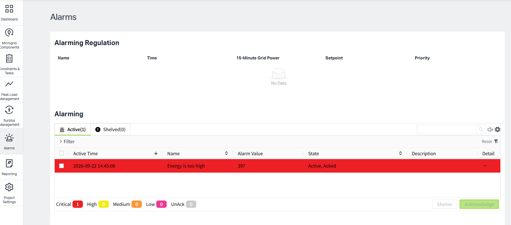

    2. When alarm lever is 'medium'/'low', the System State changes to 'limited'. The alarm only appears in the Alarm interface.

         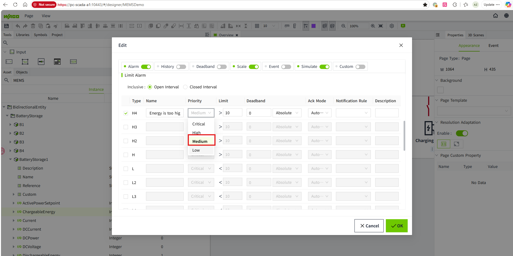

         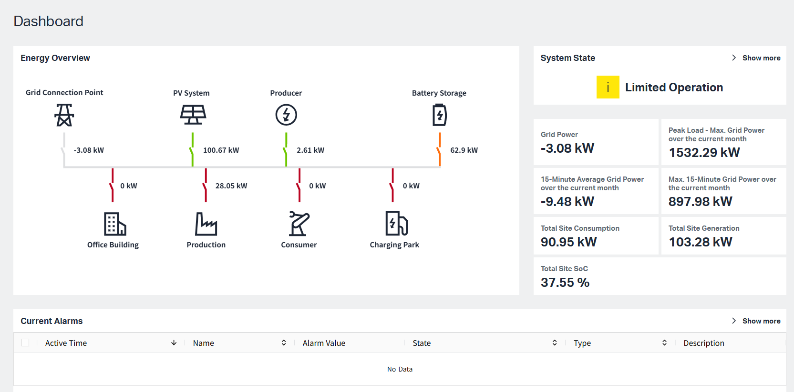

         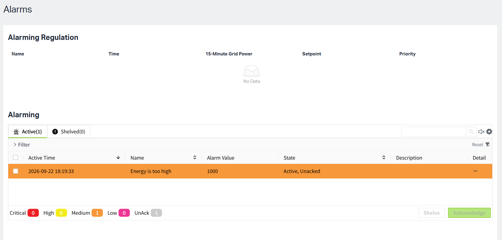
     
     

## 3.Current Alarm

The Current Alarm only display user-defined 'critical/high' alarm content. Refer to [Alarm](../../management-platform/assets-and-tags/tag/tag-properties/alarm.md) for setting up alert conditions

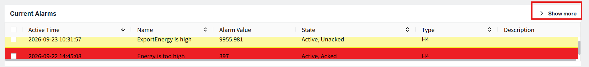

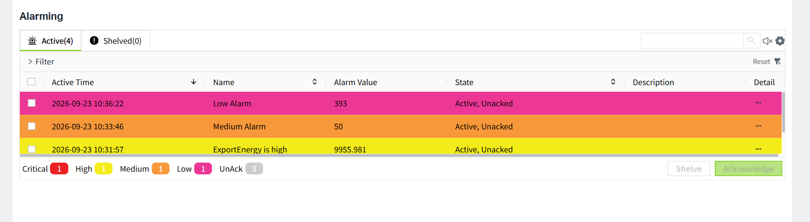
