# User Interface Overview

## Top Bar Functions

The top area of the MEMS user interface provides three main categories of functions:

1.Message Notifications

2.Version Information

3.System Login

### 1. Message Notifications 

Message notifications indicate normal system events, successful operations, or automatic regulation activities, generally divided into three categories based on severity and display color:

| Color | Severity | Meaning | Typical Operator Action |
| :--- | :--- | :--- | :--- |
| Yellow | Warning | A potential issue or abnormal condition that requires attention. | Monitor the condition and take preventive action if necessary. |
| Red | Error / Critical | A fault, failure, or critical condition that may affect system operation. | Immediate action is required. Follow the alarm handling procedure. |
| Black | Info | A normal event, status change, or successful operation. | No immediate action is required. Review if needed. |

Below action will trigger info message on black icon:
1. VcHub is successfully connected
2. Sync is started or completed
3. System trigger Peakload regulation
4. System trigger Avoid Peakload regulation
5. System trigger Reactivation regulation
6. System stop Reactivation regulation

Below action will trigger Error / Critical message on red icon:
1. VcHub is disconnected
2. License expired

Below action will trigger Warning message on yellow icon:
1. Sync failed
2. No License 
3. License almost expired
4. Surplus regulation failed

Count of unread message will displayed on the top of icon, click icon, detailed messsage will show on the list. 

Click 'Mark all read' button, system will automatically read all unread message, the number of unread messages will decrease 0.

Click 'Clear all' button, system will automatically delete all messages on the list

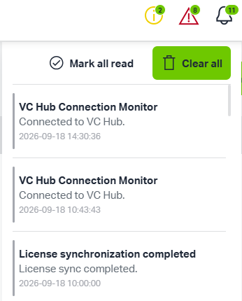

Error / Critical messages cannot be removed from the notification list until a user has explicitly acknowledged them. It prevents critical events from being missed, ignored, or deleted without being reviewed.

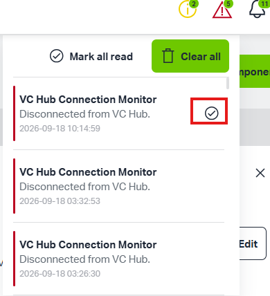

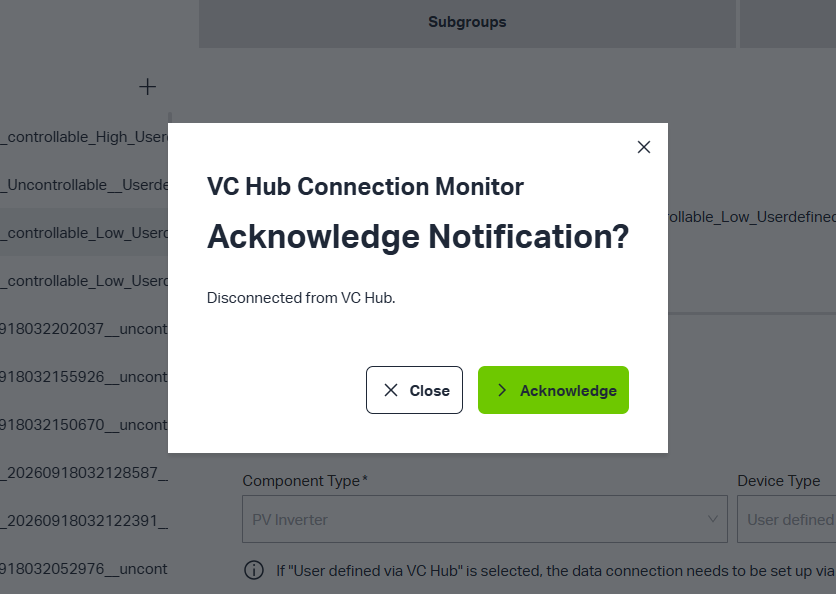

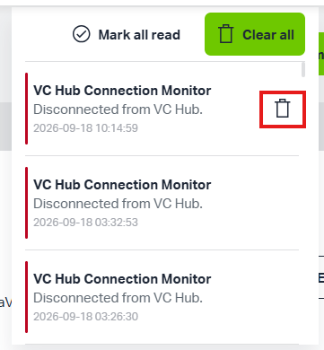

When all the Error / Critical or Warning messages are cleared , the relevant icon will disappear

### 2.Version Information

Click Version Infomration button, Version Infomration will display

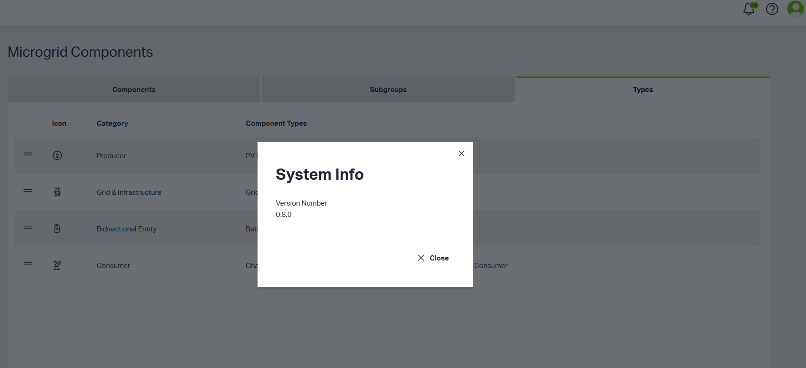

### 3.System Login

The user avatar in the top bar provides access to account-related functions. Clicking the avatar displays detailed user information. Clicking the Logout button allows the user to securely exit the system.

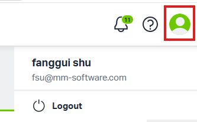

## SiderBar Functions

MEMS  provides an integrated set of functions for configuring, monitoring, controlling, and reporting on microgrid operations. It supports the full workflow from component creation and data connection to automatic regulation, alarm handling, system configuration, and energy reporting.
Users can do these actions by clicking the sidebar button.

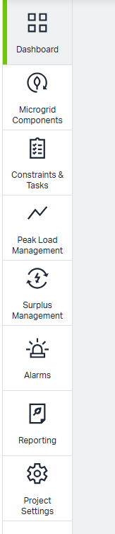

### 1.Dashboard

The Dashboard provides a centralized overview of energy usage across the system. It summarizes how energy is generated, consumed, stored, and exchanged, allowing users to quickly assess the current operating condition of the site.

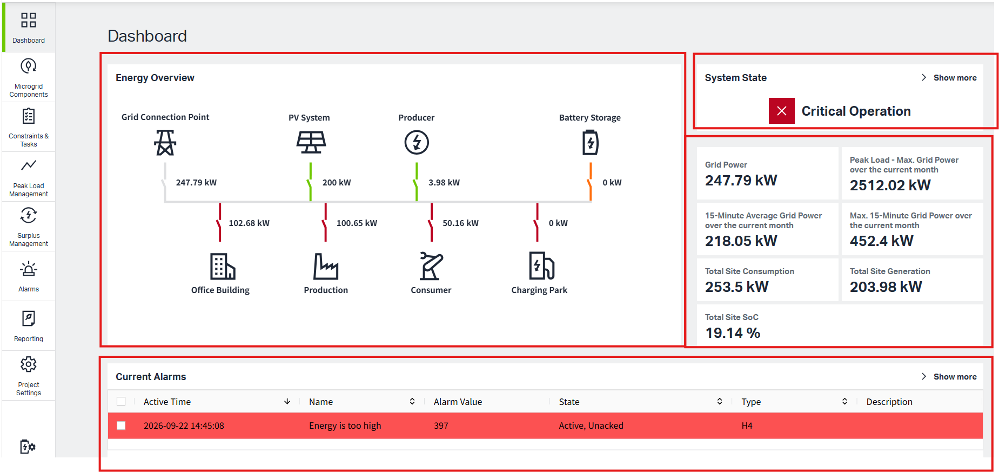

'Energy Overview' display an overview of energy usage for all configured endpoints, and allow users to configure consumption endpoints and generation endpoints in VcHub.

'System State' detect abnormal conditions based on Load Management Settings or user-defined alarm, displaying the corresponding system status.

'Alarm' can display user-defined alarm when the setting alarm conditions are triggered.

### 2.Microgrid Components

The Microgrid Components page allows users to build and manage the logical structure of the microgrid by adding different components, subgroups or folders

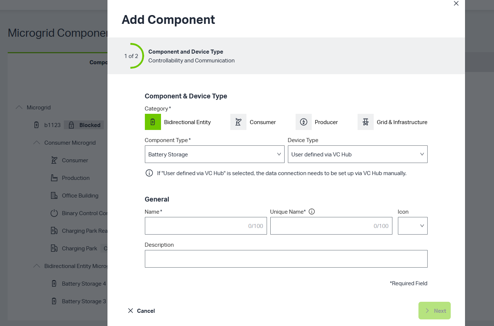

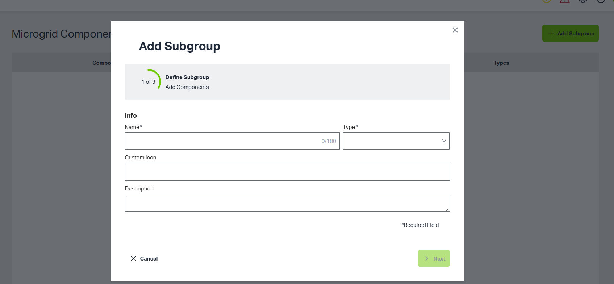

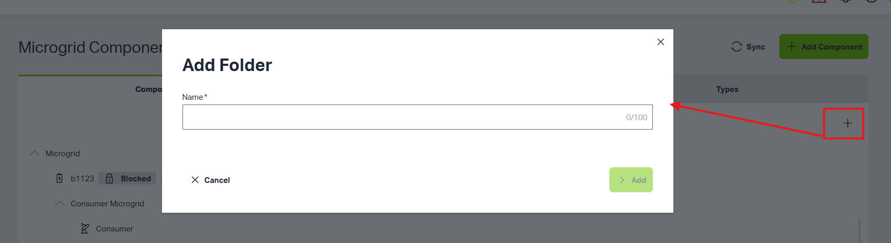

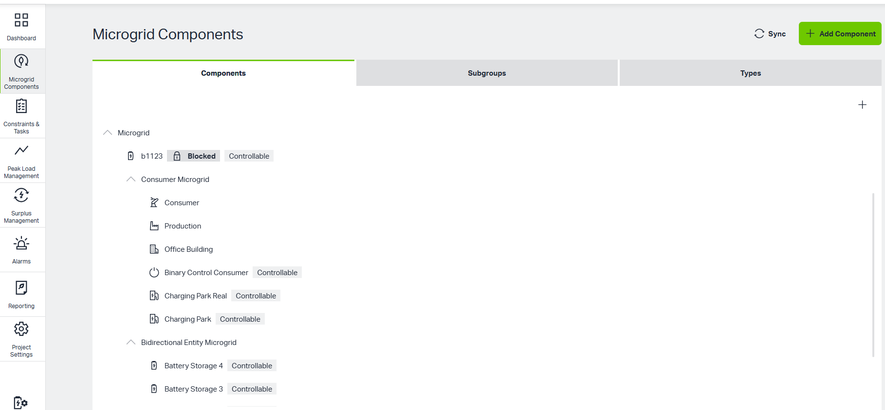

Users can create different types of components and synchronize them to VcHub. 

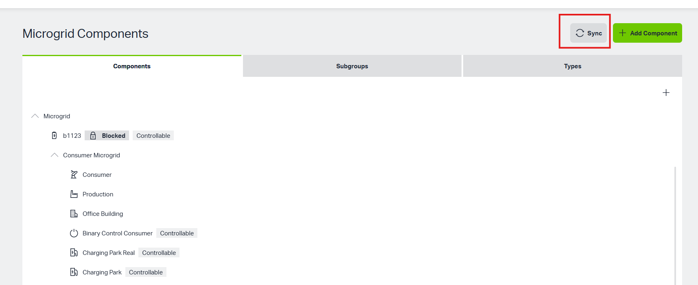

Once synchronized and connected to real data sources, component data is available on the component details page.

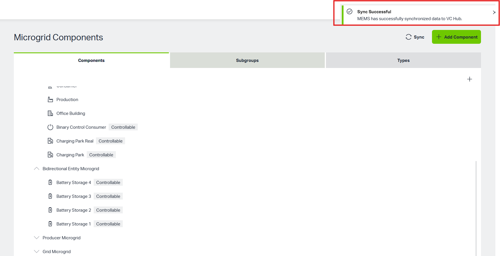

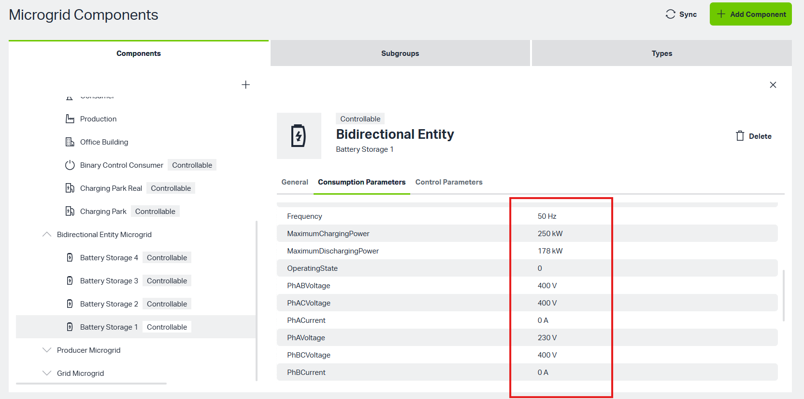

### 3.Constraints & Tasks

The Constraints & Tasks page allows users to define time-based Constraints and Tasks, and scheduled actions for the microgrid.

Constraints limit how the system or a component may operate during a specified period. Tasks can schedule charging a battery component during a specified period.

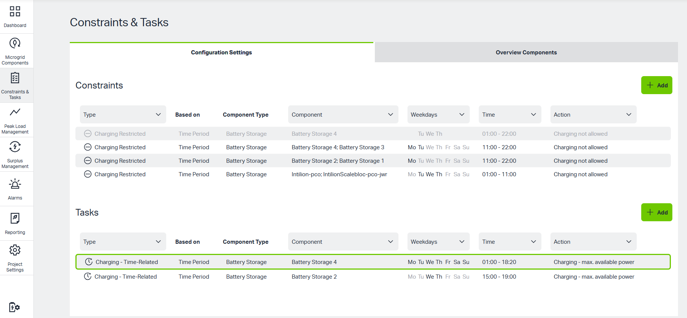

### 4.Peak Load Management

Peak Load Management is a control and monitoring function that helps maintain grid power and site consumption within a configured range. It provides two main capabilities:

1. Display system energy changes — visualize how generation, consumption, storage, and grid exchange vary over time.

     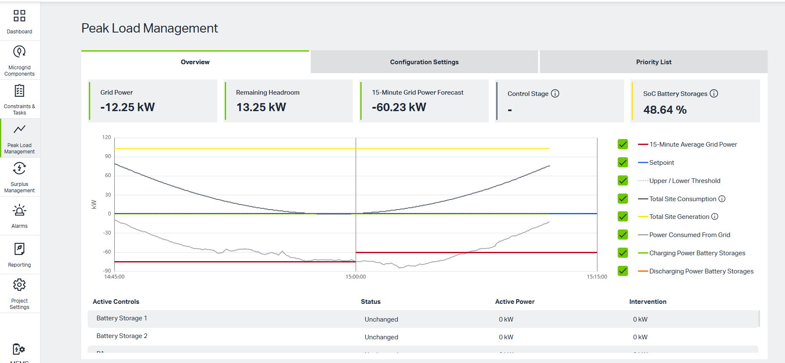

2. Adjust system consumption — automatically regulate consumption when it is too high or too low, keeping operation within the configured reasonable range by using created satges

     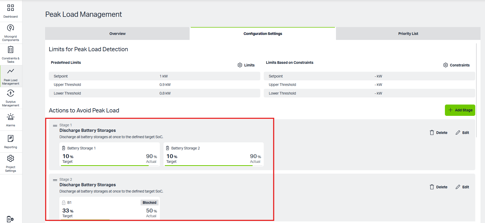

This function supports peak shaving, demand charge reduction, grid stability, and efficient use of renewable generation and battery storage.

### 5.Alarms

The Alarm interface provides a centralized view of all alarms generated in the system. It displays two main categories of alarms:

1. Regulation-triggered alarms — alarms generated automatically by the system during regulation actions, such as peak load management, battery control, or surplus handling.

2. User-defined alarms — alarms generated when a condition configured by the user is met, such as a threshold, anomaly, or custom event.

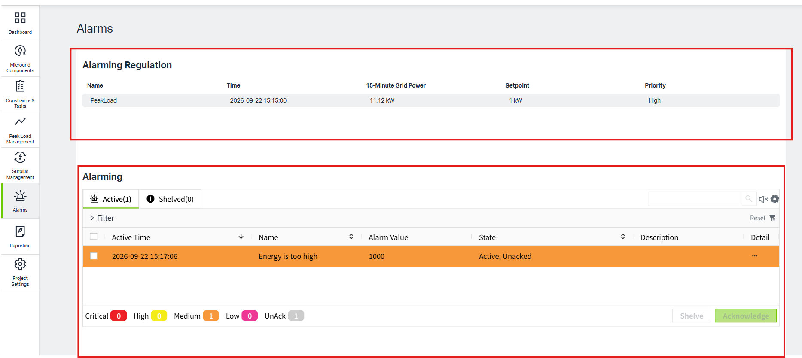

The Alarm interface helps users monitor system health, respond to abnormal conditions, and review historical events.

### 6.Reporting

The Reporting interface provides users with a clear view of energy consumption over time. It supports both annual and monthly consumption views, allowing users to analyze trends, compare periods, and support energy management decisions.

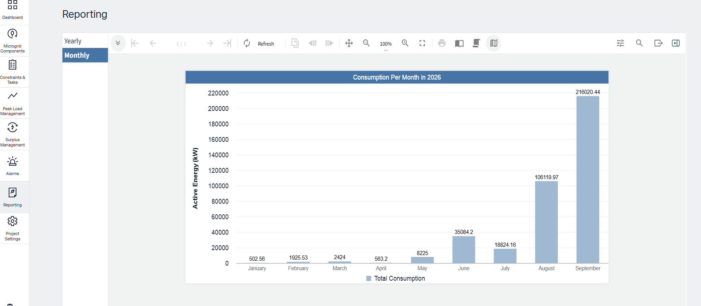

The range of data that users can see is controlled by configuration in the Project Settings page. Only data within the configured visibility range will be displayed in reports.

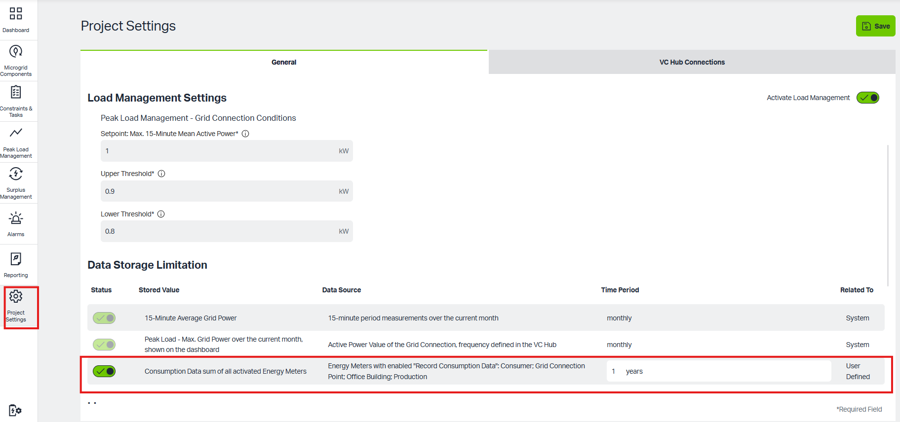

### 7.Project Settings

The Project Settings page provides system-level configuration options for the MEMS project. It allows authorized users to define basic project information, control time and regional settings, enable or disable load management, manage data retention, configure licensing, and verify connectivity to VcHub.

This page typically includes the following configuration areas:

1. Modify Project Information, set System Time Zone

     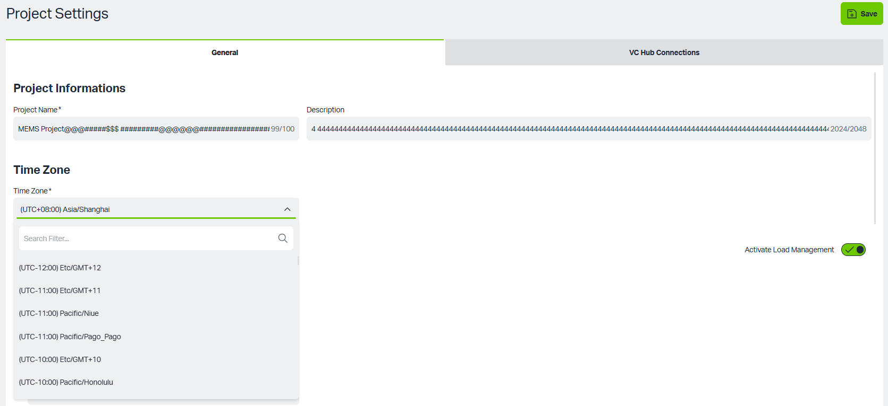

2. Set Load Management

     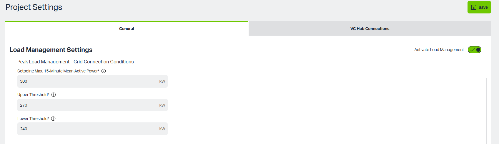

4. Set Data Storage Period

     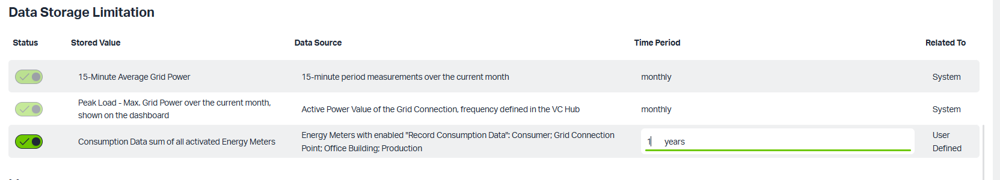

5. License Configuration
     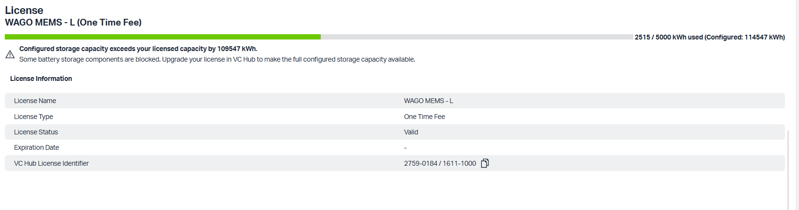

6. VcHub Connection Test

     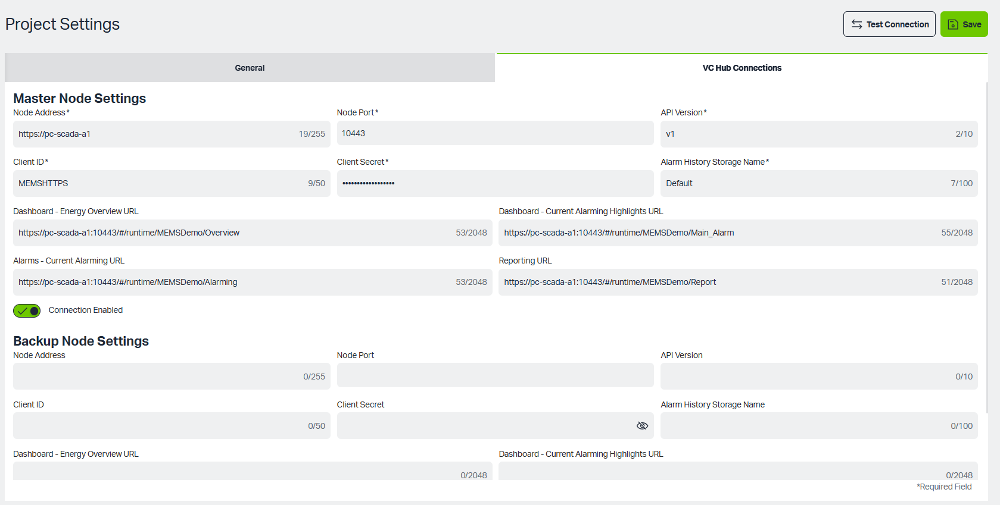