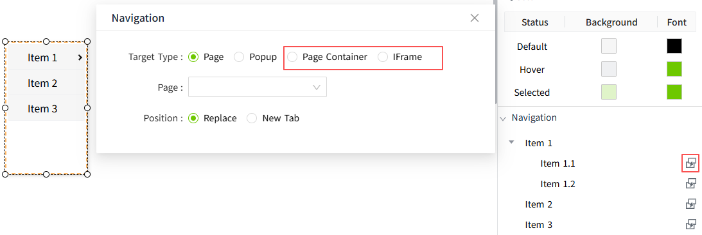

# New in this Version

## Separate licensing for runtime and engineering users

The **user type** have been added for users,including **Engineering User** and **Runtime User**. 

When a user logs in, the system opens the corresponding interface based on the assigned user type.

- After logging in, **Engineering Users** are redirected to the Admin Console page, where they can perform system configuration and access design-related pages.

- After logging in, **Runtime Users** are directed to the runtime pages for system monitoring and operation.

Users with security permissions can view all currently online engineering and runtime users under the **Security → Online User** menu. They also have the ability to force log out selected users.

## IEC 60870-5-104

The system now includes support for the IEC 60870-5-104 (IEC 104) communication protocol, enabling VC Hub to communicate efficiently and reliably with industry-standard power equipment and dispatching systems, and providing real-time monitoring and remote control capabilities while enhancing system interoperability and industry compatibility.

## Add New License Types

- Added a license item for 100,000 I/O tags
- Added a license item for IEC 104
- Added a license item for 20 Engineering Concurrent Online Users and 200 Runtime Concurrent Online Users
- Added a license item for 50 Engineering Concurrent Online Users and 500 Runtime Concurrent Online Users

## Concurrent Online Users Include Engineering Users and Runtime Users

Increased the number of runtime concurrent users based on the existing concurrent online user count.

|Original Logic	            |New Logic                              |
|---------------------------|---------------------------------------|
|1 concurrent online user	|1 engineering user and 10 runtime users|
|2 concurrent online users	|2 engineering users and 20 runtime users|
|5 concurrent online users	|5 engineering users and 50 runtime users|
|10 concurrent online users |10 engineering users and 100 runtime users|
|20 concurrent online users |20 engineering users and 200 runtime users|
|50 concurrent online users	|50 engineering users and 500 runtime users|

## OPEN APIs Enhancement

This release significantly enhances the OpenAPI capabilities.

 It introduces batch and CRUD (create, read, update, delete) APIs for assets, models, instances, tags, and alarm configurations, along with improved metadata support such as extended attributes and the ability to retrieve full tag information in a single response. Error messages have also been improved to provide clearer and more consistent feedback.

In addition, full lifecycle management APIs are provided for Modbus TCP devices and frames, including creation, modification, deletion, start/stop control, connection status subscription, connection testing, and device querying with frame information.

## Two New Navigation Types Added to the Menu Control

When clicking a menu item in the Menu control, in addition to the existing options of navigating to a new page or opening a new popup window, two new navigation types have been added: **Page Container** and **IFrame**.

Within a Page Container or IFrame, users can now switch between different pages by clicking menu items without refreshing the current page.

