# Quick Start Guide

# 1. System Requirements

Recommended hardware configuration

- x86 64bit, 4 cores
- 16 GB RAM
- SSD with at least 10G free space (pending in the database)

Supported Operating Systems

- Linux (support for popular distributions, tested with Debian and Ubuntu)
- Windows 10/11
- Windows Server 2019/2022

Supported Browsers

- Google Chrome (Latest Version)
- Microsoft Edge (Latest Version)

# 2. Download installation package

Download the latest VC Hub version from the WAGO Download Center.

https://downloadcenter.wago.com/wago/software

There are two versions available for download: **Linux** and **Windows**. 

You can download whichever one suits your actual needs.  

 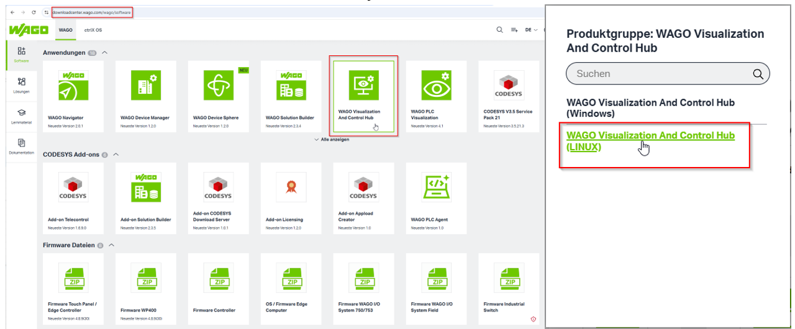

 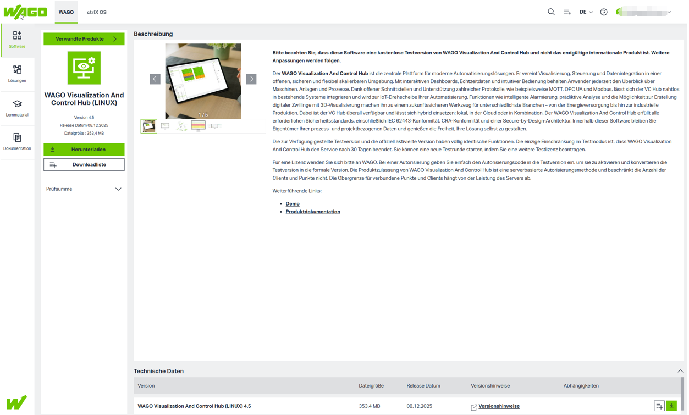

Upload the installer package to the desired computer.

The easiest way is to use a file transfer tool such as WinSCP or FileZilla.
 
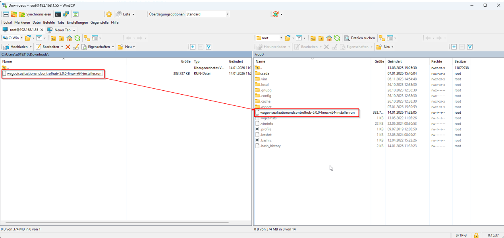

**Be ensured before installation:**
- The device must be accessible to the operator / administrator on the network. At the latest when the application has been installed on the target system, all further steps are carried out via the VC Hub web interface.
- To install the VC Hub, the technician requires administrative rights, meaning they must be a member of the root / sudo group on the target system.
- The target computer requires access to the Internet, as any packages that are not available during installation will be installed automatically. Access to the Internet is also required after installation for licensing the system with the Wago registration server. After that, Internet access is no longer necessary.

# 3. Install VC hub

## 3.1 Windows Environment

**Recommended Systems**

- Windows Server 2012 R2
- Windows Server 2016
- Windows Server 2019
- Windows Server 2022
- Windows 10 (Not supported in Home Edition)
- Windows 11 (Not supported in Home Edition)

**Installation Steps**
1. Run the installation package program as an administrator.
2. Select the installation language.
3. Perform a port check, if the port is occupied, the installation cannot proceed.
  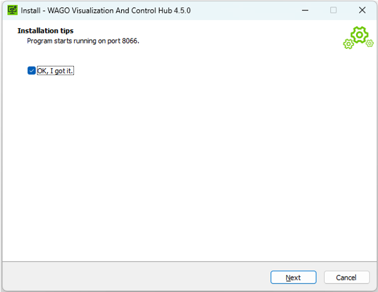
4. Read and accept the license agreement.
5. Choose the installation location.
6. Select the VC Hub application data directory.
7. The installation process will take a few minutes. 
8. The installation is complete. Check the Checkbox as shown in the picture below, then click "Finish”. 
   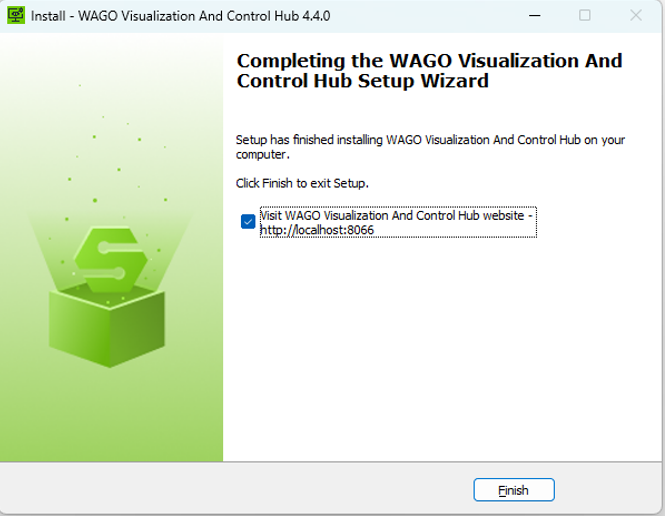
9. You will enter the process of creating the user interface. Create an administrator user. Remember this username and password, as you will use them to log in for the first time.
   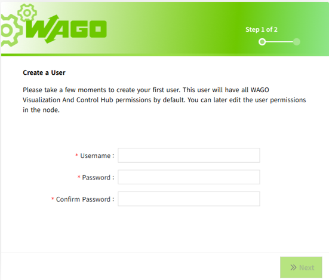
10.	Port configuration.The VC Hub suggests ports 8066 and 10443 for the web interface.
   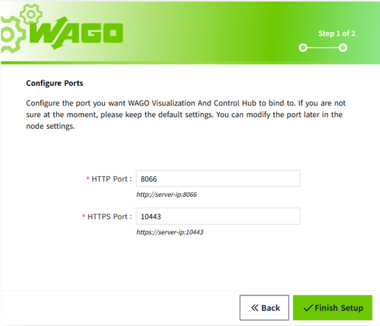
11.	After completing the above steps, wait for the program to load, and then you can log in to the default-created workspace with the user created in step 1.
   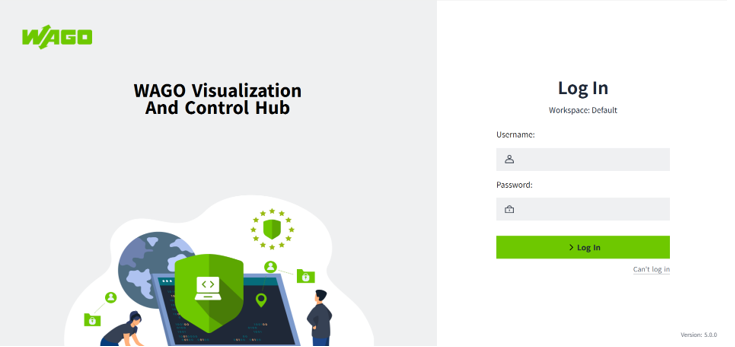

**Notes:**
With https, only a self-signed certificate is currently available, which is why a security message appears in the browser. This can be adjusted later. It will not affect the current use of the system.

_The IP address is based on the actual deployment address you have chosen. The following image is merely for illustration purposes._

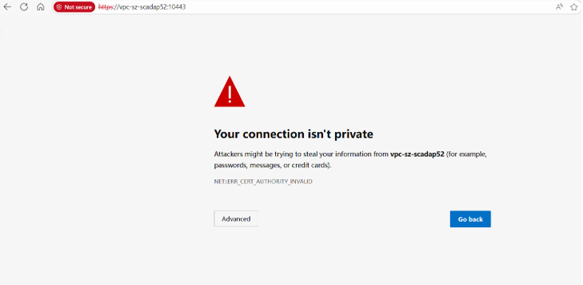

## 3.2 Linux Environment

**Installation Steps**

1. To perform the installation, you need a Terminal (SSH) connection to the target server. You can log in using a connected display and keyboard, or connect remotely using any SSH tool.
e.g. `ssh root@192.168.1.55` (Server IP or Hostname)
    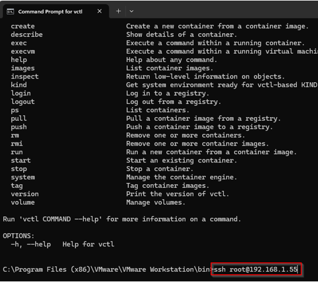
    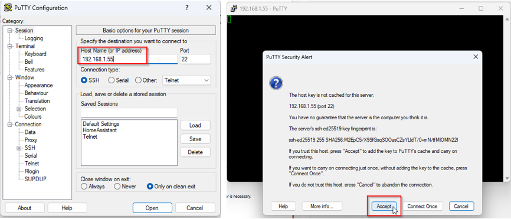
    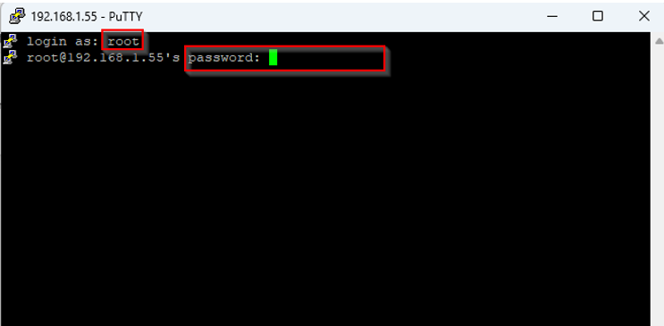
2. For a WAGO Edge Computer server that has a preinstalled operating system, the terminal is also accessible via the web interface.
    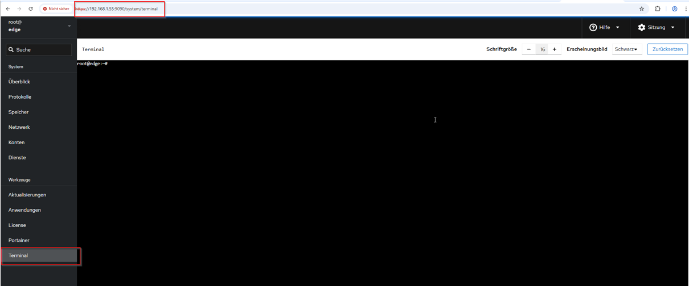
3. The user performing the installation requires root privileges on the system
    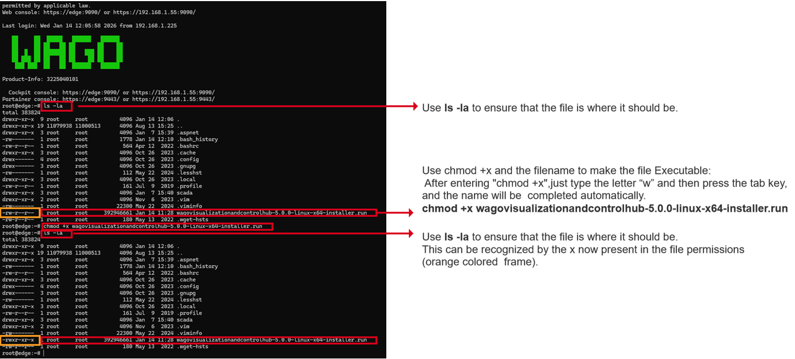
4. Install the installation package
    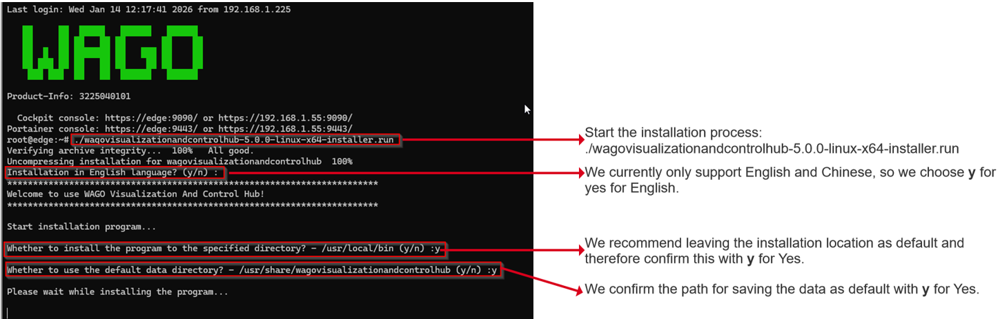
5. The installation should be complete after a few minutes. The next steps are taken in the web browser.( The information about the local host is not entirely correct, as the VC Hub can now also be accessed via the configured IP address or the assigned domain name.)
    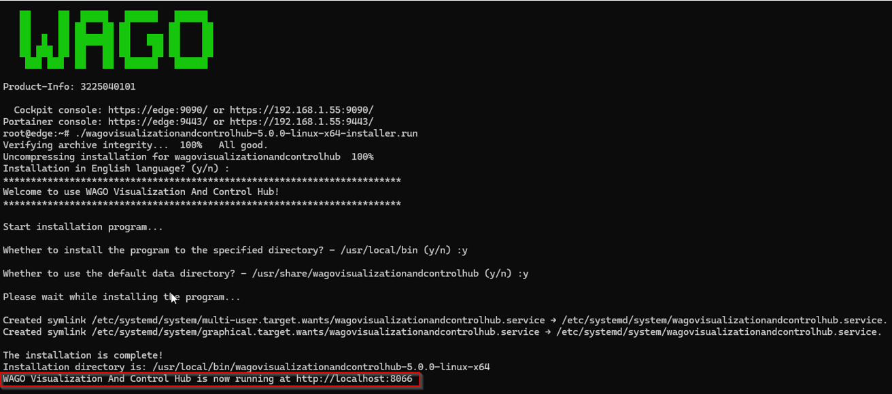
6. Open the URL 192.168.1.55:55:8066, where the address 192.168.1.55 is used here as an example. Use the IP address or domain name you have assigned. Port 8066 must also be specified.
    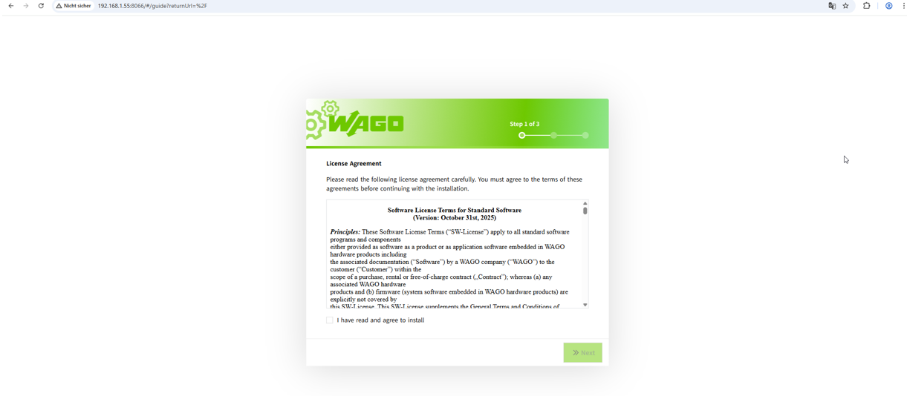
7. Accept the License Agreement.
    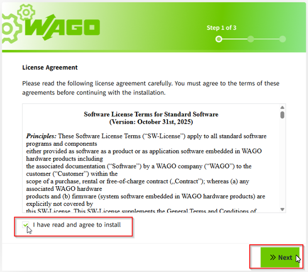
8. Setting up the first administrator user 
    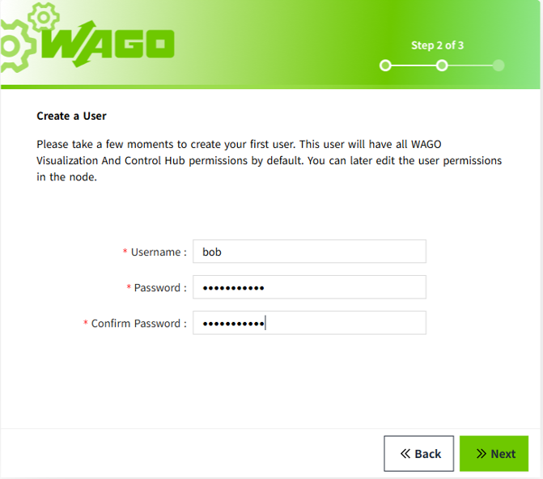
9. Port configuration.The VC Hub suggests ports 8066 and 10443 for the web interface.
    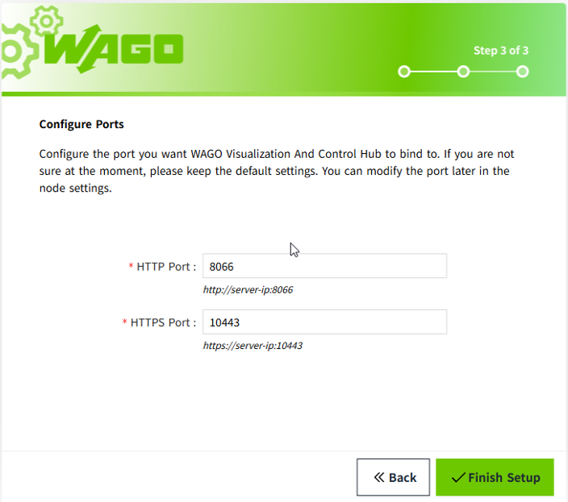
10.	Now we can log in with the user we created earlier.
    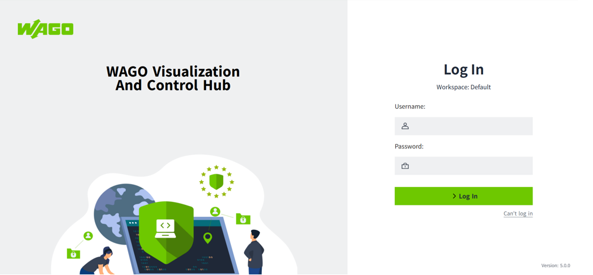

**Notes:**

With https, only a self-signed certificate is currently available, which is why a security message appears in the browser. This can be adjusted later. It will not affect the current use of the system.

_The IP address is based on the actual deployment address you have chosen. The following image is merely for illustration purposes._

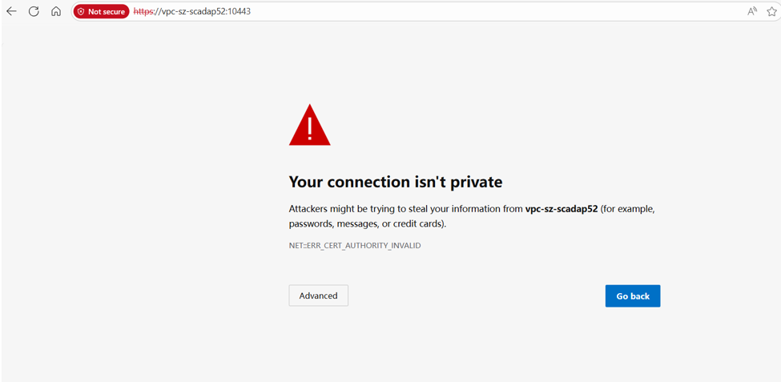

## 3.3 Firewall Settings

We have outlined some simple steps to guide you through configuring your project. You can run a project in a short amount of time.

## 1.Create a Project

Click the "Add" button in the project list to create a project.

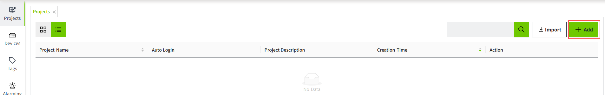

## 2.Add a Database

After the installation of VC Hub, a SQLite database will be automatically created, which you can use for basic testing. You can also click "[Database](../management-platform/databases/index.md)" -> "[Database Connection](../management-platform/databases/database-connection/index.md)" page and then click the "New" button to create a new database connection. 

## 3.Add Assets

After the installation of VC Hub, a default asset will be automatically created, which you can use for basic testing. You can also click "Tags" -> "[Assets](../management-platform/assets-and-tags/asset/index.md)" page and then click the "New" button to create new assets.

## 4.Open the Editor

On the project list page, click the "Design" button for the project.

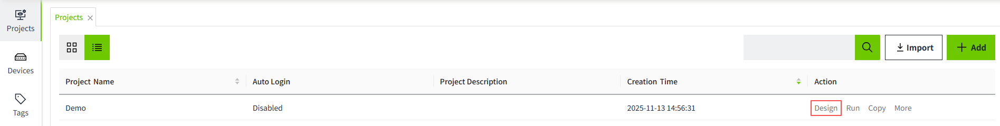

Open the configuration editor to display the following interface.

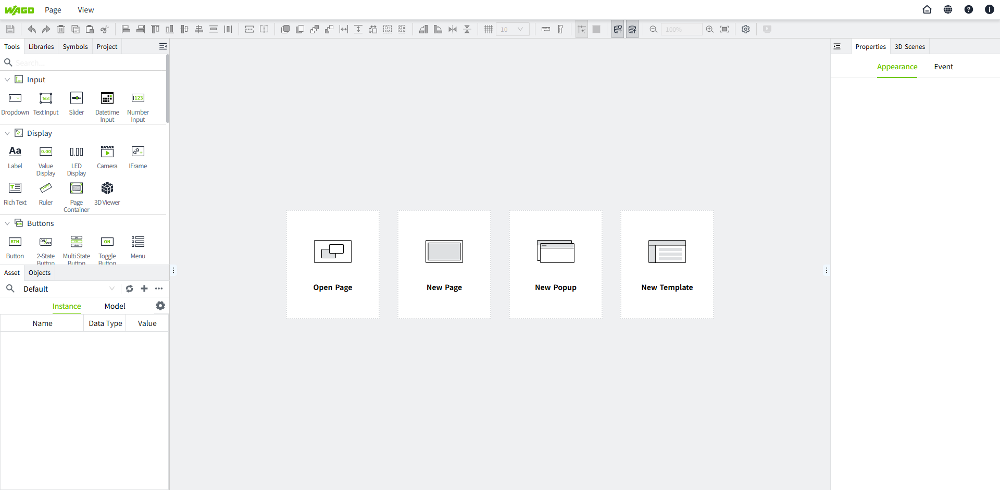

## 5.Create a New Page

Click "New Page" to quickly create a new page.

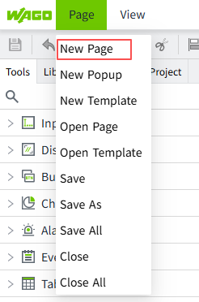

In the **Tools** window on the left side of the designer, add for example "Rect" , "Label" , "Value Display",and "Historical Trend Chart" controls to the page. You can also use the search functionality.

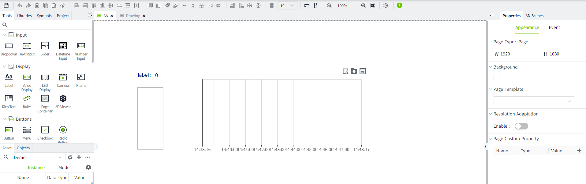

## 6.Create a Tag

In the asset dropdown box of the asset window in the configuration editor, select an asset and then click the add button to add a memory tag to that asset. Tag name: liquid.

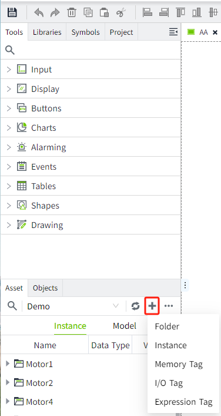

Enable the simulated property for this tag, using simulated value as the tag value. Types supported are **Random**, **Increment**, **Decrement**, and **Fixed.**

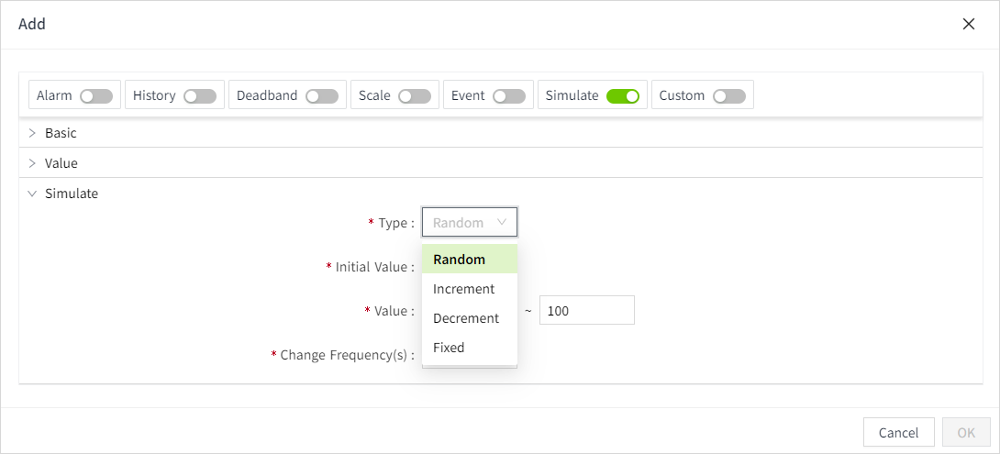

## 7.Enable History for Tags

At the top of the tag editing page, enable [history](../management-platform/assets-and-tags/tag/tag-properties/history.md) to store the value of the tag historically.

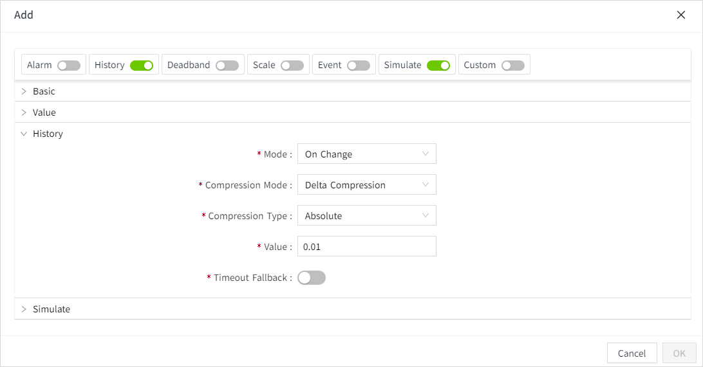

## 8.Bind Tag

Bind tags to controls on the page.

1. Set the display content of the text label to: "Liquid level:"
    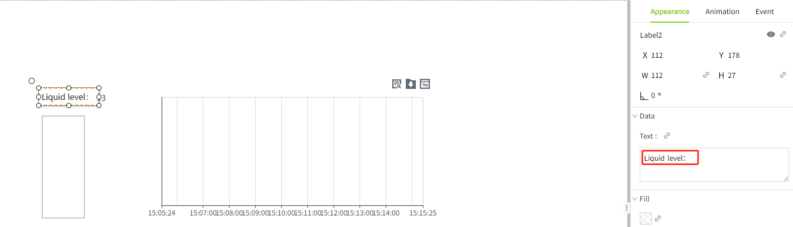
2.  In the animation of the rectangle, select the fill animation. Click the value binding button and bind the created tag:liquid.
    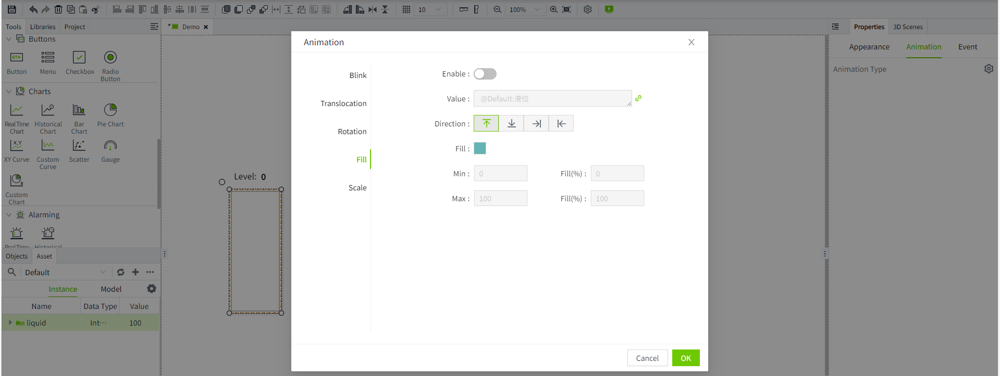
3. In the value display control, click the value binding button and bind the created tag:liquid. Afte binding, the binding icon will turn from gray to green.
    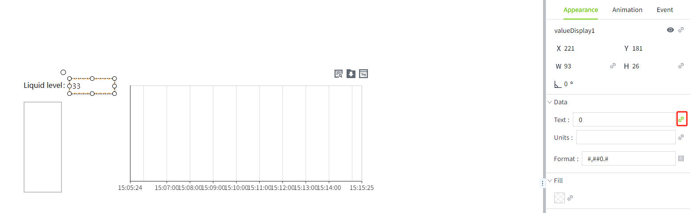
4. In the historical chart control, click the value binding button and bind the created tag:liquid. 
    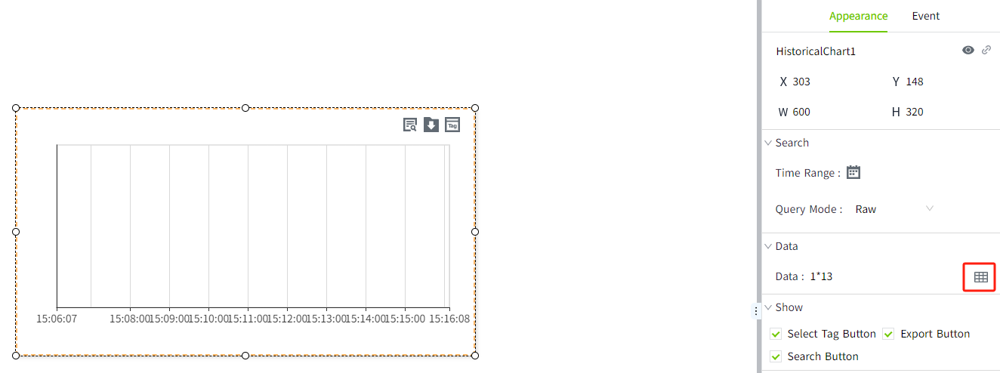
    
**Note:** For more information on binding, please refer to the Property Binding page. 

## 9.Preview/Run

Click the preview button in the page tool bar to view the preview effect. You can also click the run button for the project in the project list to view the running page.

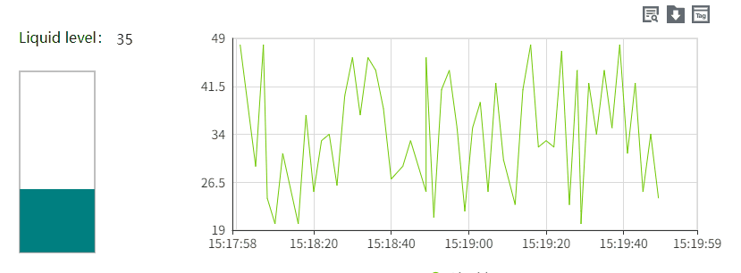

